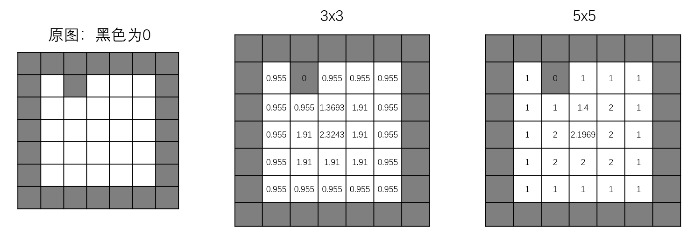

建议点击链接去看 OpenCV 的说明，可以在 [test_moro.ipynb](../code/test_moro.ipynb) 中查看具体的情况和表现。

1. 函数解释：Calculates the distance to the closest zero pixel for each pixel of the source image.
2. 函数作用：细化轮廓、提取前景（可在 test_moro.ipynb 查看具体代码）

函数详解：参数 distanceType 表示距离类型，如 DIST_L2 是欧式距离。参数 labelType 有两个 DIST_LABEL_CCOMP 或 DIS_LABEL_PIXEL，函数返回的 tuple 第一个表示标签，这个参数和标签有关。如果是 CCOMP，那么联通的零像素会被标记为一个标签；如果是 PIXEL，则每个零都会单独一个标签。

参数 maskSize 需要好好讲一下。如果是 DIST_MASK_PRECISE，这个好理解，最精确的方式；如果是 3 或者 5，则表示**每一步可以走的范围**：对于 3x3 而言，无非横竖走和斜着走两种；对于 5x5 而言，除了横竖和斜线，还可以走一个马步（即走日）。每一种类型有代价，比如斜着走肯定要比横竖走一步代价高，而且这个代价和什么样的距离有关。如下：

- DIST_L1: 只能 3x3 的走，横竖代价 1、斜线代价 2
- DIST_L2: 3x3 的走，横竖代价 0.955、斜线代价 1.3693；5x5 的走，横竖代价 1、斜线代价 1.4、马步代价 2.1969
- DIST_C：只能 3x3 的走，横竖代价 1、斜线代价 1

下面用例子说明，以下是 DIST_L2 的情况：

1. 对于 3x3 的 (3, 3) 点，其必须要走两步，第一步向上走、第二步向左上斜线走，这样代价为  0.955+1.3693=2.3243
2. 对于 5x5 的 (3, 3) 点，由于范围是 5x5，所以它只用走一步就到了，即走一个马步即可，这样代价为 2.1969

