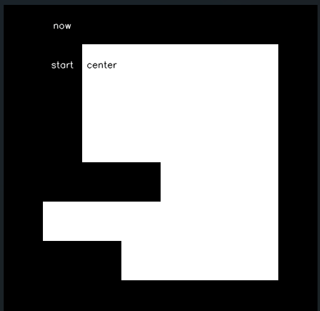
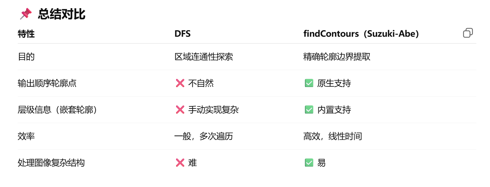

# findcontours 记录

推荐的测试图像，自行用 opencv 生成：



**如果只是想找外边界，直接用 DFS 就行，很直观，找到边界点就开始 DFS 就行了。**

而 `findcontours` 用的是叫做 Suzuki 轮廓搜索方法，处理层级、效率更好一些：



没怎么细看，记录一下几个写的还可以的链接：
1. [文章一](https://www.cnblogs.com/liutianrui1/articles/10281465.html) 和 [文章二](https://blog.csdn.net/chchzh/article/details/109535132) 讲的比较详细
2. [文章三](https://zhuanlan.zhihu.com/p/144807771) 有代码实现，感觉很不错

我个人根据文章三的代码修改了一下，很简陋的处理：

<details>

<summary> 代码（会输出找的过程的图片，但只对最先找到的轮廓上色）</summary>

```py
import numpy as np
import os
import cv2

class FindContours:
    def __init__(self):
        self.grid = np.zeros((8, 8), dtype=int)
        self.grid[1:4, 2:7] = 1
        self.grid[4, 4:7] = 1
        self.grid[5, 1:7] = 1
        self.grid[6, 3:7] = 1

        self.end_point = None

        self.save_idx = 0
        self.save_dir = './contours_show'
        os.makedirs(self.save_dir, exist_ok=True)

        self.reset()
        
    def reset(self):
        self.LNBD = 1
        self.NBD = 1
        self.MAX_BODER_NUMBER = self.grid.shape[0]*self.grid.shape[1]
        self.contours_dict = {}
        self.contours_dict[1] = self.Contour(-1,"Hole")
        
    def Contour(self,parent,contour_type,start_point = [-1,-1]):
        contour = {"parent":parent,
                   "contour_type":contour_type,
                   "son":[],
                   "start_point":start_point}#Hole/Outer
        return contour
    
    def disp_grid(self):
        for i in range(self.grid.shape[0]):
            num = '\033[0;37m' + '['
            print(num,end = ' ')
            for j in range(self.grid.shape[1]):
                if self.grid[i][j] == 0:
                    num = '\033[0;37m' + str(self.grid[i][j]) 
                    print(num,end = ' ')
                else:
                    num = '\033[1;31m' + str(self.grid[i][j]) 
                    print(num,end = ' ')
            num = '\033[0;37m' + ']'
            print(num)
        print("\033[0;37m")

    def write_text(self, img, text, pos, scale):
        if pos is None:
            return

        font = cv2.FONT_HERSHEY_SIMPLEX
        font_scale = 0.5
        thickness = 1

        x = int(pos[1] * scale)
        y = int(pos[0] * scale)
        w = scale
        h = scale

        color = tuple(int(255-x) for x in img[y, x])

        (text_width, text_height), baseline = cv2.getTextSize(text, font, font_scale, thickness)

        # 计算文字左下角的起始点 (text_x, text_y)，使其居中
        text_x = x + (w - text_width) // 2
        text_y = y + (h + text_height) // 2  # 注意：OpenCV 的 y 是基线，所以是 + 而不是 -

        # 写入文字
        cv2.putText(img, text, (text_x, text_y), font, font_scale, color, thickness, cv2.LINE_AA)

    def draw_grid(self, now, center, start):
        showimg = np.zeros((self.grid.shape[0], self.grid.shape[1], 3), dtype=np.uint8)
        showimg[self.grid == 0] = (0, 0, 0)
        showimg[self.grid == 1] = (255, 255, 255)
        showimg[self.grid == 2] = (0, 255, 0)
        showimg[self.grid == -2] = (0, 255, 0)

        scaleimg = cv2.resize(showimg, None, fx=64, fy=64, interpolation=cv2.INTER_NEAREST)

        # 写入文字
        self.write_text(scaleimg, 'now', now, 64)
        self.write_text(scaleimg, 'center', center, 64)
        self.write_text(scaleimg, 'start', start, 64)
        self.write_text(scaleimg, 'end', self.end_point, 64)

        cv2.imwrite(f'{self.save_dir}/showimg_{self.save_idx:03d}.png', scaleimg)
        self.save_idx += 1

    def find_neighbor(self, center, start, clock_wise=1):
        weight = 1 if clock_wise == 1 else -1

        # 索引默认是顺时针，后面会根据 weight 进行调整
        connected_type = 8
        indexs = np.array([[0,1,2], [7,8,3], [6,5,4]]) # 8-联通
        # connected_type = 4
        # indexs = np.array([[8,0,8], [3,8,1], [8,2,8]]) # 4-联通

        dxs = np.zeros(9, dtype=int)
        dys = np.zeros(9, dtype=int)
        for i in range(0, 3):
            for j in range(0, 3):
                dxs[indexs[i, j]] = i - 1
                dys[indexs[i, j]] = j - 1

        start_idx = indexs[start[0]-center[0]+1][start[1]-center[1]+1]

        for i in range(1, connected_type+1):
            now_idx = (start_idx + i*weight+connected_type)%connected_type
            x = center[0] + dxs[now_idx]
            y = center[1] + dys[now_idx]

            self.draw_grid((x, y), center, start)
            if self.grid[x][y] != 0:
                return [x,y]
        return [-1,-1]

    def board_follow(self, center_p, start_p, mode):
        ij = center_p
        ij2 = start_p
        ij1 = self.find_neighbor(ij,ij2,1)
        self.end_point = ij1
        x = ij1[0]
        y = ij1[1]
        if ij1 == [-1,-1]:
                self.grid[ij[0]][ij[1]]  = -self.NBD
                return
        ij2 = ij1
        ij3 = ij
        for k in range(self.MAX_BODER_NUMBER):
            #step 3.3
            print(f'ij3: {ij3}, ij2: {ij2}')
            ij4 = self.find_neighbor(ij3,ij2,0)
            x = ij3[0]
            y = ij3[1]
            if ij4[0] - ij2[0] <=0:
                weight = -1
            else:
                weight = 1
            if self.grid[x][y] < 0:
                self.grid[x][y] = self.grid[x][y]
                
            elif self.grid[x][y-1] == 0 and self.grid[x][y+1] ==0:
                self.grid[x][y] = self.NBD*weight
  
            elif self.grid[x][y+1]== 0:
                self.grid[x][y] = -self.NBD
                
            elif self.grid[x][y]== 1 and self.grid[x][y+1] != 0:
                self.grid[x][y] = self.NBD
                
            else:
                self.grid[x][y] = self.grid[x][y]
                
            if ij4 == ij and ij3 ==ij1:
                return 
            ij2 = ij3
            ij3 = ij4
    
    def raster_scan(self):
        for i in range(self.grid.shape[0]):
            self.LNBD = 1
            for j in range(self.grid.shape[1]):
                if abs(self.grid[i][j]) > 1:
                        self.LNBD = abs(self.grid[i][j])
                if self.grid[i][j] >= 1:
                    if self.grid[i][j] == 1 and self.grid[i][j-1] == 0:
                        self.NBD += 1
                        self.board_follow([i,j],[i,j-1],1)
                        border_type = "Outer"
                    elif self.grid[i][j] > 1 and self.grid[i][j+1] == 0:
                        border_type = "Hole"
                        self.NBD += 1
                        self.board_follow([i,j],[i,j+1],1)
                    else:
                        continue

                    parent = self.LNBD
                    if self.contours_dict[self.LNBD]["contour_type"] == border_type:
                        parent = self.contours_dict[self.LNBD]["parent"]
                    self.contours_dict[self.NBD] = self.Contour(parent,border_type,[i-1,j-1])
                    self.contours_dict[parent]["son"].append(self.NBD)

        self.grid = self.grid[1:-1,1:-1]


def main(): 
    fc = FindContours()       
    fc.raster_scan()
    fc.disp_grid()
    print(fc.contours_dict)
if __name__ == "__main__":
    main()
```

</details>