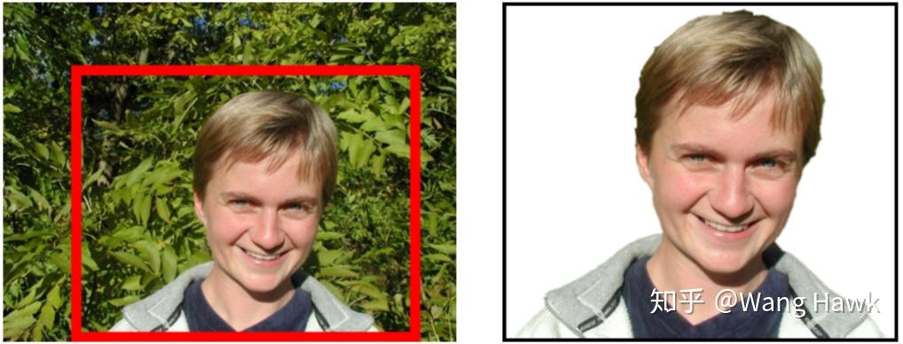
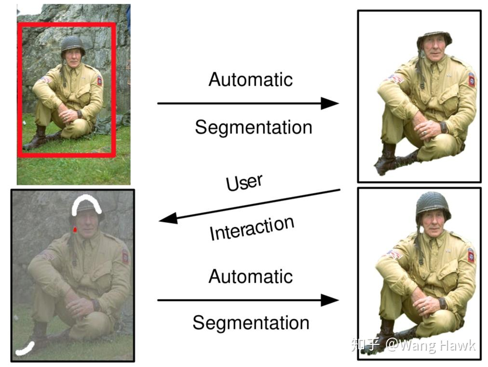
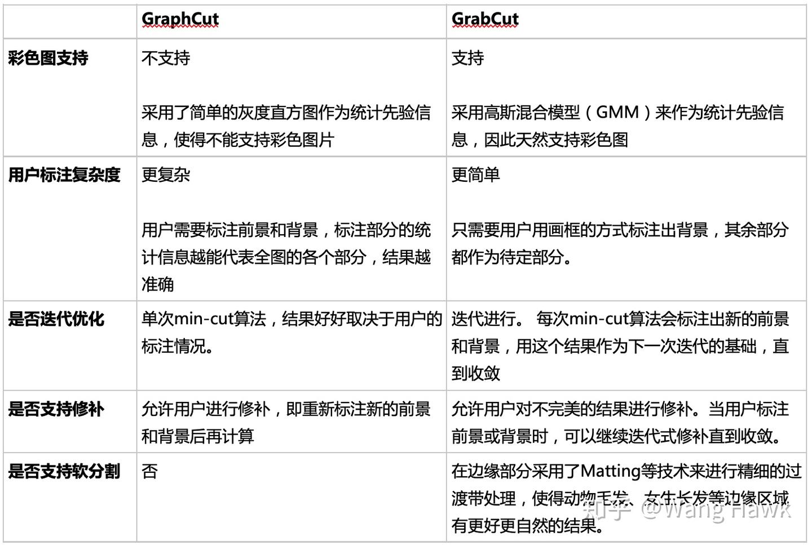
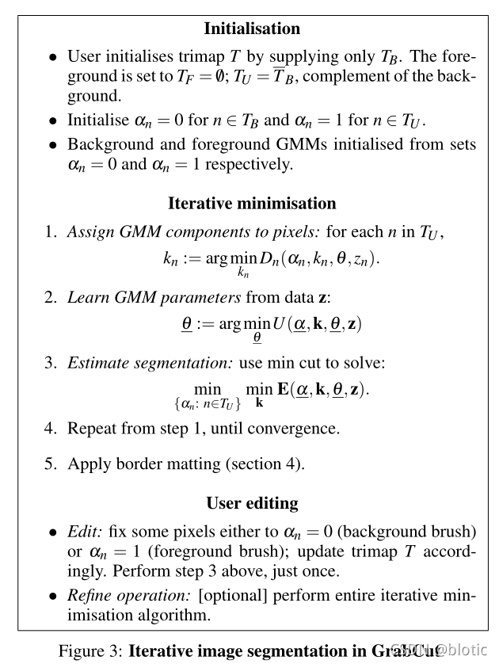

# GrabCut 算法

**一定要先知道 GraphCut 算法，没得商量。[GraphCut 的个人笔记](graphCut.md)**

## 参考

1. https://zhuanlan.zhihu.com/p/64615890
2. https://blog.csdn.net/zhengbq_seu/article/details/85264868
3. https://blog.csdn.net/zouxy09/article/details/8535087


## 简介

微软研究院的一个课题：

> Rother et al., “Interactive Foreground Extraction with Iterated Graph Cuts,” SIGGRAPH 2004.


首先明显比 GraphCut 更方便，只要拉个框就可以：



有的时候，仅仅框住前景还不能得到最好的结果，GrabCut 还支持迭代式的修复，能够允许用户用画线的方式标注出前景或背景，从而得到更加精准的结果。



## 和 GraphCut 的比较



## 具体流程

理解 GraphCut 后 GrabCut 的流程就非常好理解，所以一定要先去看 GraphCut 算法（[个人笔记](06.GraphCut.md)）。

下面大部分来源[参考文章二](https://blog.csdn.net/zhengbq_seu/article/details/85264868)

Graph Cut 的算法是一次性最小化的，而 Grab Cut 是迭代最小的，每次迭代过程都使得对目标和背景建模的GMM的参数更优，使得图像分割更优。

### 初始化

1. 用户通过直接框选目标来得到一个初始的 trimap T，即方框外的像素全部作为背景像素 TB，而方框内 TU 的像素全部作为可能是目标的像素。

2. 对 TB 内的每一像素 $p$，初始化像素 $p$ 的标签 $\alpha_p=0$，即为背景像素；而对 TU 内的每个像素 $p$，初始化像素 $p$ 的标签 $\alpha_p=1$，即作为可能是目标的像素。

3. 估计目标和背景的 GMM，目标和背景都做一次：先通过 k-mean 算法把属于目标/背景的像素聚为 K 类，然后根据对应像素的 RGB 值估计 GMM 参数。**注意，这里是目标和背景各自做 K 类，即目标是一个 K 个高斯分布合起来的 GMM，背景是一个 K 个高斯分布合并起来的 GMM。K 一般取 5。**

然后在文章开始说 GrabCut 比 GraphCut 更方便，这其实就是讨巧之处，这篇[文章](https://zhuanlan.zhihu.com/p/20255114)讲的话我觉得很对：

> 这也就是论文中『框住前景』处理的讨巧之处。『画框』看似在标记前景物体，但其实得到了大范围而且确定的背景区域。根据这些确定的背景区域，能够得到比较准确的背景GMM。相比之下，前景的GMM要低效得多，因为用来出前景GMM的数据里包含了很多背景GMM的数据。

### 迭代

有点类似 EM 算法中求 GMM 分布的过程：

1. 先看各个像素点属于前景还是背景，然后用算好的 GMM 参数，计算出像素点对应前景/背景的哪一个 GMM。

2. 更新 GMM 参数：利用上一步归类后的像素点，更新 GMM 参数。同样的，目标和背景是独立更新的（即像素先判断是背景还是目标，然后加入到对应训练集中）。这里的参数是 GMM 的参数，而不是更新像素属于前景还是目标。

3. 更新像素的归属：利用 GraphCut 方法中，即转成最大流-最小割方法进行图像分割，最后更新像素属于目标还是背景。其中消耗函数，即 Gibbs 能量项，和 GraphCut 有点不一样，这里用了一些 GMM 的参数，具体不谈。

4. 重复上面的操作，直到收敛。迭代过程都是能量递减的过程，所以可以保证会收敛。

5. 用户人为地修改一些像素是目标或者背景像素后，那么就再执行一次上面的步骤

### 总体方案

如下图所示。其中如果 Kmeans 中选择了 K 类，那么 $k_n$ 就属于 `{1, ..., K}`，而 $\alpha_n$ 表示像素点是前景还是背景，属于 `{0, 1}`，




## OpenCV 源码缝隙

我觉得下面这个代码真的太棒了，我之前一直不太懂文章，网上查了好多也总是迷迷糊糊，网上的文章也大都人云亦云。但是看了代码发现太清晰了，果然还是得看源码分析，这里的代码来自文章[参考文章三](https://blog.csdn.net/zouxy09/article/details/8535087)。

```cpp
/*M///
//
//  IMPORTANT: READ BEFORE DOWNLOADING, COPYING, INSTALLING OR USING.
//
//  By downloading, copying, installing or using the software you agree to this license.
//  If you do not agree to this license, do not download, install,
//  copy or use the software.
//
//
//                        Intel License Agreement
//                For Open Source Computer Vision Library
//
// Copyright (C) 2000, Intel Corporation, all rights reserved.
// Third party copyrights are property of their respective owners.
//
// Redistribution and use in source and binary forms, with or without modification,
// are permitted provided that the following conditions are met:
//
//   * Redistribution's of source code must retain the above copyright notice,
//     this list of conditions and the following disclaimer.
//
//   * Redistribution's in binary form must reproduce the above copyright notice,
//     this list of conditions and the following disclaimer in the documentation
//     and/or other materials provided with the distribution.
//
//   * The name of Intel Corporation may not be used to endorse or promote products
//     derived from this software without specific prior written permission.
//
// This software is provided by the copyright holders and contributors "as is" and
// any express or implied warranties, including, but not limited to, the implied
// warranties of merchantability and fitness for a particular purpose are disclaimed.
// In no event shall the Intel Corporation or contributors be liable for any direct,
// indirect, incidental, special, exemplary, or consequential damages
// (including, but not limited to, procurement of substitute goods or services;
// loss of use, data, or profits; or business interruption) however caused
// and on any theory of liability, whether in contract, strict liability,
// or tort (including negligence or otherwise) arising in any way out of
// the use of this software, even if advised of the possibility of such damage.
//
//M*/
 
#include "precomp.hpp"
#include "gcgraph.hpp"
#include <limits>
 
using namespace cv;
 
/*
This is implementation of image segmentation algorithm GrabCut described in
"GrabCut — Interactive Foreground Extraction using Iterated Graph Cuts".
Carsten Rother, Vladimir Kolmogorov, Andrew Blake.
 */
 
/*
 GMM - Gaussian Mixture Model
*/
class GMM
{
public:
    static const int componentsCount = 5;
 
    GMM( Mat& _model );
    double operator()( const Vec3d color ) const;
    double operator()( int ci, const Vec3d color ) const;
    int whichComponent( const Vec3d color ) const;
 
    void initLearning();
    void addSample( int ci, const Vec3d color );
    void endLearning();
 
private:
    void calcInverseCovAndDeterm( int ci );
    Mat model;
    double* coefs;
    double* mean;
    double* cov;
 
    double inverseCovs[componentsCount][3][3]; //协方差的逆矩阵
    double covDeterms[componentsCount];  //协方差的行列式
 
    double sums[componentsCount][3];
    double prods[componentsCount][3][3];
    int sampleCounts[componentsCount];
    int totalSampleCount;
};
 
//背景和前景各有一个对应的GMM（混合高斯模型）
GMM::GMM( Mat& _model )
{
	//一个像素的（唯一对应）高斯模型的参数个数或者说一个高斯模型的参数个数
	//一个像素RGB三个通道值，故3个均值，3*3个协方差，共用一个权值
    const int modelSize = 3/*mean*/ + 9/*covariance*/ + 1/*component weight*/;
    if( _model.empty() )
    {
		//一个GMM共有componentsCount个高斯模型，一个高斯模型有modelSize个模型参数
        _model.create( 1, modelSize*componentsCount, CV_64FC1 );
        _model.setTo(Scalar(0));
    }
    else if( (_model.type() != CV_64FC1) || (_model.rows != 1) || (_model.cols != modelSize*componentsCount) )
        CV_Error( CV_StsBadArg, "_model must have CV_64FC1 type, rows == 1 and cols == 13*componentsCount" );
 
    model = _model;
 
	//注意这些模型参数的存储方式：先排完componentsCount个coefs，再3*componentsCount个mean。
	//再3*3*componentsCount个cov。
    coefs = model.ptr<double>(0);  //GMM的每个像素的高斯模型的权值变量起始存储指针
    mean = coefs + componentsCount; //均值变量起始存储指针
    cov = mean + 3*componentsCount;  //协方差变量起始存储指针
 
    for( int ci = 0; ci < componentsCount; ci++ )
        if( coefs[ci] > 0 )
			 //计算GMM中第ci个高斯模型的协方差的逆Inverse和行列式Determinant
			 //为了后面计算每个像素属于该高斯模型的概率（也就是数据能量项）
             calcInverseCovAndDeterm( ci ); 
}
 
//计算一个像素（由color=（B,G,R）三维double型向量来表示）属于这个GMM混合高斯模型的概率。
//也就是把这个像素像素属于componentsCount个高斯模型的概率与对应的权值相乘再相加，
//具体见论文的公式（10）。结果从res返回。
//这个相当于计算Gibbs能量的第一个能量项（取负后）。
double GMM::operator()( const Vec3d color ) const
{
    double res = 0;
    for( int ci = 0; ci < componentsCount; ci++ )
        res += coefs[ci] * (*this)(ci, color );
    return res;
}
 
//计算一个像素（由color=（B,G,R）三维double型向量来表示）属于第ci个高斯模型的概率。
//具体过程，即高阶的高斯密度模型计算式，具体见论文的公式（10）。结果从res返回
double GMM::operator()( int ci, const Vec3d color ) const
{
    double res = 0;
    if( coefs[ci] > 0 )
    {
        CV_Assert( covDeterms[ci] > std::numeric_limits<double>::epsilon() );
        Vec3d diff = color;
        double* m = mean + 3*ci;
        diff[0] -= m[0]; diff[1] -= m[1]; diff[2] -= m[2];
        double mult = diff[0]*(diff[0]*inverseCovs[ci][0][0] + diff[1]*inverseCovs[ci][1][0] + diff[2]*inverseCovs[ci][2][0])
                   + diff[1]*(diff[0]*inverseCovs[ci][0][1] + diff[1]*inverseCovs[ci][1][1] + diff[2]*inverseCovs[ci][2][1])
                   + diff[2]*(diff[0]*inverseCovs[ci][0][2] + diff[1]*inverseCovs[ci][1][2] + diff[2]*inverseCovs[ci][2][2]);
        res = 1.0f/sqrt(covDeterms[ci]) * exp(-0.5f*mult);
    }
    return res;
}
 
//返回这个像素最有可能属于GMM中的哪个高斯模型（概率最大的那个）
int GMM::whichComponent( const Vec3d color ) const
{
    int k = 0;
    double max = 0;
 
    for( int ci = 0; ci < componentsCount; ci++ )
    {
        double p = (*this)( ci, color );
        if( p > max )
        {
            k = ci;  //找到概率最大的那个，或者说计算结果最大的那个
            max = p;
        }
    }
    return k;
}
 
//GMM参数学习前的初始化，主要是对要求和的变量置零
void GMM::initLearning()
{
    for( int ci = 0; ci < componentsCount; ci++)
    {
        sums[ci][0] = sums[ci][1] = sums[ci][2] = 0;
        prods[ci][0][0] = prods[ci][0][1] = prods[ci][0][2] = 0;
        prods[ci][1][0] = prods[ci][1][1] = prods[ci][1][2] = 0;
        prods[ci][2][0] = prods[ci][2][1] = prods[ci][2][2] = 0;
        sampleCounts[ci] = 0;
    }
    totalSampleCount = 0;
}
 
//增加样本，即为前景或者背景GMM的第ci个高斯模型的像素集（这个像素集是来用估
//计计算这个高斯模型的参数的）增加样本像素。计算加入color这个像素后，像素集
//中所有像素的RGB三个通道的和sums（用来计算均值），还有它的prods（用来计算协方差），
//并且记录这个像素集的像素个数和总的像素个数（用来计算这个高斯模型的权值）。
void GMM::addSample( int ci, const Vec3d color )
{
    sums[ci][0] += color[0]; sums[ci][1] += color[1]; sums[ci][2] += color[2];
    prods[ci][0][0] += color[0]*color[0]; prods[ci][0][1] += color[0]*color[1]; prods[ci][0][2] += color[0]*color[2];
    prods[ci][1][0] += color[1]*color[0]; prods[ci][1][1] += color[1]*color[1]; prods[ci][1][2] += color[1]*color[2];
    prods[ci][2][0] += color[2]*color[0]; prods[ci][2][1] += color[2]*color[1]; prods[ci][2][2] += color[2]*color[2];
    sampleCounts[ci]++;
    totalSampleCount++;
}
 
//从图像数据中学习GMM的参数：每一个高斯分量的权值、均值和协方差矩阵；
//这里相当于论文中“Iterative minimisation”的step 2
void GMM::endLearning()
{
    const double variance = 0.01;
    for( int ci = 0; ci < componentsCount; ci++ )
    {
        int n = sampleCounts[ci]; //第ci个高斯模型的样本像素个数
        if( n == 0 )
            coefs[ci] = 0;
        else
        {
            //计算第ci个高斯模型的权值系数
			coefs[ci] = (double)n/totalSampleCount; 
 
            //计算第ci个高斯模型的均值
			double* m = mean + 3*ci;
            m[0] = sums[ci][0]/n; m[1] = sums[ci][1]/n; m[2] = sums[ci][2]/n;
 
            //计算第ci个高斯模型的协方差
			double* c = cov + 9*ci;
            c[0] = prods[ci][0][0]/n - m[0]*m[0]; c[1] = prods[ci][0][1]/n - m[0]*m[1]; c[2] = prods[ci][0][2]/n - m[0]*m[2];
            c[3] = prods[ci][1][0]/n - m[1]*m[0]; c[4] = prods[ci][1][1]/n - m[1]*m[1]; c[5] = prods[ci][1][2]/n - m[1]*m[2];
            c[6] = prods[ci][2][0]/n - m[2]*m[0]; c[7] = prods[ci][2][1]/n - m[2]*m[1]; c[8] = prods[ci][2][2]/n - m[2]*m[2];
 
            //计算第ci个高斯模型的协方差的行列式
			double dtrm = c[0]*(c[4]*c[8]-c[5]*c[7]) - c[1]*(c[3]*c[8]-c[5]*c[6]) + c[2]*(c[3]*c[7]-c[4]*c[6]);
            if( dtrm <= std::numeric_limits<double>::epsilon() )
            {
                //相当于如果行列式小于等于0，（对角线元素）增加白噪声，避免其变
				//为退化（降秩）协方差矩阵（不存在逆矩阵，但后面的计算需要计算逆矩阵）。
				// Adds the white noise to avoid singular covariance matrix.
                c[0] += variance;
                c[4] += variance;
                c[8] += variance;
            }
			
			//计算第ci个高斯模型的协方差的逆Inverse和行列式Determinant
            calcInverseCovAndDeterm(ci);
        }
    }
}
 
//计算协方差的逆Inverse和行列式Determinant
void GMM::calcInverseCovAndDeterm( int ci )
{
    if( coefs[ci] > 0 )
    {
		//取第ci个高斯模型的协方差的起始指针
        double *c = cov + 9*ci;
        double dtrm =
              covDeterms[ci] = c[0]*(c[4]*c[8]-c[5]*c[7]) - c[1]*(c[3]*c[8]-c[5]*c[6]) 
								+ c[2]*(c[3]*c[7]-c[4]*c[6]);
 
        //在C++中，每一种内置的数据类型都拥有不同的属性, 使用<limits>库可以获
		//得这些基本数据类型的数值属性。因为浮点算法的截断，所以使得，当a=2，
		//b=3时 10*a/b == 20/b不成立。那怎么办呢？
		//这个小正数（epsilon）常量就来了，小正数通常为可用给定数据类型的
		//大于1的最小值与1之差来表示。若dtrm结果不大于小正数，那么它几乎为零。
		//所以下式保证dtrm>0，即行列式的计算正确（协方差对称正定，故行列式大于0）。
		CV_Assert( dtrm > std::numeric_limits<double>::epsilon() );
		//三阶方阵的求逆
        inverseCovs[ci][0][0] =  (c[4]*c[8] - c[5]*c[7]) / dtrm;
        inverseCovs[ci][1][0] = -(c[3]*c[8] - c[5]*c[6]) / dtrm;
        inverseCovs[ci][2][0] =  (c[3]*c[7] - c[4]*c[6]) / dtrm;
        inverseCovs[ci][0][1] = -(c[1]*c[8] - c[2]*c[7]) / dtrm;
        inverseCovs[ci][1][1] =  (c[0]*c[8] - c[2]*c[6]) / dtrm;
        inverseCovs[ci][2][1] = -(c[0]*c[7] - c[1]*c[6]) / dtrm;
        inverseCovs[ci][0][2] =  (c[1]*c[5] - c[2]*c[4]) / dtrm;
        inverseCovs[ci][1][2] = -(c[0]*c[5] - c[2]*c[3]) / dtrm;
        inverseCovs[ci][2][2] =  (c[0]*c[4] - c[1]*c[3]) / dtrm;
    }
}
 
//计算beta，也就是Gibbs能量项中的第二项（平滑项）中的指数项的beta，用来调整
//高或者低对比度时，两个邻域像素的差别的影响的，例如在低对比度时，两个邻域
//像素的差别可能就会比较小，这时候需要乘以一个较大的beta来放大这个差别，
//在高对比度时，则需要缩小本身就比较大的差别。
//所以我们需要分析整幅图像的对比度来确定参数beta，具体的见论文公式（5）。
/*
  Calculate beta - parameter of GrabCut algorithm.
  beta = 1/(2*avg(sqr(||color[i] - color[j]||)))
*/
static double calcBeta( const Mat& img )
{
    double beta = 0;
    for( int y = 0; y < img.rows; y++ )
    {
        for( int x = 0; x < img.cols; x++ )
        {
			//计算四个方向邻域两像素的差别，也就是欧式距离或者说二阶范数
			//（当所有像素都算完后，就相当于计算八邻域的像素差了）
            Vec3d color = img.at<Vec3b>(y,x);
            if( x>0 ) // left  >0的判断是为了避免在图像边界的时候还计算，导致越界
            {
                Vec3d diff = color - (Vec3d)img.at<Vec3b>(y,x-1);
                beta += diff.dot(diff);  //矩阵的点乘，也就是各个元素平方的和
            }
            if( y>0 && x>0 ) // upleft
            {
                Vec3d diff = color - (Vec3d)img.at<Vec3b>(y-1,x-1);
                beta += diff.dot(diff);
            }
            if( y>0 ) // up
            {
                Vec3d diff = color - (Vec3d)img.at<Vec3b>(y-1,x);
                beta += diff.dot(diff);
            }
            if( y>0 && x(y-1,x+1);
                beta += diff.dot(diff);
            }
        }
    }
    if( beta <= std::numeric_limits<double>::epsilon() )
        beta = 0;
    else
        beta = 1.f / (2 * beta/(4*img.cols*img.rows - 3*img.cols - 3*img.rows + 2) ); //论文公式（5）
 
    return beta;
}
 
//计算图每个非端点顶点（也就是每个像素作为图的一个顶点，不包括源点s和汇点t）与邻域顶点
//的边的权值。由于是无向图，我们计算的是八邻域，那么对于一个顶点，我们计算四个方向就行，
//在其他的顶点计算的时候，会把剩余那四个方向的权值计算出来。这样整个图算完后，每个顶点
//与八邻域的顶点的边的权值就都计算出来了。
//这个相当于计算Gibbs能量的第二个能量项（平滑项），具体见论文中公式（4）
/*
  Calculate weights of noterminal vertices of graph.
  beta and gamma - parameters of GrabCut algorithm.
 */
static void calcNWeights( const Mat& img, Mat& leftW, Mat& upleftW, Mat& upW, 
							Mat& uprightW, double beta, double gamma )
{
    //gammaDivSqrt2相当于公式（4）中的gamma * dis(i,j)^(-1)，那么可以知道，
	//当i和j是垂直或者水平关系时，dis(i,j)=1，当是对角关系时，dis(i,j)=sqrt(2.0f)。
	//具体计算时，看下面就明白了
	const double gammaDivSqrt2 = gamma / std::sqrt(2.0f);
	//每个方向的边的权值通过一个和图大小相等的Mat来保存
    leftW.create( img.rows, img.cols, CV_64FC1 );
    upleftW.create( img.rows, img.cols, CV_64FC1 );
    upW.create( img.rows, img.cols, CV_64FC1 );
    uprightW.create( img.rows, img.cols, CV_64FC1 );
    for( int y = 0; y < img.rows; y++ )
    {
        for( int x = 0; x < img.cols; x++ )
        {
            Vec3d color = img.at<Vec3b>(y,x);
            if( x-1>=0 ) // left  //避免图的边界
            {
                Vec3d diff = color - (Vec3d)img.at<Vec3b>(y,x-1);
                leftW.at<double>(y,x) = gamma * exp(-beta*diff.dot(diff));
            }
            else
                leftW.at<double>(y,x) = 0;
            if( x-1>=0 && y-1>=0 ) // upleft
            {
                Vec3d diff = color - (Vec3d)img.at<Vec3b>(y-1,x-1);
                upleftW.at<double>(y,x) = gammaDivSqrt2 * exp(-beta*diff.dot(diff));
            }
            else
                upleftW.at<double>(y,x) = 0;
            if( y-1>=0 ) // up
            {
                Vec3d diff = color - (Vec3d)img.at<Vec3b>(y-1,x);
                upW.at<double>(y,x) = gamma * exp(-beta*diff.dot(diff));
            }
            else
                upW.at<double>(y,x) = 0;
            if( x+1=0 ) // upright
            {
                Vec3d diff = color - (Vec3d)img.at<Vec3b>(y-1,x+1);
                uprightW.at<double>(y,x) = gammaDivSqrt2 * exp(-beta*diff.dot(diff));
            }
            else
                uprightW.at<double>(y,x) = 0;
        }
    }
}
 
//检查mask的正确性。mask为通过用户交互或者程序设定的，它是和图像大小一样的单通道灰度图，
//每个像素只能取GC_BGD or GC_FGD or GC_PR_BGD or GC_PR_FGD 四种枚举值，分别表示该像素
//（用户或者程序指定）属于背景、前景、可能为背景或者可能为前景像素。具体的参考：
//ICCV2001“Interactive Graph Cuts for Optimal Boundary & Region Segmentation of Objects in N-D Images”
//Yuri Y. Boykov Marie-Pierre Jolly 
/*
  Check size, type and element values of mask matrix.
 */
static void checkMask( const Mat& img, const Mat& mask )
{
    if( mask.empty() )
        CV_Error( CV_StsBadArg, "mask is empty" );
    if( mask.type() != CV_8UC1 )
        CV_Error( CV_StsBadArg, "mask must have CV_8UC1 type" );
    if( mask.cols != img.cols || mask.rows != img.rows )
        CV_Error( CV_StsBadArg, "mask must have as many rows and cols as img" );
    for( int y = 0; y < mask.rows; y++ )
    {
        for( int x = 0; x < mask.cols; x++ )
        {
            uchar val = mask.at<uchar>(y,x);
            if( val!=GC_BGD && val!=GC_FGD && val!=GC_PR_BGD && val!=GC_PR_FGD )
                CV_Error( CV_StsBadArg, "mask element value must be equel"
                    "GC_BGD or GC_FGD or GC_PR_BGD or GC_PR_FGD" );
        }
    }
}
 
//通过用户框选目标rect来创建mask，rect外的全部作为背景，设置为GC_BGD，
//rect内的设置为 GC_PR_FGD（可能为前景）
/*
  Initialize mask using rectangular.
*/
static void initMaskWithRect( Mat& mask, Size imgSize, Rect rect )
{
    mask.create( imgSize, CV_8UC1 );
    mask.setTo( GC_BGD );
 
    rect.x = max(0, rect.x);
    rect.y = max(0, rect.y);
    rect.width = min(rect.width, imgSize.width-rect.x);
    rect.height = min(rect.height, imgSize.height-rect.y);
 
    (mask(rect)).setTo( Scalar(GC_PR_FGD) );
}
 
//通过k-means算法来初始化背景GMM和前景GMM模型
/*
  Initialize GMM background and foreground models using kmeans algorithm.
*/
static void initGMMs( const Mat& img, const Mat& mask, GMM& bgdGMM, GMM& fgdGMM )
{
    const int kMeansItCount = 10;  //迭代次数
    const int kMeansType = KMEANS_PP_CENTERS; //Use kmeans++ center initialization by Arthur and Vassilvitskii
 
    Mat bgdLabels, fgdLabels; //记录背景和前景的像素样本集中每个像素对应GMM的哪个高斯模型，论文中的kn
    vector<Vec3f> bgdSamples, fgdSamples; //背景和前景的像素样本集
    Point p;
    for( p.y = 0; p.y < img.rows; p.y++ )
    {
        for( p.x = 0; p.x < img.cols; p.x++ )
        {
            //mask中标记为GC_BGD和GC_PR_BGD的像素都作为背景的样本像素
			if( mask.at<uchar>(p) == GC_BGD || mask.at<uchar>(p) == GC_PR_BGD )
                bgdSamples.push_back( (Vec3f)img.at<Vec3b>(p) );
            else // GC_FGD | GC_PR_FGD
                fgdSamples.push_back( (Vec3f)img.at<Vec3b>(p) );
        }
    }
    CV_Assert( !bgdSamples.empty() && !fgdSamples.empty() );
	
	//kmeans中参数_bgdSamples为：每行一个样本
	//kmeans的输出为bgdLabels，里面保存的是输入样本集中每一个样本对应的类标签（样本聚为componentsCount类后）
    Mat _bgdSamples( (int)bgdSamples.size(), 3, CV_32FC1, &bgdSamples[0][0] );
    kmeans( _bgdSamples, GMM::componentsCount, bgdLabels,
            TermCriteria( CV_TERMCRIT_ITER, kMeansItCount, 0.0), 0, kMeansType );
    Mat _fgdSamples( (int)fgdSamples.size(), 3, CV_32FC1, &fgdSamples[0][0] );
    kmeans( _fgdSamples, GMM::componentsCount, fgdLabels,
            TermCriteria( CV_TERMCRIT_ITER, kMeansItCount, 0.0), 0, kMeansType );
 
    //经过上面的步骤后，每个像素所属的高斯模型就确定的了，那么就可以估计GMM中每个高斯模型的参数了。
	bgdGMM.initLearning();
    for( int i = 0; i < (int)bgdSamples.size(); i++ )
        bgdGMM.addSample( bgdLabels.at<int>(i,0), bgdSamples[i] );
    bgdGMM.endLearning();
 
    fgdGMM.initLearning();
    for( int i = 0; i < (int)fgdSamples.size(); i++ )
        fgdGMM.addSample( fgdLabels.at<int>(i,0), fgdSamples[i] );
    fgdGMM.endLearning();
}
 
//论文中：迭代最小化算法step 1：为每个像素分配GMM中所属的高斯模型，kn保存在Mat compIdxs中
/*
  Assign GMMs components for each pixel.
*/
static void assignGMMsComponents( const Mat& img, const Mat& mask, const GMM& bgdGMM, 
									const GMM& fgdGMM, Mat& compIdxs )
{
    Point p;
    for( p.y = 0; p.y < img.rows; p.y++ )
    {
        for( p.x = 0; p.x < img.cols; p.x++ )
        {
            Vec3d color = img.at<Vec3b>(p);
			//通过mask来判断该像素属于背景像素还是前景像素，再判断它属于前景或者背景GMM中的哪个高斯分量
            compIdxs.at<int>(p) = mask.at<uchar>(p) == GC_BGD || mask.at<uchar>(p) == GC_PR_BGD ?
                bgdGMM.whichComponent(color) : fgdGMM.whichComponent(color);
        }
    }
}
 
//论文中：迭代最小化算法step 2：从每个高斯模型的像素样本集中学习每个高斯模型的参数
/*
  Learn GMMs parameters.
*/
static void learnGMMs( const Mat& img, const Mat& mask, const Mat& compIdxs, GMM& bgdGMM, GMM& fgdGMM )
{
    bgdGMM.initLearning();
    fgdGMM.initLearning();
    Point p;
    for( int ci = 0; ci < GMM::componentsCount; ci++ )
    {
        for( p.y = 0; p.y < img.rows; p.y++ )
        {
            for( p.x = 0; p.x < img.cols; p.x++ )
            {
                if( compIdxs.at<int>(p) == ci )
                {
                    if( mask.at<uchar>(p) == GC_BGD || mask.at<uchar>(p) == GC_PR_BGD )
                        bgdGMM.addSample( ci, img.at<Vec3b>(p) );
                    else
                        fgdGMM.addSample( ci, img.at<Vec3b>(p) );
                }
            }
        }
    }
    bgdGMM.endLearning();
    fgdGMM.endLearning();
}
 
//通过计算得到的能量项构建图，图的顶点为像素点，图的边由两部分构成，
//一类边是：每个顶点与Sink汇点t（代表背景）和源点Source（代表前景）连接的边，
//这类边的权值通过Gibbs能量项的第一项能量项来表示。
//另一类边是：每个顶点与其邻域顶点连接的边，这类边的权值通过Gibbs能量项的第二项能量项来表示。
/*
  Construct GCGraph
*/
static void constructGCGraph( const Mat& img, const Mat& mask, const GMM& bgdGMM, const GMM& fgdGMM, double lambda,
                       const Mat& leftW, const Mat& upleftW, const Mat& upW, const Mat& uprightW,
                       GCGraph<double>& graph )
{
    int vtxCount = img.cols*img.rows;  //顶点数，每一个像素是一个顶点
    int edgeCount = 2*(4*vtxCount - 3*(img.cols + img.rows) + 2);  //边数，需要考虑图边界的边的缺失
    //通过顶点数和边数创建图。这些类型声明和函数定义请参考gcgraph.hpp
	graph.create(vtxCount, edgeCount);
    Point p;
    for( p.y = 0; p.y < img.rows; p.y++ )
    {
        for( p.x = 0; p.x < img.cols; p.x++)
        {
            // add node
            int vtxIdx = graph.addVtx();  //返回这个顶点在图中的索引
            Vec3b color = img.at<Vec3b>(p);
 
            // set t-weights			
            //计算每个顶点与Sink汇点t（代表背景）和源点Source（代表前景）连接的权值。
			//也即计算Gibbs能量（每一个像素点作为背景像素或者前景像素）的第一个能量项
			double fromSource, toSink;
            if( mask.at<uchar>(p) == GC_PR_BGD || mask.at<uchar>(p) == GC_PR_FGD )
            {
                //对每一个像素计算其作为背景像素或者前景像素的第一个能量项，作为分别与t和s点的连接权值
				fromSource = -log( bgdGMM(color) );
                toSink = -log( fgdGMM(color) );
            }
            else if( mask.at<uchar>(p) == GC_BGD )
            {
                //对于确定为背景的像素点，它与Source点（前景）的连接为0，与Sink点的连接为lambda
				fromSource = 0;
                toSink = lambda;
            }
            else // GC_FGD
            {
                fromSource = lambda;
                toSink = 0;
            }
			//设置该顶点vtxIdx分别与Source点和Sink点的连接权值
            graph.addTermWeights( vtxIdx, fromSource, toSink );
 
            // set n-weights  n-links
            //计算两个邻域顶点之间连接的权值。
			//也即计算Gibbs能量的第二个能量项（平滑项）
			if( p.x>0 )
            {
                double w = leftW.at<double>(p);
                graph.addEdges( vtxIdx, vtxIdx-1, w, w );
            }
            if( p.x>0 && p.y>0 )
            {
                double w = upleftW.at<double>(p);
                graph.addEdges( vtxIdx, vtxIdx-img.cols-1, w, w );
            }
            if( p.y>0 )
            {
                double w = upW.at<double>(p);
                graph.addEdges( vtxIdx, vtxIdx-img.cols, w, w );
            }
            if( p.x0 )
            {
                double w = uprightW.at<double>(p);
                graph.addEdges( vtxIdx, vtxIdx-img.cols+1, w, w );
            }
        }
    }
}
 
//论文中：迭代最小化算法step 3：分割估计：最小割或者最大流算法
/*
  Estimate segmentation using MaxFlow algorithm
*/
static void estimateSegmentation( GCGraph<double>& graph, Mat& mask )
{
    //通过最大流算法确定图的最小割，也即完成图像的分割
	graph.maxFlow();
    Point p;
    for( p.y = 0; p.y < mask.rows; p.y++ )
    {
        for( p.x = 0; p.x < mask.cols; p.x++ )
        {
            //通过图分割的结果来更新mask，即最后的图像分割结果。注意的是，永远都
			//不会更新用户指定为背景或者前景的像素
			if( mask.at<uchar>(p) == GC_PR_BGD || mask.at<uchar>(p) == GC_PR_FGD )
            {
                if( graph.inSourceSegment( p.y*mask.cols+p.x /*vertex index*/ ) )
                    mask.at<uchar>(p) = GC_PR_FGD;
                else
                    mask.at<uchar>(p) = GC_PR_BGD;
            }
        }
    }
}
 
//最后的成果：提供给外界使用的伟大的API：grabCut 
/*
****参数说明：
	img——待分割的源图像，必须是8位3通道（CV_8UC3）图像，在处理的过程中不会被修改；
	mask——掩码图像，如果使用掩码进行初始化，那么mask保存初始化掩码信息；在执行分割
		的时候，也可以将用户交互所设定的前景与背景保存到mask中，然后再传入grabCut函
		数；在处理结束之后，mask中会保存结果。mask只能取以下四种值：
		GCD_BGD（=0），背景；
		GCD_FGD（=1），前景；
		GCD_PR_BGD（=2），可能的背景；
		GCD_PR_FGD（=3），可能的前景。
		如果没有手工标记GCD_BGD或者GCD_FGD，那么结果只会有GCD_PR_BGD或GCD_PR_FGD；
	rect——用于限定需要进行分割的图像范围，只有该矩形窗口内的图像部分才被处理；
	bgdModel——背景模型，如果为null，函数内部会自动创建一个bgdModel；bgdModel必须是
		单通道浮点型（CV_32FC1）图像，且行数只能为1，列数只能为13x5；
	fgdModel——前景模型，如果为null，函数内部会自动创建一个fgdModel；fgdModel必须是
		单通道浮点型（CV_32FC1）图像，且行数只能为1，列数只能为13x5；
	iterCount——迭代次数，必须大于0；
	mode——用于指示grabCut函数进行什么操作，可选的值有：
		GC_INIT_WITH_RECT（=0），用矩形窗初始化GrabCut；
		GC_INIT_WITH_MASK（=1），用掩码图像初始化GrabCut；
		GC_EVAL（=2），执行分割。
*/
void cv::grabCut( InputArray _img, InputOutputArray _mask, Rect rect,
                  InputOutputArray _bgdModel, InputOutputArray _fgdModel,
                  int iterCount, int mode )
{
    Mat img = _img.getMat();
    Mat& mask = _mask.getMatRef();
    Mat& bgdModel = _bgdModel.getMatRef();
    Mat& fgdModel = _fgdModel.getMatRef();
 
    if( img.empty() )
        CV_Error( CV_StsBadArg, "image is empty" );
    if( img.type() != CV_8UC3 )
        CV_Error( CV_StsBadArg, "image mush have CV_8UC3 type" );
 
    GMM bgdGMM( bgdModel ), fgdGMM( fgdModel );
    Mat compIdxs( img.size(), CV_32SC1 );
 
    if( mode == GC_INIT_WITH_RECT || mode == GC_INIT_WITH_MASK )
    {
        if( mode == GC_INIT_WITH_RECT )
            initMaskWithRect( mask, img.size(), rect );
        else // flag == GC_INIT_WITH_MASK
            checkMask( img, mask );
        initGMMs( img, mask, bgdGMM, fgdGMM );
    }
 
    if( iterCount <= 0)
        return;
 
    if( mode == GC_EVAL )
        checkMask( img, mask );
 
    const double gamma = 50;
    const double lambda = 9*gamma;
    const double beta = calcBeta( img );
 
    Mat leftW, upleftW, upW, uprightW;
    calcNWeights( img, leftW, upleftW, upW, uprightW, beta, gamma );
 
    for( int i = 0; i < iterCount; i++ )
    {
        GCGraph<double> graph;
        assignGMMsComponents( img, mask, bgdGMM, fgdGMM, compIdxs );
        learnGMMs( img, mask, compIdxs, bgdGMM, fgdGMM );
        constructGCGraph(img, mask, bgdGMM, fgdGMM, lambda, leftW, upleftW, upW, uprightW, graph );
        estimateSegmentation( graph, mask );
    }
}
```

