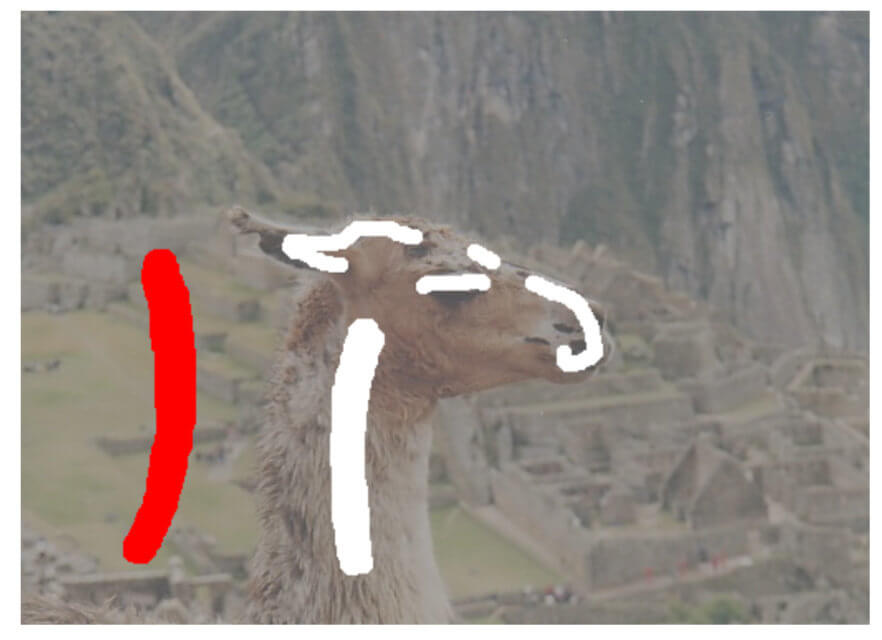
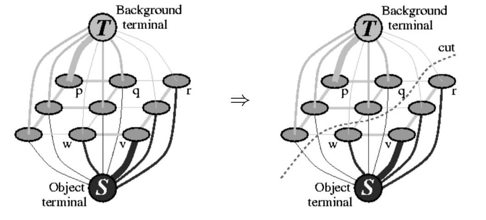
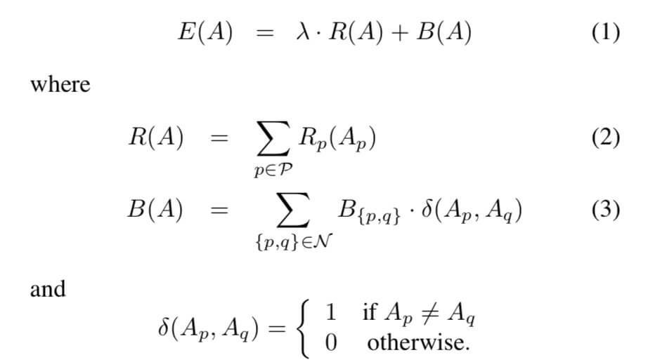
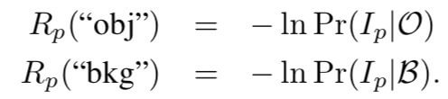
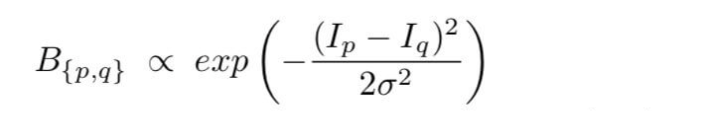

# GraphCut 算法

图像分割，乃至图像处理中一篇经典的论文：

> Interactive graph cuts for optimal boundary and region segmentation of objects in N-D images

一个前提，需要用户先指定一些前景和背景：

## 图的构建

首先图片按照四联通转成一张图，然后比较特殊的一点：还需要加两个特殊点，叫做终端节点。起始的时候这两个特殊点和图上所有像素点都相连。

然后这样就能转换为一个图割问题，用来最大流-最小割方法（几年前算法课的死去回忆再一次攻击我...），这个就偏程序算法层了，不谈。后面主要讲图割中重要的损耗在本论文中是什么样的。

## 符号定义

像素点我们称作 $p$，背景叫做 bkg，前景叫做 obj。

我们把 $A_p$ 定义为像素点 $p$ 的标签，那么 $A_p$ 只能是 obj 或者 bkg。很明显，每个像素只有两种可能性。**我们把 $A$ 定义为所有像素点标签的集合，即 $A = (A_1, ..., A_p, ..., A_{|P|})$。也可以理解它为一种分割方法。**

一定要谨记 $A$ 是所有像素点标签的集合，我们最终的目标就是寻找正确的 $A$，即此时总损耗最小。

## 损耗函数计算

总损耗函数 $E(A)$ 在本文中的计算公式为：

其中 $\lambda$ 是平衡参数，下面介绍 $R(A)$ 和 $B(A)$ 的计算。

### 区域项 $R(A)$
从公式很简单看出，$R(A)$ 是每一个像素点的 cost 总和。每个像素点的 cost 其实就是像素点 $p$ 被归为 $obj$ 的 cost 或者被归为 $bkg$ 的 cost。

而每个点这种的 cost 是如何算的呢，这就需要用到用户在最开始指定的一些前景和背景。方法就是按照像素值去计算出前景和背景的各自灰度直方图。

现在，假设有像素点 $p$，其像素值为 $I_p$，如果最后它被归为前景，那么根据直方图计算出概率为 $Pr(I_p|O)$，如果属于背景，计算出属于背景的概率为 $Pr(I_p|B)$。如果是已经是在用户指定出的前景或背景中，则跳过这个点。

### 边界项 $B(A)$

公式中 $B(A)$ 的 $B(p, q)$ 计算方式为：

其实就是做一个高斯分布，根据像素值差异给出不同的权重。