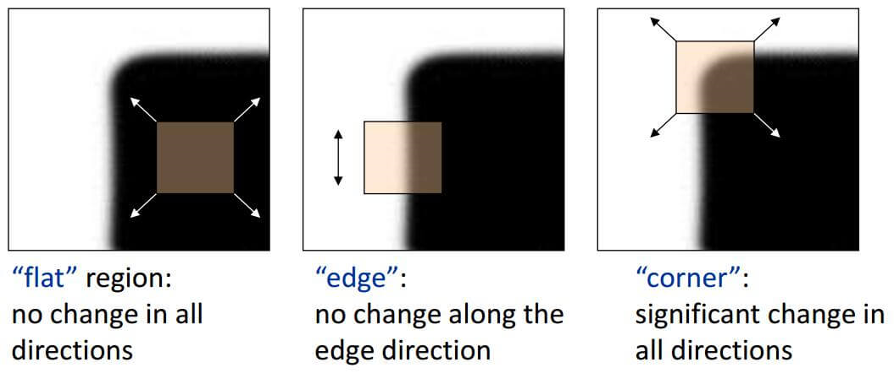
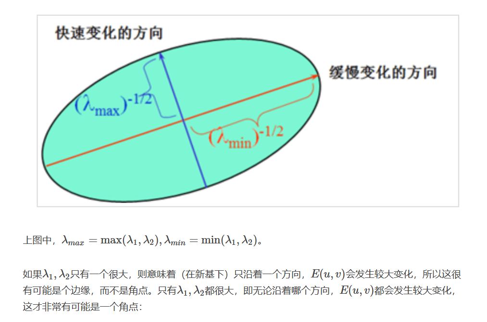
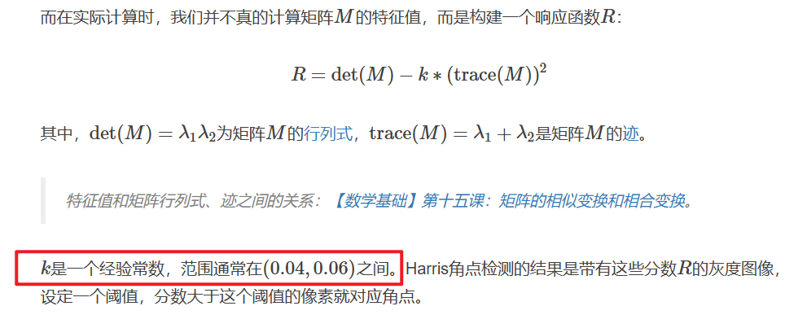

建议看这个博主的[博客](http://shichaoxin.com/2022/05/30/OpenCV%E5%9F%BA%E7%A1%80-%E7%AC%AC%E4%B8%89%E5%8D%81%E4%BA%8C%E8%AF%BE-Harris%E8%A7%92%E7%82%B9%E6%A3%80%E6%B5%8B/)，慢下来从原理开始看，收获太大了！！

1. 角点检测和矩阵的特征值 $\lambda$ 怎么扯起来的？
2. 矩阵的特征值大小和角点检测准确度的联系
3. 函数中有一个参数 k 代表什么含义

这个博主的[博客](http://shichaoxin.com/2022/05/30/OpenCV%E5%9F%BA%E7%A1%80-%E7%AC%AC%E4%B8%89%E5%8D%81%E4%BA%8C%E8%AF%BE-Harris%E8%A7%92%E7%82%B9%E6%A3%80%E6%B5%8B/) 讲的相当好，接下来相当于是复制粘贴了。

#### 问题一：角点检测和矩阵的特征值 $\lambda$ 怎么扯起来的？

什么是角点：如果在任何方向上滑动窗口，窗口内的灰度都会发生变化，则这是一个角点。窗口滑动的灰度变化可以表示为：

这样角点检测就和某个矩阵的特征值相关联起来了。

#### 问题二：矩阵的特征值大小和角点检测准确度的联系

#### 问题三：函数中有一个参数 k 代表什么含义

