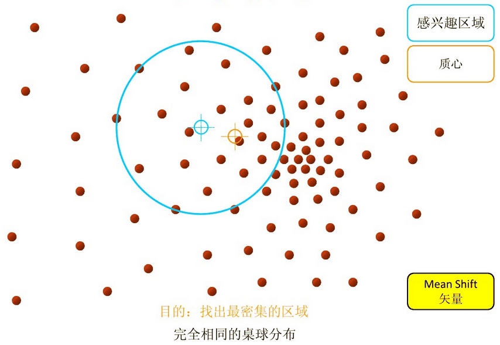

# MeanShift 原理

直接看网上其他文章即可。

MeanShift 和 反向投影经常一起使用。

> 当时就疑惑，这个反向投影的作用究竟有什么用，这不就来了：找模板。即用模板的直方图去在另外一张图上进行反向投影，由于计算反向投影时只用的是模板直方图，所以可以想象反向投影结果：和模板接近的部分基本上大部分像素在模板出现过，所以对应的反向投影上都有值；而和模板不像的地方，出现了模板没出现的像素，反射投影后为 0，所以和模板不像的地方往往会有比较多的 0。

> 所以反向投影后，匹配出反向投影最密集的部分，很大概率是模板。而怎么找到最密集的部分，那就是 MeanShift 和 CamShift 负责的了

直观的理解：

CamShift 在这基础上就是窗口大小可能会变，也可能会旋转，具体原理不细谈了。
