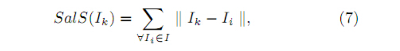
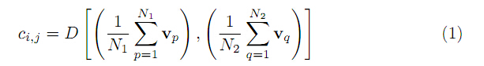
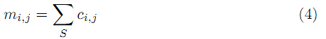

# 显著性检测简单方法记录

简单写写

## LC 算法

Visual Attention Detection in Video Sequences Using Spatiotemporal Cues

就是每个点都算和其他点在像素值上的欧式距离：

## HC 算法

[2011 CVPR Global Contrast based salient region detection Ming-Ming Cheng](http://mmcheng.net/salobj/)

其实就是 LC 算法彩色版，彩色图像有 256x256x256 种颜色，太大了。实际上一幅彩色图像并不会用到那么多种颜色，因此，作者提出了降低颜色数量的方案，将 RGB 分别映射成12等份，这样就可以构造一个较小的直方图用来加速。

但是由于过渡量化会对结果带来一定的瑕疵，因此作者又用了一个平滑的过程。 最后和 LC 不同的是，作者的处理时在 Lab 空间进行的，而由于Lab 空间和 RGB 并不是完全对应的，其量化过程还是在 RGB 空间完成的。

## AC 算法

Salient Region Detection and Segmentation

其实还是 LC 算法的思路，计算每个像素和其他像素的距离再求平均。但是这里用的是像素块，比如是当前像素为中心5x5的块均值去和其他像素为中心5x5的块均值之间的距离。

算法还用了不同程度的块大小，分别求出来，再相加。其实 LC 算法可以看作 AC 算法只用一个程度的块大小，即 1x1 大小的块去求的结果。

直接看链接：https://cloud.tencent.com/developer/article/2067801?areaId=106001

## FT 算法

Frequency-tuned salient region detection

FT 算法实现也非常简单，该方法从频率角度分析图像。低频部分反映了图像的整体信息，高频部分反映了图像的细节信息，如物体的纹理。显著性区域检测用到的更多的是低频部分的信息。

在实际进行计算时，FT方法使用窗口5*5的高斯平滑来实现对最高频的舍去。像素的显著性可以用下面公式计算：

$$
S(p) = || I_{\mu} - I_{w_{hc}}(p) ||
$$

其中，$I_{\mu}$ 为图像的平均特征，使用 Lab 颜色特征；后一项为像素 p 在高斯平滑后的 Lab 颜色特征。

1. 对图像进行5*5的高斯平滑
2. 转换颜色空间。RGB颜色空间转换为CIELAB颜色空间
3. 计算整幅图片的l、a、b的平均值
4. 按照算法中的公式，计算每个像素l、a、b值同图像三个l、a、b均值的欧氏距离，得到显著图
5. 归一化。图像中每个像素的显著值除以最大的那个显著值。得到最终的显著图

链接：https://cloud.tencent.com/developer/article/2067802