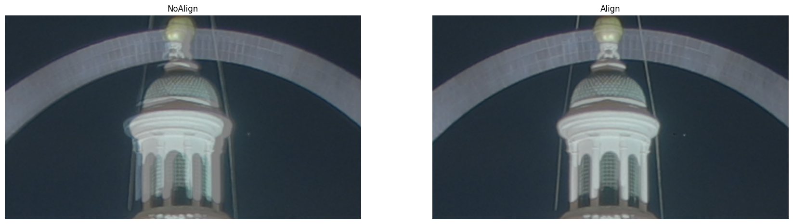
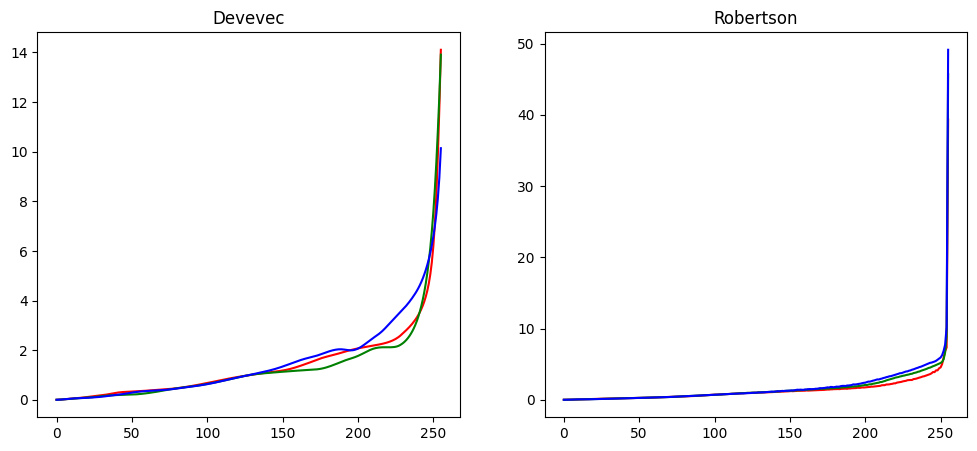
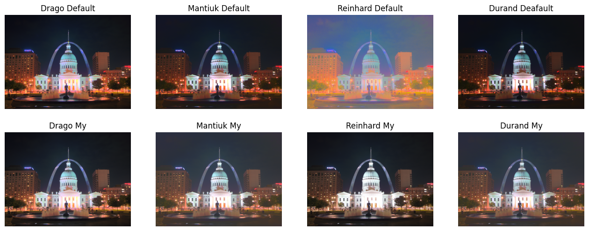

## 9.1 经典的长短帧融合 HDR

不同曝光的图片融合，文章不讲具体原理，这个也是经典方法了，搜一下很容易搜到资料，我当时是深蓝学院的计算摄影学上学到的，授课老师 Wang Hawk 在知乎上也有专栏分享，非常值得一看。

下面主要是走一遍代码流程吧，整体代码在 [test_hdr.ipynb](../code/test_hdr.ipynb)，基本就是对 LearnOpenCV 的复制粘贴：https://learnopencv.com/high-dynamic-range-hdr-imaging-using-opencv-cpp-python/

原始数据：三个不同曝光的图片；目标输出：三张图片融合为一张。

### 1. 对齐图片

对齐，无需多言，这里对齐不常用特征点+变换矩阵的方法，而是使用一个叫做 MTB(Median Threshold Bitmap) 的一个方法，具体可以看图像配准那个部分写的[文章](./5.3.md)

```python
# 对齐和不对齐显示
result = []

mean_img = np.mean(images, axis=0).astype(np.uint8)
result.append(['NoAlign', np.copy(mean_img)[600:800, 1250:1600]])

alignMTB = cv2.createAlignMTB()
alignMTB.process(images, images)
mean_img = np.mean(images, axis=0).astype(np.uint8)
result.append(['Align', np.copy(mean_img)[600:800, 1250:1600]])

show_images(result)
```



### 2. 获取响应曲线

这个要写一下简单的原因，之后再补。

```python
# 返回值: (256, 1, 3)，即 0-256 下 RGB 各自响应值
calibrateDebevec = cv2.createCalibrateDebevec()
responseDebevec = calibrateDebevec.process(images, exp_times)
```



### 3. 融合

最后得到一个 hdr 图片，hdr 图片每个像素是 np.float32，不过范围可以任意（这就是 HDR 的含义），可以很大。

```python
mergeDebevec = cv2.createMergeDebevec()
hdrDebevec = mergeDebevec.process(images, exp_times, responseDebevec)
# cv2.imwrite("hdrDebevec.hdr", hdrDebevec)
```

### 4. Tonemap

这其实是一个单独的话题了，就是把高动态转为可以显示器显示，即所谓的低动态。四种方法：

```python

# Tonemap methods
def to_ldr(now_method, hdr_img):
    ldr_img = now_method.process(hdr_img)

    # 去除过于离散的点后再进行归一化
    meanv, stdv = np.mean(ldr_img), np.std(ldr_img)
    minv = max(meanv-3*stdv, ldr_img.min())
    maxv = min(meanv+3*stdv, ldr_img.max())
    ldr_img = (ldr_img - minv) / (maxv - minv)

    ldr_img = (ldr_img * 255).clip(0, 255).astype('uint8')

    return ldr_img

tonemapDrago = cv2.createTonemapDrago()
ldrDrago0 = to_ldr(tonemapDrago, hdrDebevec)

tonemapDrago = cv2.createTonemapDrago(1.0, 0.7)
ldrDrago1 = to_ldr(tonemapDrago, hdrDebevec)

tonemapMantiuk = cv2.createTonemapMantiuk()
ldrMantiuk0 = to_ldr(tonemapMantiuk, hdrDebevec)

tonemapMantiuk = cv2.createTonemapMantiuk(2.2,0.85, 1.2)
ldrMantiuk1 = to_ldr(tonemapMantiuk, hdrDebevec)

tonemapReinhard = cv2.createTonemapReinhard()
ldrReinhard0 = to_ldr(tonemapReinhard, hdrDebevec)

tonemapReinhard = cv2.createTonemapReinhard(1.5, 0,0,0)
ldrReinhard1 = to_ldr(tonemapReinhard, hdrDebevec)

# You need to set the OPENCV_ENABLE_NONFREE option in cmake to use those. Use them at your own risk.
tonemapDurand = cv2.xphoto.createTonemapDurand()
ldrDurand0 = to_ldr(tonemapDurand, hdrDebevec)

tonemapDurand = cv2.xphoto.createTonemapDurand(contrast=2.5, saturation=0.6)
ldrDurand1 = to_ldr(tonemapDurand, hdrDebevec)

show_images([
    ('Drago Default', ldrDrago0), 
    ('Mantiuk Default', ldrMantiuk0), 
    ('Reinhard Default', ldrReinhard0), 
    ('Durand Deafault', ldrDurand0),

    ('Drago My', ldrDrago1), 
    ('Mantiuk My', ldrMantiuk1), 
    ('Reinhard My', ldrReinhard1), 
    ('Durand My', ldrDurand1), 
], colnum=4)
```


