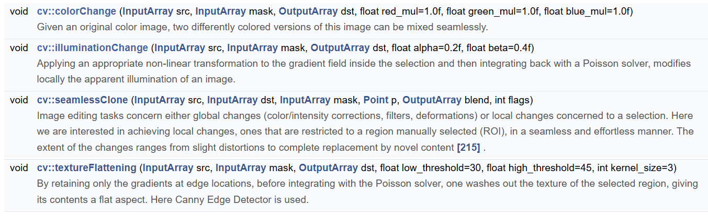
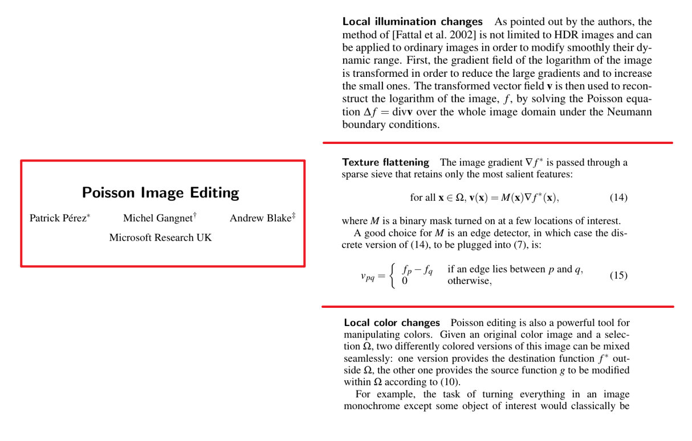

## 9.2 图像泊松融合

又是一个入门必学，学了没用的知识(doge)：泊松融合，让两张图片更好更自然的融合。用到了变分思想，参考资料还是推荐 Hawk Wang 老师在知乎上的专栏，以及授课的计算摄影学。

主要是四个函数，具体用法直接看代码就好（[test_poisson.ipynb](../code/test_poisson.ipynb)）：

colorchange是更平滑的改变 mask 标记的物体的颜色，从而不显得让物体和图片中 mask 之外的地方之间太过突兀。

illuminationChange通常用于去除高亮部分；textureFlattening 用于去除纹理；seamlessClone 就是融合两张图片。

虽然这四个函数并不都是图片融合，但是都用到了泊松融合的知识，其实这几个应用是在原论文里面提到的：

