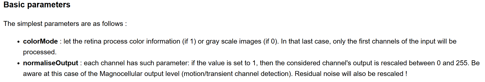
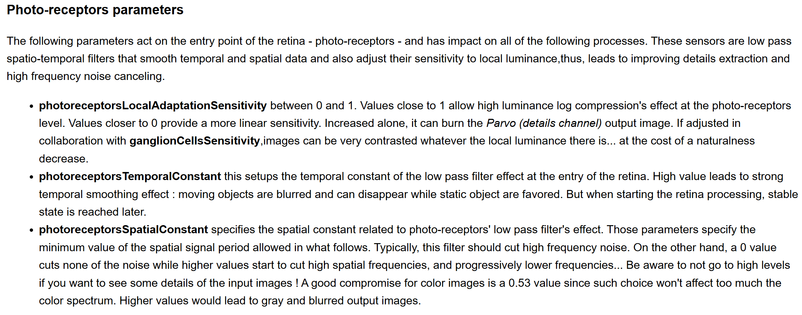
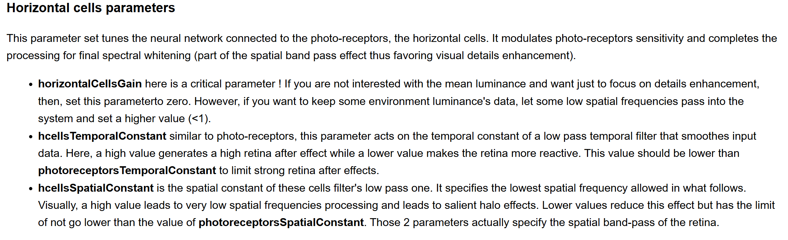
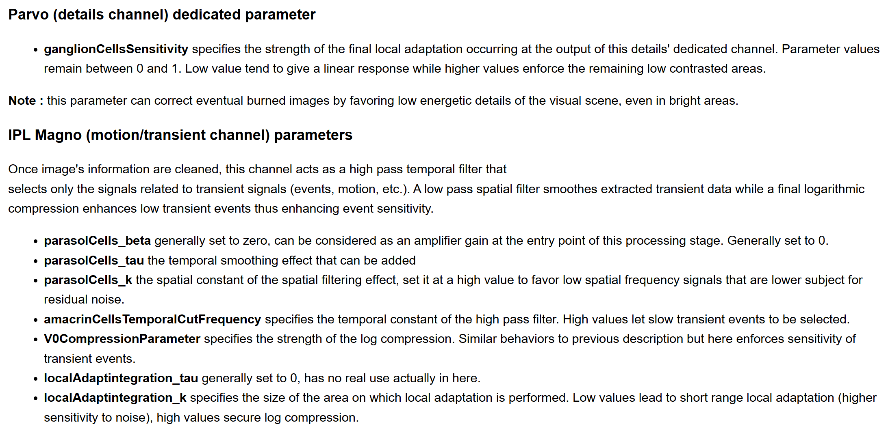

## Retina 视网膜模型

OpenCV 专门的 bininspired 模块来负责 Retina 视网膜模型的功能，大部分研究来自某个大学实验组的研究内容。

要细说估计得学半天，因为我看这个有好多相关论文，具体可以看 OpenCV 的这个[介绍文档](https://docs.opencv.org/4.x/d2/d94/bioinspired_retina.html) 里面涉及到的参考链接。我看有好多地方可以用这个工作：对比度增强、去马赛克色彩插值、Tonemapping、运动检测等等...

这里就简单理解下，Retina 貌似是用一堆参数来模拟人眼两种视觉细胞的行为，反正每个参数最后导致对图片有一定的影响。一共有两种视觉细胞：parvo 和 mangno，前者看起来是负责主体视觉的，对比度增强、ToneMapping 等都是改变它并且获取它的输出结果；后者看起来是负责运动检测的。

### 使用时的总体逻辑
OpenCV 的使用方法：有一个 Retina 类。先创建一个对象，然后这个对象有一堆参数，调整完参数后就使用 `getParvo` 和 `getmagno` 来获取上述两种视觉细胞产生的结果。

设置参数方法是 `setupOPLandIPLParvoChannel`。之所以提这个是因为我在实验的时候踩了一个坑：最好调用这个函数一次性把想设置的参数设好，不要反复调用它。因为不显著指定某个参数的值时，它会用默认值。所以当前调用如果没显著声明之前设好的参数，那么之前设好的参数会被替换掉。

```cpp
virtual void cv::bioinspired::Retina::setupOPLandIPLParvoChannel (
    const bool  colorMode = true, 
    const bool  normaliseOutput = true,
    const float photoreceptorsLocalAdaptationSensitivity = 0.7f,
    const float photoreceptorsTemporalConstant = 0.5f,
    const float photoreceptorsSpatialConstant = 0.53f,
    const float horizontalCellsGain = 0.f,
    const float HcellsTemporalConstant = 1.f,
    const float HcellsSpatialConstant = 7.f,
    const float ganglionCellsSensitivity = 0.7f 
)
```

### 参数说明
<details>
    <summary> 
        具体参数的含义，来自 <a href=https://docs.opencv.org/4.x/d2/d94/bioinspired_retina.html>OpenCV 介绍文档</a>
    </summary>
    
    
    
    
    
</details>

其中实测 horizontalCellsGain 应该要乘以 100，即文档上说要设置 0.4，实际应该要设置为 40。自己实验的代码在 [test_retina.ipynb](../code/test_retina.ipynb) 中。

### 其他说明

Opencv 还有一个 RetinaFastToneMapping 类，这个是 Retina 用于 Tonemapping 的。相当于涉及到的参数会少一点，即上面那么多的参数有一些是不起作用的。但不知道为什么，我实验的时候用这个类，最后出来的结果是黑图。不过 Retina 类有一个 `applyFastTonemapping` 方法，也是一样的，专门用于 tonemapping；当然如果直接用常规的 `getParvo` 获取 Parvo 细胞（主体视觉）的输出也可以做 tonemapping，只不过要考虑的参数可能会多一点（因为这个方法就是所有参数都会对结果有影响）。实验代码在 [test_retina.ipynb](../code/test_retina.ipynb) 中。

Opencv 还有一个 TransientAreasSegmentationModule 类，这个是用于运动检测的。原理上是利用了 Magno 细胞（周边运动）的输出结果。实验代码在 [test_retina.ipynb](../code/test_retina.ipynb) 中。

Retina 类还有一些其他的方法，如保存或读取配置文件等。具体实验代码在 [test_retina.ipybn](../code/test_retina.ipynb) 中了。这里直接复制一段，便于不用跳转直接查阅：
```python
'''
Retina 提高对比度
'''
# 说明：在 retina 处理 src 前可以进一步处理 src，常见的如只保留直方图的 5%-95% 之间的像素
src = cv2.imread('./image/retina/input.JPG')

# 创建 retina
retina = cv2.bioinspired_Retina.create((src.shape[1], src.shape[0]))
 
# 打印属性 / 保存属性
# retina.write('retinaParams.xml')
# print(retina.printSetup())

# 读取默认配置
retina.setup('./data/retina/default_retina_config.xml')
# 各个参数含义：https://docs.opencv.org/4.x/d2/d94/bioinspired_retina.html
retina.setColorSaturation(colorSaturationValue=4.0)
# 重要：参数必须要一下子设完，不要出现多次 setupxxx，否则当前 setup 会用默认值覆盖掉前面设好的参数！
retina_config = {
    'photoreceptorsLocalAdaptationSensitivity': 0.6, 
    'ganglionCellsSensitivity': 0.6, 
    'horizontalCellsGain': 20,
}
retina.setupOPLandIPLParvoChannel(**retina_config)
# 可以用 write 到一个配置文件中，看看是否参数设置成功
# retina.write('./test.xml') 
retina.run(src)
cv2.imshow('My Parvo', retina.getParvo())
cv2.imshow('My Magno', retina.getMagno())
```