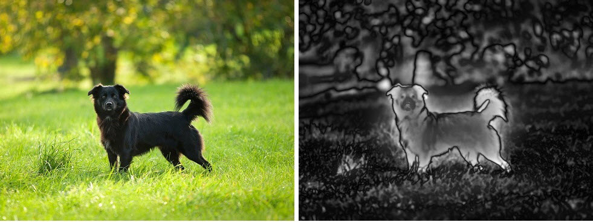
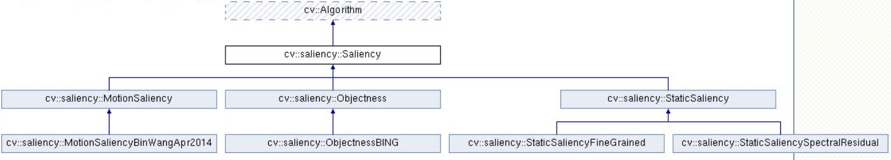

## OpenCV 的显著性检测

**大部分是摘抄，建议直接看这篇文章，足够了：[https://blog.csdn.net/LuohenYJ/article/details/108607926](https://blog.csdn.net/LuohenYJ/article/details/108607926)**

而且 OpenCV 里面的显著性检测其实效果很烂，没有必要多深究。

### 显著性检测是什么

人类具有一种视觉注意机制，即当面对一个场景时，会选择性地忽略不感兴趣的区域，聚焦于感兴趣的区域。这些感兴趣的区域称为显著性区域。视觉显著性检测（Visual Saliency Detection，VSD）则是一种模拟人类视觉并从图像中提取显著性区域的智能算法。如下面左边的图所示，人眼在观看该图片时会首先注意其中的小狗，自动忽略背景区域，小狗所在区域就是显著性区域。通过计算机视觉算法对左边的图像进行视觉显著性检测能够得到下图右边的结果，其中黑色区域为不显著区域，白色为显著区域，显著性检测在机器人领域、目标检测领域和图像识别领域有大量应用。



显著性检测算法与目标检测算法大大不同。显著性检测算法，只是判断图中有显著目标的区域，这些区域可能包含目标也可能不包含目标，因方法而异。类比人眼的观察方式，显著性检测算法是许多计算机视觉任务的第一步，检测出显著性区域后，对这些显著性区域进行进一步判断和预测。显著性检测算法通常检测速度较快，某些计算量大的算法如深度学习图像分类算法，可以只在显著性区域上运行，以缩小检测范围，加快检测速度，提高检测精度。

### OpenCV 中的显著性检测

OpenCV saliency模块提供了四种不同的显著性检测方法，但是按方法类别只有三种。OpenCV saliency模块的类关系如下图所示：



其中 MotionSaliencyBinWang 只能输入视频，其他三种可以处理图片。方法评价（总之都是一般...）：
- Motion saliency：输入为连续的图像帧，通过运动检测算法对连续图像帧进行处理，然后对运动目标进行跟踪，最终将运动目标设置为显著区域。算法容易出现丢帧和鬼影情况，运动检测效果不如主流的运动检测算法，实际图像显著性检测效果一般。
- Objectness：算法输入为单帧图像，通过计算得到大量的建议区域，并将这些建议区域作为显著性区域。该类算法检测速度较慢，实际检测出来的建议区域可能上万个，需要进行筛选，总体效果一般。
- Static saliency：输入为单帧图像，通过图像特征和统计量来定位图像中的显著性区域。该类算法检测速度非常快，不过效果总体一般。

### 代码
实验代码在 [test_saliency.ipynb](../code/test_saliency.ipynb) 中，只写了处理图片的三种，这里也写一下，便于快速查阅：
```python
import cv2
import numpy as np
src = cv2.imread('./image/cow.jpg')

model = cv2.saliency.StaticSaliencySpectralResidual.create()
success, saliencyMap = model.computeSaliency(src)

model = cv2.saliency.StaticSaliencyFineGrained.create()
success, saliencyMap = model.computeSaliency(src)

model = cv2.saliency.ObjectnessBING.create()
model.setTrainingPath('./image/saliency/ObjectnessTrainedModel')
success, saliencyRects = model.computeSaliency(src)
# 这个方法返回的是 (n, 1, 4)，即各个框，这里显示 30 个
saliencyMap = np.copy(src)
for i in range(0, min(saliencyRects.shape[0], 30)):
	(startX, startY, endX, endY) = saliencyRects[i].flatten()
	color = [int(c) for c in np.random.randint(0, 255, size=(3,))]
	cv2.rectangle(saliencyMap, (startX, startY), (endX, endY), color, 2)
```