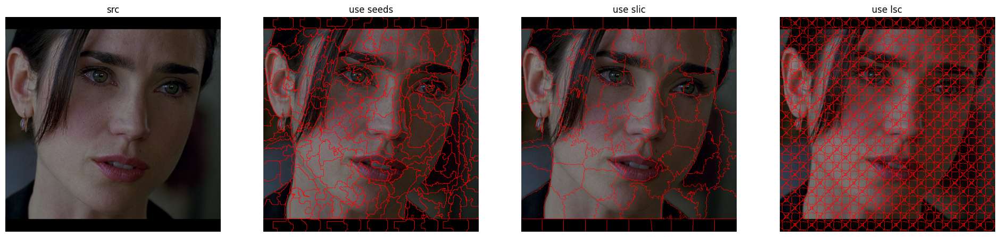

## SuperPixels（超像素）

什么是 superpixels，一图胜千言：



AI 的回答：每个块被称为一个超像素，这些超像素通常包含相似的颜色、纹理和亮度等特征，使得它们在视觉上具有一定的连贯性和意义。使用超像素的主要优点包括：

1. **降低计算复杂度**：通过使用较少的超像素代替大量像素，可以简化后续图像处理任务，如图像分割、特征提取等。

2. **保留图像结构**：超像素在分割图像的同时，尽量保持了图像中物体的边界信息，使得分割结果更符合视觉感知。

3. **提高处理速度**：在进行图像处理时，如使用图论方法分离前景背景，使用超像素可以大大减少需要处理的节点数，从而加快处理速度。

4. **特征提取**：超像素可以用于提取颜色直方图、纹理信息等特征，有助于后续的图像分析任务。

5. **图像重建**：超像素可以用于图像的压缩和重建，通过保留主要特征来减少数据量。

6. **增强区域连通性**：在分割过程中，可以通过增强连通性来解决超像素过小或不连续的问题。

7. **应用于深度学习**：超像素可以集成到深度学习模型中，用于学习任务特定的超像素特征，提高模型性能。

8. **多领域应用**：超像素在医学图像分割、视频前景分割、目标跟踪、骨架提取、人体姿态估计等多个领域都有应用。


OpenCV 中 ximgproc 有一节专门负责 SuperPixels，有三类，看代码即可，代码如下：
```python
import cv2
import numpy as np
from utils import show_images

src = cv2.imread('image/edge/sources/06.png')

'''
class  	cv::ximgproc::SuperpixelLSC
class  	cv::ximgproc::SuperpixelSEEDS
class  	cv::ximgproc::SuperpixelSLIC
'''

rgb_src = cv2.imread('image/edge/sources/06.png')
hsv_src = cv2.cvtColor(rgb_src, cv2.COLOR_BGR2HSV)

# SEEDS 参数，请自行调整，原来 samples 文件对各个参数有 trackbar 调整方式，参数后面的注释就是其中的最大值
prior = 2               # 5
num_levels = 4          # 10
num_iterations = 4      # 1000
num_superpixels = 400   # 1000

num_histogram_bins = 5
double_step = False

seeds = cv2.ximgproc.createSuperpixelSEEDS(src.shape[1], src.shape[0], src.shape[2], num_superpixels, num_levels, prior, num_histogram_bins, double_step)
seeds.iterate(hsv_src, num_iterations)

# SLIC 参数
region_size = 50        # 200
ruler = 30              # 100
min_element_size = 50   # 100
num_iterations = 4      # 12
algorithm = cv2.ximgproc.SLIC   # SLIC, SLICO, MSLIC

slic = cv2.ximgproc.createSuperpixelSLIC(hsv_src, algorithm, region_size, ruler)
slic.iterate(num_iterations)
slic.enforceLabelConnectivity(min_element_size)

# LSC 参数
region_size = 10
ration = 0.075
num_iterations = 4

lsc = cv2.ximgproc.createSuperpixelLSC(hsv_src, region_size, ruler)
lsc.iterate(num_iterations)


for now in [seeds, slic, lsc]:
    labels = now.getLabels()
    mask = now.getLabelContourMask()
    nowimg = np.copy(src)
    nowimg[mask != 0] = [0, 0, 255]

    show_images([
        ('src', rgb_src),
        ('result', nowimg),
        ('mask', mask),
        ('labels', labels)
    ])
```