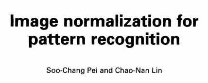
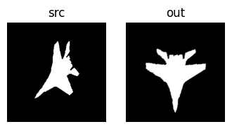

## PeiLin Transformation

没看懂...原始论文如下，可以看到 PeiLin 是两个作者的姓。



OpenCV 的函数介绍已经讲清楚了：

> Assume given image I=T(I¯) where I¯ is a normalized image and T is an affine transformation distorting this image by translation, rotation, scaling and skew. The function returns an affine transformation matrix corresponding to the transformation T−1 described in [PeiLin95].

但是关键点是 normalized image 是什么，原论文说是无论缩放、旋转都不会变的图片，太奇怪了，没理解。

> Here, we define normalization as a process which transforms the input pattern into a normal form that is invariant under translation, rotation, scaling and skew. We call the transformed image a normalized image. Since the normalized image is invariant under translation, rotation, scaling and skew, we can recognize patterns just by a simple matching method.

OpenCV 的调用：

```python
import cv2
from utils import show_images

src = cv2.imread('./image/peilin_plane.png', cv2.IMREAD_GRAYSCALE)
M = cv2.ximgproc.PeiLinNormalization(src)

out = cv2.warpAffine(src, M, dsize=None)

show_images([ ('src', src), ('out', out) ])
```


