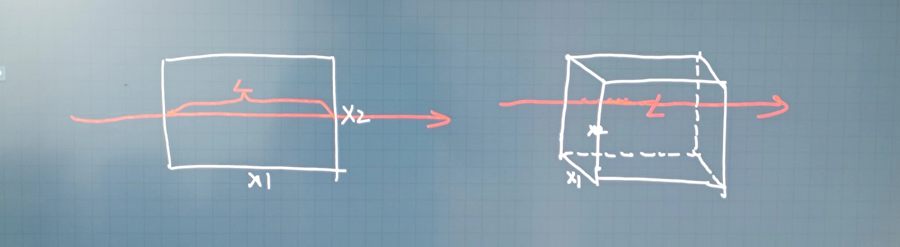

## Radon Transform

CT 用到的技术，我觉得这篇文章讲的特别棒：https://www.cnblogs.com/TaigaCon/p/5191628.html

文章里面说 x 是传播距离，是指光在穿过的物体是的传播距离，如下图，左边是二维的情况，右边是三维的情况：

OpenCV 中有一个 API 可以实现 Radon Transform，不推荐用，啥例子都没有。skimage 也有实现，别人有例子：https://scikit-image.org/docs/stable/auto_examples/transform/plot_radon_transform.html
