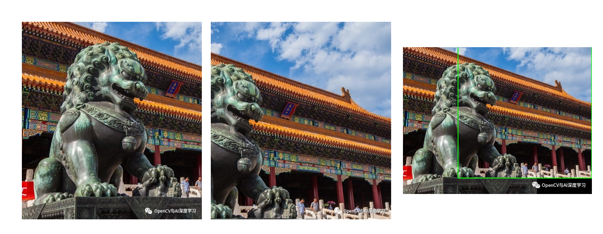

## Phase Correlate 相位相关配准

OpenCV Image Processing 模块有一个 [phaseCorrelate 方法](https://docs.opencv.org/4.x/d7/df3/group__imgproc__motion.html#ga552420a2ace9ef3fb053cd630fdb4952)。

这个就理解成计算两张图片之间的位移，用于图像拼接。

这个文章讲的可以：https://cloud.tencent.com/developer/article/1851548

### 原理说明

简单说一下原理，其实就是对两个图片功率谱进行一些计算。

当两幅函数 `f1(x,y)` 和 `f2(x,y)` 仅仅有位移的差异，即 `f2(x,y) = f1(x-a,y-b)`，则它们的傅立叶变换 `F1(u,v)` 和 `F2(u,v)` 有如下关系：

$$
F_2(u,v) = F_1(u,v) * e^{-j2\pi(ua+vb)}
$$

然后他们的互功率谱如下：

$$
\frac{F_1(u,v) * F_2^*(u,v)}{|F_1(u,v) * F_2(u,v)|} = e^{-j2\pi(ua+vb)}
$$

式中 $F^*$ 表示 $F$ 的共轭，所以就可以计算两张图片的互功率谱，然后就能推出平移关系了。

### 拼接结果

两张图的拼接结果：

### 其他说明

1. 相位相关法相比模板匹配方法可以自动计算偏移量，省去设定模板的步骤；

2. 在特征点较少的图像拼接情况下，特征匹配如SIFT/SURF可能会失败，此时可尝试相位相关法：

3. 相位相关法不适用图像有周期性重复区域的图像，如棋盘格图像。

4. 一些畸变明显的图像不能单纯靠此方法得到好的效果。

