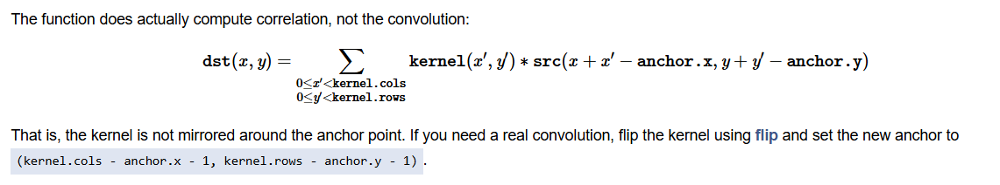
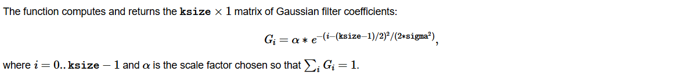
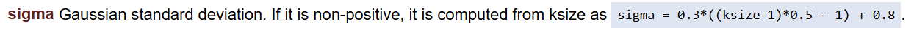
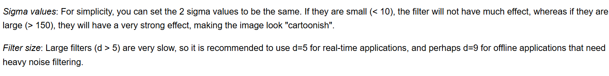
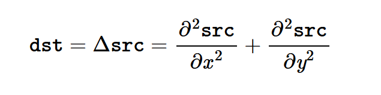

# 1.1：各种滤波

- [Image Process - Image Filtering](https://docs.opencv.org/4.x/d4/d86/group__imgproc__filter.html)

一些滤波，基础知识。

前提知识：基本没有，知道滤波是个啥玩意就行，网上查一下，五分钟搞定。

## 函数说明：

个人认为可以把 OpenCV 滤波函数分为四种类型：第一，通用型函数、获取滤波核函数；第二，常见的低通滤波；第三，常见的高通滤波；第四，杂项滤波。

通用型、获取滤波:

- [filter2D](https://docs.opencv.org/4.x/d4/d86/group__imgproc__filter.html#ga27c049795ce870216ddfb366086b5a04)：通用二维滤波
- [sepFilter2D](https://docs.opencv.org/4.x/d4/d86/group__imgproc__filter.html#ga910e29ff7d7b105057d1625a4bf6318d)：可拆分的二维滤波，如高斯滤波，可以拆分为两个一维滤波叉乘，对于这种滤波按照两个一维去做速度会增加很多，该方法就需要传入两个一维滤波作为其中参数
- [getGaussianKernel](https://docs.opencv.org/4.x/d4/d86/group__imgproc__filter.html#ga76e863e7869912edbe88321253b72688): 获取高斯滤波核
- [getDerivKernels](https://docs.opencv.org/4.x/d4/d86/group__imgproc__filter.html#ga6d6c23f7bd3f5836c31cfae994fc4aea): 获取Sobel算子和Scharr算子的滤波核

低通:

- [blur](https://docs.opencv.org/4.x/d4/d86/group__imgproc__filter.html#ga8c45db9afe636703801b0b2e440fce37): 均值滤波，最后会归一化（即如果是3x3，那么就会除以9）
- [boxFilter](https://docs.opencv.org/4.x/d4/d86/group__imgproc__filter.html#ga8c45db9afe636703801b0b2e440fce37): 相当于是上面blur的一个扩展，有参数支持是否归一化
- [sqrBoxFilter](https://docs.opencv.org/4.x/d4/d86/group__imgproc__filter.html#ga76e863e7869912edbe88321253b72688): 平方后进行均值滤波（常用在求方差、标准差等操作）
- bilateralFiltear, GaussionBlur, medianblur: 双边滤波，高斯滤波，中值滤波
- [stackBlur](https://docs.opencv.org/4.x/d4/d86/group__imgproc__filter.html#ga13a01048a8a200aab032ce86a9e7c7be): stackBlur can generate similar results as Gaussian blur, and the time consumption does not increase with the increase of kernel size.

高通:

- [Sobel, Scharr](https://docs.opencv.org/4.x/d4/d86/group__imgproc__filter.html#gacea54f142e81b6758cb6f375ce782c8d): Sobel算子, Scharr算子，都是相当于图像一维求导，其中第一个函数已经覆盖了第二个函数
- [Laplacian](https://docs.opencv.org/4.x/d4/d86/group__imgproc__filter.html#gad78703e4c8fe703d479c1860d76429e6): 拉普拉斯滤波（相当于二维求导）

其他滤波:

- [getGaborKernel](https://docs.opencv.org/4.x/d4/d86/group__imgproc__filter.html#ga6d6c23f7bd3f5836c31cfae994fc4aea): 获取 Gabor 核，常用于纹理表示与判别
- [pyrMeanShiftFiltering](https://docs.opencv.org/4.x/d4/d86/group__imgproc__filter.html#ga9fabdce9543bd602445f5db3827e4cc0): 色彩上的的均值模糊（水彩画风格），[图片](./image/1.1/20190702132744870.png)（[原文](https://blog.csdn.net/kingkee/article/details/94437333)）

## 具体细节

具体用的时候还是要查文档，这里只是记录一下用的时候注意点。有些函数有的属性没记录，要么太简单（比如 src 这种表示输入图片），要么和别的函数一样（这个全局搜索一下即可）。

### filter2D

  

**这个函数做的是相关操作，而不是卷积！！如图片所属，如果核不是对称的，需要事先翻转！！**

- kernel: 滤波核，single-channel 操作，也就是即使输入彩色图片，每一个通道都是做同样的滤波操作。**如果想要通道做不同处理，需要自行分离通道，分别去调用滤波函数再合成**
- achor: 如上面图片所展示的。默认值 (-1, -1) 会自动将其放在滤波核的中心，一般都是这个参数，没太理解这个的意义
- [borderType](https://docs.opencv.org/4.x/d2/de8/group__core__array.html#ga209f2f4869e304c82d07739337eae7c5): 边界怎么处理，经典的细节问题了。默认值是类似 `gfedcb|abcdefgh|gfedcba` 这种处理。

不重要的参数:

- ddepth: 滤波后图片的深度，即第三维度是多少。-1则保持输入图片一样，一般都是这个参数（比如输入RGB彩色图片，-1保持一样，那么第三维度就是3）
- delta: 计算完结果做一个偏移，个人感觉没啥用，后续多写一句话即可

### sepFilter2D

- 如果能拆分就请尽量用这个函数，速度提升确实很多
- kernelX, kernelY：两个方向的滤波核

### getGaussianKernel

- 如图片所述，返回值不是二维的矩阵，而是一维！即二维高斯核拆分后的一维向量。可以直接传入 sepFilter2D 函数，如果想要二维核，请手动再去乘一下。
- sigma 如果不是正数，则是通过图片所展示的公式计算。
- ksize 表示直径，Opencv 中其他函数的 ksize 也都是直径。

### getDerivKernels

- 返回两个 n*1 的向量，叉乘后对应 Sobel 或 Scharr 的二维核；常用的几个组合:
  - ksize=-1, dx=1, dy=0: [-1, 0, 1] * [3, 10, 3]
  - ksize=1, dx=1, dy=0: [-1, 0, 1] * [0]
  - ksize=3, dx=1, dy=0: [-1, 0, 1] * [1, 2, 1]
  - ksize=3, dx=1, dy=1: [-1, 0, 1] * [-1, 0, 1]
- dx, dy: Derivative order，官方文档没有给出核内容生成的公式，试了一些(ksize, dx, dy)组合很难推出公式来，[源码](https://github.com/opencv/opencv/blob/4.x/modules/imgproc/src/deriv.cpp#L172)也很难看出来，用的时候直接动手随便试。不过上面常用的占了绝大部分场景。

### blur, boxFilter

- blur 默认归一化，boxFilter 有一个参数 normalize，bool 属性用于标识是否归一化；所以只要记住 boxFilter 即可

### GaussianBlur

- ksize: 格式 (x, y)，x 和 y 奇数；如果是 (0, 0)，那么将会根据 sigma 计算，根据在 getGaussianKernel 那里的图片公式，本质其实类似直径要大于6倍标准差。
- sigmaX, sigmaY: 标准差；sigmaY 如果为 0，那么就和 sigmaX 相等；sigmaXY 都为 0，那么就按照 ksize 计算，同样参考 getGaussianKernel 那里的图片公式。

### medianBlur

- src:  When ksize is 3 or 5, the image depth should be CV_8U, CV_16U, or CV_32F. For larger ksize, it can only be CV_8U.
- medianBlur 的边界处理和其他不同，是 `aaaaaa|abcdefgh|hhhhhhh`，而且这个好像还不能改...

### bilateralFilter

OpenCV 本身官网就写的非常好了，直接参考过来：

- d, sigmaSpace: 核的直径，空间上的 sigma；如果 d 不是正数，那么由 sigmaSpace 计算；**如果 d 是正数，那么 sigmaSpace 无论有没有赋值，最后实际中肯定是通过 d 计算的**。计算方式参考 getGaussianKernel，一样的。
- sigmaColor: A larger value of the parameter means that farther colors within the pixel neighborhood (see sigmaSpace) will be mixed together, resulting in larger areas of semi-equal color.

### stackBlur

- 参数很少，直接查阅官方文档。

### Sobel, Scharr

- 前者已经包含后者了，直接用第一个函数即可；这两函数和 getDeriveKernels 深度绑定，可以先去那个函数查阅
- ksize=-1: 使用 Scharr 内核，其大小为 3\*3，并且**如果内核大小确定是 3，那么更推荐用 Scharr，其效果更好**
- ksize=1: 和 get DerivKernels 一样，用的是 3x1，如 dx,dy=1,0 时核内容为 [-1, 0, 1]
- ksize, dx, dy: 和 getDerivKernels 一样属性。同样很难根据参数手算出核内容，所以先用 getDerviKernels 查看核内容。

### Lapalician

- ksize=1: 此时核内容就是常说的 [[0, -1, 0], [-1, 4, -1], [0, -1, 0]]
- ksize>1: 利用 Sobel 算子做如下公式，具体的 Sobel 算子可以先用 getDerivKernels 看一下内容。
  

### getGaborKernel

- 参数具体可查阅文档，没有什么其他额外的设置。比起函数使用，我觉得更重要的是 Gabor Filter 究竟用在什么地方，很少用到，查阅资料主要还是纹理识别方面，这两篇文章相对实用性较强：[文章一](https://scikit-image.org/docs/stable/auto_examples/features_detection/plot_gabor.html)，[文章二](https://ww2.mathworks.cn/help/images/texture-segmentation-using-gabor-filters.html)

### pyrMeanShiftFiltering

- 参数没什么说的，都是算法原理上涉及到的超参。算法的细节原理：**TODO**