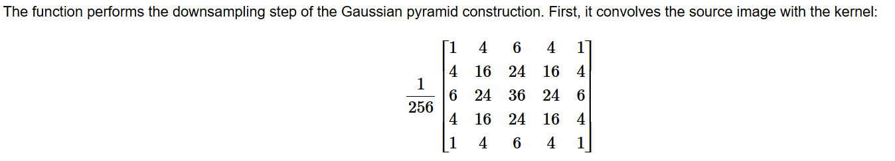
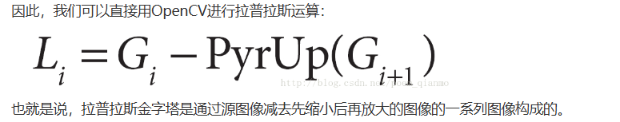

# 1.2：金字塔函数

- [Image Process - Image Filtering](https://docs.opencv.org/4.x/d4/d86/group__imgproc__filter.html)

图片金字塔[是什么](https://zhuanlan.zhihu.com/p/112040797)；目的就是不同尺度做不同程度的调整，这样可以在速度和质量上权衡，比如我只在低尺度下做精细的图像处理，速度会快一些。

什么时候想到用这个：做完任何图像处理都可以想到要用金字塔，比如图像对准、去噪等等都可以去用金字塔，这个相当于是一个 Warp，其改变的是图片尺寸，和图像处理算法是不冲突的。

## 函数说明：

- [pyrDown](https://docs.opencv.org/4.x/d4/d86/group__imgproc__filter.html#ga910e29ff7d7b105057d1625a4bf6318d): 高斯金字塔的下采样，即先高斯平滑然后行列各自少一半
- [pyrUp](https://docs.opencv.org/4.x/d4/d86/group__imgproc__filter.html#gada75b59bdaaca411ed6fee10085eb784): 高斯金字塔的上采样，即先行列加一半然后高斯平滑
- [buildPyramid](https://docs.opencv.org/4.x/d4/d86/group__imgproc__filter.html#gacfdda2bc1ac55e96de7e9f0bce7238c0)：构建高斯金字塔

## 具体细节

### pyrDown, pyrUP



- 高斯模糊是固定的，不满意则不能用这个函数
- out: 可选项，输出的结果图片，实测在 Python 中没有起作用，返回结果才是最后真正结果
- dstsize: 可选项，输出图片的大小。默认是src长宽除以2，实际这个函数也基本就只能在默认值上下浮动两个单位：`|dstsize.width*2 - src.width| <= 2`；**注意他的顺序是 (cols, rows)，除非特殊情况建议不赋值直接默认。**

### buildPyramid

- OpenCV 文档上有，但 Python 不知道为啥会报错没有，不过这个也可以自己写

### Gaussian and Laplacian Pyrmid

Opencv 里面没有默认的 拉普拉斯金字塔，需要自行写；高斯金字塔有 buildPyramid，但如上面所说，Python 貌似不支持。拉普拉斯的定义：



```python
def Pyramid(img, level=3):
    # 高斯金字塔，不断下采样
    G = [img]
    for _ in range(level):
        img = cv2.pyrDown(img)    
        G.append(img)

    # 拉普拉斯金字塔，高斯上采样，相减
    L = []
    for i in range(level):
        L.append(G[i] - cv2.pyrUp(G[i+1]))

    # 利用拉普拉斯金字塔还原
    img = G[-1]
    for nowL in reversed(L):
        img = cv2.pyrUp(img) + nowL
```
