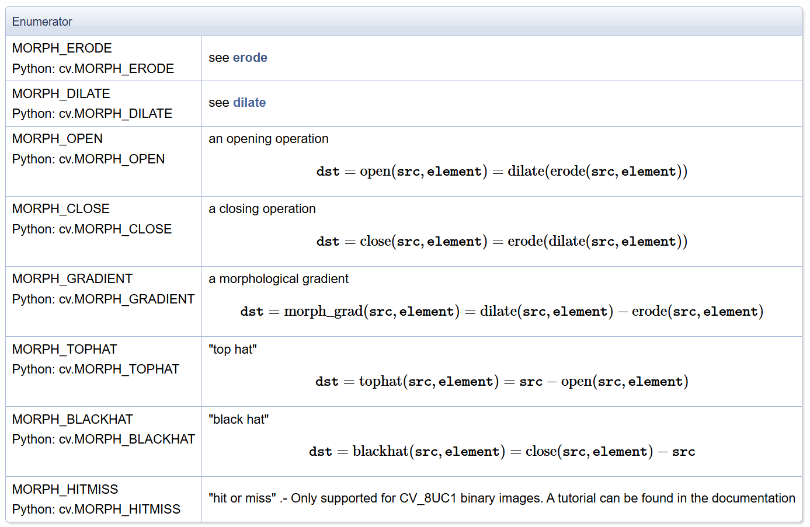
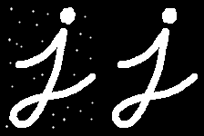
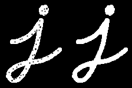
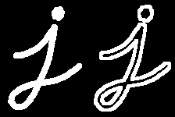
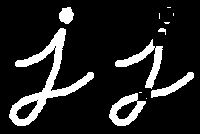
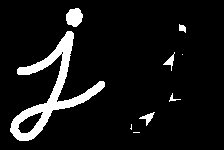

# 1.3：形态学函数

- [Image Process - Image Filtering](https://docs.opencv.org/4.x/d4/d86/group__imgproc__filter.html)

知道形态学是干什么的，这个任何一本基本的图像处理书肯定会讲的，而且在网上搜一下实战即可；什么时候想到用形态学：涉及到极大极小都可以去往这方面想。其实形态学也可以归类为滤波。

## 函数说明：

- [getStructingElement](https://docs.opencv.org/4.x/d4/d86/group__imgproc__filter.html#gac342a1bb6eabf6f55c803b09268e36dc)：构造形态学的【滤波核】
- [morphologyEx](https://docs.opencv.org/4.x/d4/d86/group__imgproc__filter.html#ga67493776e3ad1a3df63883829375201f): 形态学的通用函数
- [erode, dilate](https://docs.opencv.org/4.x/d4/d86/group__imgproc__filter.html#ga4ff0f3318642c4f469d0e11f242f3b6c): 膨胀腐蚀的函数，可以用上面的函数替代

## 具体细节

### getStructingElement

- shape: 形状，有三种：矩形、十字架、椭圆；如果 shape 不满足的话，比如需要菱形，可以不用这个函数，自己构造 ndarray

### morphologyEx



- 滤波核是 uint8，但本质其实是 bool，值分为 0 和 非0；输入块可以是 uint8, uint16 等，最后结果和输入块一样类型
- op: 形态学操作，包括膨胀腐蚀、开闭等等，具体请参考[文档](https://docs.opencv.org/4.x/d4/d86/group__imgproc__filter.html#ga7be549266bad7b2e6a04db49827f9f32)
- iterations: 遍历次数；注意这里的顺序是按照膨胀腐蚀的粒度来进行的；例子：an opening operation (MORPH_OPEN) with two iterations is equivalent to apply successively: erode -> erode -> dilate -> dilate (and not erode -> dilate -> erode -> dilate).

### erode, dilate

- 膨胀腐蚀操作，完全可以被上面的函数替代（即赋值 op 为相对应的操作）

## 形态学操作用途

### 腐蚀、膨胀

腐蚀，膨胀的概念要知道，这方面以前一直没有注意，老是觉得只是分别用来扩大黑白块的，而且网上大部分资料其实很差：要么过于学术了，用集合去定义，非常绕口；要么过于错误，如前所述，认为是扩充或减小边界的。

按照大白话解释就是：腐蚀是赋值为其在 Kernel 上所有非零位置的最小值；膨胀是赋值其在 Kernel 上所有非零位置的最大值。

```python
s = np.array([[1,2,3], [4,5,6], [7,8,9]]).astype(np.uint8)
k = np.array([[0,1,0], [1,1,1], [0,1,0]]).astype(np.uint8)

erode(s, k)[1, 1] == 2
dilate(s, k)[1, 1] == 8
```

### Hit or Miss

Hit or Miss，官方的[文章](https://docs.opencv.org/4.x/db/d06/tutorial_hitOrMiss.html)讲的不错，该操作**对于在二值图像中寻找指定模式是很有用**。它能发现那些邻域像素匹配第一个结构元素B1的形状而同时不匹配第二个结构元素B2的形状的像素。

举例其实就明白了，对于二值化图片，想找到这些像素：自身是黑色、上下左右是白色、其他无所谓；分为两个步骤：

1. 先用 [[0,1,0],[1,0,1],[0,1,0]] 腐蚀原图，经过这个步骤，筛选出上下左右一定是黑色的值。
2. 再用 [[0,0,0],[0,1,0],[0,0,0]] 腐蚀原图反相后的图，此时筛选出自身是白色。
3. 两个筛选出来的图取交集，就能得到要求的点，上面的两个核就分别是 B1 和 B2。

使用 Hit or Miss 时和其他方法的要求不同：原图只能是 U8C1 二值化图，即只有0和255；最终的结果也是如此；而滤波核就是 B1-B2，类型是 int，值只能是零和正负一。

下图就是上面例子的 B1, B2, 最终滤波核，即最终滤波核中 -1 表示必须黑色、1 表示必须白色、0 表示无所谓：


多说一句，为什么只需要知道 B1-B2 就行了，而非 B1 和 B2 具体值呢？如果 B1-B2 某个元素为正负一，这个是可以得出 B1 和 B2 确定值的；但是如果某个元素是 0，那么可能是 1-1 或 0-0，但其实是这样的逻辑：最终滤波核为 0 时表示我们不在意这个地方的元素值，而 B1=0、B2=0 是能达到这样的效果，那么既然可以，源码中遇到输入的最终滤波核为 0 时就让 B1=0、B2=0 即可，此时达到了不在意这个地方的元素值的目的...

代码展示（官方文档也有）：

```python
import cv2 as cv
import numpy as np
 
input_image = np.array((
 [0, 0, 0, 0, 0, 0, 0, 0],
 [0, 255, 255, 255, 0, 0, 0, 255],
 [0, 255, 255, 255, 0, 0, 0, 0],
 [0, 255, 255, 255, 0, 255, 0, 0],
 [0, 0, 255, 0, 0, 0, 0, 0],
 [0, 0, 255, 0, 0, 255, 255, 0],
 [0,255, 0, 255, 0, 0, 255, 0],
 [0, 255, 255, 255, 0, 0, 0, 0]), dtype="uint8")
 
kernel = np.array(([0, 1, 0], [1, -1, 1], [0, 1, 0]), dtype="int")
 
output_image = cv.morphologyEx(input_image, cv.MORPH_HITMISS, kernel)
```

### 其他形态学操作：开闭、梯度、顶帽、黑帽

参考文章：https://blog.csdn.net/phinoo/article/details/113238563

开运算可以用来**消除图像中的细小对象**，在纤细点处分离物体和平滑较大物体的边界而又不明显改变其面积和形状。

闭运算可以用来**填充目标内部的细小孔洞**，将断开的邻近目标连接，在不明显改变物体面积和形状的情况下平滑其边界。

形态学梯度操作能描述图像亮度变化的剧烈程度；当我们想要**突出高亮区域的外围时**，则可以选用形态学梯度来突出边缘，可以保留物体的边缘轮廓。

顶帽是原图与原图的开运算的差值图像。开运算放大了裂缝或者局部低亮度的区域，所以从原图中减去开运算后的图，结果突出了比原图轮廓周围的区域更明亮的区域，这个操作与选择的核的大小有关。**一般用来分离比邻近点亮一些的斑块，可以使用这个运算提取背景。**

黑帽是闭运算结果与原图的差值图像。结果突出了比原图轮廓周围区域更暗的区域，**用来分离比邻近点暗一些的斑块**。

| 开                                          | 闭                                          | 梯度                                        |
| ------------------------------------------- | ------------------------------------------- | ------------------------------------------- |
|  |  |  |

| TopHat                                      | BlackHat                                    |
| ------------------------------------------- | ------------------------------------------- |
|  |  |
