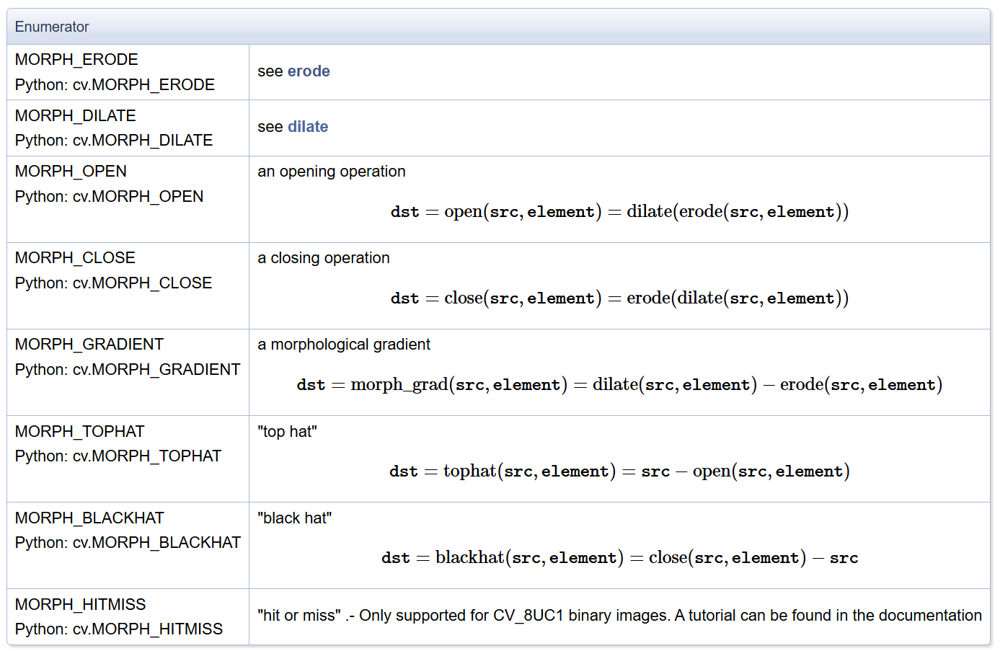
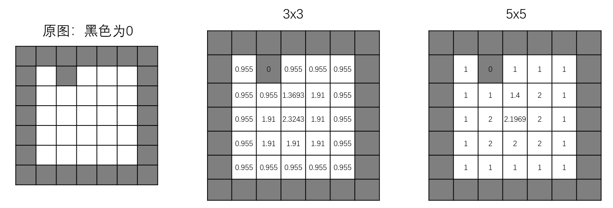

# 1.3：形态学函数

知道形态学是干什么的，这个任何一本基本的图像处理书肯定会讲的，而且在网上搜一下实战即可；**重点是什么时候想到用形态学：涉及到极大极小都可以去往这方面想**。其实形态学也可以归类为滤波。

一些经典的操作：**提取确定前景、背景，涉及到轮廓等操作**，都可以去想形态学。

形态学中还有一个叫做 RunLength Encode 的技术，这个不是图形处理方法，而是用于加快速度和节省空间，具体看最后的章节。

## 函数说明

- [getStructingElement](https://docs.opencv.org/4.x/d4/d86/group__imgproc__filter.html#gac342a1bb6eabf6f55c803b09268e36dc)：构造形态学的【滤波核】
- [morphologyEx](https://docs.opencv.org/4.x/d4/d86/group__imgproc__filter.html#ga67493776e3ad1a3df63883829375201f): 形态学的通用函数
- [erode, dilate](https://docs.opencv.org/4.x/d4/d86/group__imgproc__filter.html#ga4ff0f3318642c4f469d0e11f242f3b6c): 膨胀腐蚀的函数，可以用上面的函数替代
- [distanceTransform](https://docs.opencv.org/3.4/d7/d1b/group__imgproc__misc.html#ga8a0b7fdfcb7a13dde018988ba3a43042): 距离变换函数，通常用于提取确定前景
- [thinning](https://docs.opencv.org/4.x/df/d2d/group__ximgproc.html#ga37002c6ca80c978edb6ead5d6b39740c): 细化图片，最终会得到特别细的图片

## 具体细节

### getStructingElement

shape: 形状，有三种：矩形、十字架、椭圆；如果 shape 不满足的话，比如需要菱形，可以不用这个函数，自己构造 ndarray

### morphologyEx



- 滤波核是 uint8，但本质其实是 bool，值分为 0 和 非0；输入块可以是 uint8, uint16 等，最后结果和输入块一样类型
- op: 形态学操作，包括膨胀腐蚀、开闭等等，具体请参考[文档](https://docs.opencv.org/4.x/d4/d86/group__imgproc__filter.html#ga7be549266bad7b2e6a04db49827f9f32)
- iterations: 遍历次数；注意这里的顺序是按照膨胀腐蚀的粒度来进行的。例子：an opening operation (MORPH_OPEN) with two iterations is equivalent to apply successively: erode -> erode -> dilate -> dilate (and not erode -> dilate -> erode -> dilate).

### erode, dilate

膨胀腐蚀操作，完全可以被上面的函数替代（即赋值 op 为相对应的操作）

腐蚀，膨胀的概念要知道，这方面以前一直没有注意，老是觉得只是分别用来扩大黑白块的，而且网上大部分资料其实很差：要么过于学术了，用集合去定义，非常绕口；要么过于错误，如前所述，认为是扩充或减小边界的。

**按照大白话解释就是：腐蚀是赋值为其在 Kernel 上所有非零位置的最小值；膨胀是赋值其在 Kernel 上所有非零位置的最大值。**

```python
s = np.array([[1,2,3], [4,5,6], [7,8,9]]).astype(np.uint8)
k = np.array([[0,1,0], [1,1,1], [0,1,0]]).astype(np.uint8)

erode(s, k)[1, 1] == 2
dilate(s, k)[1, 1] == 8
```

### distanceTransform

**函数常见作用：细化轮廓、提取前景**，可以在 [test_moro.ipynb](../code/test_moro.ipynb) 中查看其应用和表现。

点击[链接](https://docs.opencv.org/3.4/d7/d1b/group__imgproc__misc.html#ga8a0b7fdfcb7a13dde018988ba3a43042)去看 OpenCV 的说明，但其实官方链接写的很绕口，下面进一步说明。

首先必须明确函数是干什么的：给原图的**每一个像素**，计算它到**最近的 0 像素**的距离。

```python
cv2.distanceTransform(src, distanceType, maskSize[, dst[, dstType]]) ->	dst
cv2.distanceTransformWithLabels(src, distanceType, maskSize[, dst[, labels[, labelType]]]) ->	dst, labels
```
#### 1. 函数作用
> Calculates the distance to the closest zero pixel for each pixel of the source image.
> The function cv::distanceTransform calculates the approximate or precise distance from every binary image pixel to the nearest zero pixel. For zero image pixels, the distance will obviously be zero.

给原图的**每一个像素**，计算它到**最近的 0 像素**的距离。原图是二值图，0 和 非 0，其中 0 像素的距离为 0，非 0 像素的距离为它到最近的 0 像素的距离。

#### 2. 两种计算算法
> When maskSize == DIST_MASK_PRECISE and distanceType == DIST_L2 , the function runs the algorithm described in [89] . This algorithm is parallelized with the TBB library.
> In other cases, the algorithm [36] is used.

函数有两种计算方式：

1. **精确算法**
   - 条件：`maskSize == DIST_MASK_PRECISE` + `distanceType == DIST_L2`
   - 用论文[89]的高精度算法，这个结果就是最准确的距离，比如 `(0, 0)` 和 `(1, 2)` 的距离为 `sqrt(1^2 + 2^2) = 2.236`
   - 支持**多线程并行加速（TBB）**

2. **近似算法（默认）**
   - 其他所有情况都用这个
   - 用论文[36]的快速近似算法

#### 3. 近似算法的原理（非常重要）
> This means that for a pixel the function finds the shortest path to the nearest zero pixel consisting of basic shifts: horizontal, vertical, diagonal, or knight's move (the latest is available for a 5x5 mask).
> The overall distance is calculated as a sum of these basic distances.

近似算法不是直接算直线距离，而是**按“走路步数”算总距离**，这个时候和参数 `distanceType` 和 `maskSize` 很有关系，具体如下：

对于 `distanceType` 而言，定义距离类型，可以为 DIST_L1、DIST_L2、DIST_C：
- DIST_L1: `|x1 - x2| + |y1 - y2|`
- DIST_L2: `sqrt((x1 - x2)^2 + (y1 - x2)^2)`，欧式距离
- DIST_C: `max(|x1 - x2|, |y1 - y2|)`，曼哈顿距离

对于 `maskSize` 而言，定义步长范围，可以为 3 或 5：

1. 对于 3x3 而言，那只有横竖走和斜着走两种情况；
2. 对于 5x5 而言，除了横竖和斜线，还可以走一个马步（即走日）。

斜着走肯定要比横竖走一步代价高，而且这个代价和什么样的距离有关。如下： 

- DIST_L1: 只能 3x3 的走，横竖代价 1、斜线代价 2
- DIST_L2: 3x3 的走，横竖代价 0.955、斜线代价 1.3693；5x5 的走，横竖代价 1、斜线代价 1.4、马步代价 2.1969
- DIST_C：只能 3x3 的走，横竖代价 1、斜线代价 1

下面用例子说明，以下是 DIST_L2 的情况：

1. 对于 3x3 的 (3, 3) 点，其必须要走两步，第一步向上走到了 (2, 3)，第二步向左上斜线走到了 (1, 2)，这样代价为  0.955+1.3693=2.3243
2. 对于 5x5 的 (3, 3) 点，由于范围是 5x5，所以它只用走一步就到了 (1, 2)，即走一个马步即可，这样代价为 2.1969



#### 4. 实际使用建议
> Typically, for a fast, coarse distance estimation DIST_L2, a 3x3 mask is used. For a more accurate distance estimation DIST_L2, a 5x5 mask or the precise algorithm is used.

- 要**快 + 粗糙**：`DIST_L2 + 3×3`
- 要**准 + 稍慢**：`DIST_L2 + 5×5`
- 要**最精准**：`DIST_MASK_PRECISE`

两种算法速度都是 **O(n)**（和像素数量成正比），都非常快。

#### 5. 带标签的扩展功能（Voronoi 图）
> This variant of the function does not only compute the minimum distance for each pixel (x, y) but also identifies the nearest connected component consisting of zero pixels (labelType == DIST_LABEL_CCOMP) or the nearest zero pixel (labelType == DIST_LABEL_PIXEL).

这个函数还能**同时输出标签图**，告诉你：每个像素**属于哪一个 0 像素区域**。

参数 `labelType` 定义了标签模式，有两种：
1. `DIST_LABEL_CCOMP`：标记离当前像素最近的**连通的 0 像素区域**
2. `DIST_LABEL_PIXEL`：标记离当前像素最近的**0 像素**

这个功能本质就是**快速计算二值图像的 Voronoi 图**。注意：**带标签模式只能用近似算法，不支持精确模式。**

### thinning

ximgproc 实现的函数，如名字所述，函数作用是彻底细化，最后每条粗线细化成一条线的程度。可以在 [test_moro.ipynb](../code/test_moro.ipynb) 中看其表现情况，这里给出简单代码：

```python
thin1 = cv2.ximgproc.thinning(binary_img, thinningType=cv2.ximgproc.THINNING_ZHANGSUEN)
thin2 = cv2.ximgproc.thinning(binary_img, thinningType=cv2.ximgproc.THINNING_GUOHALL)
```

## Run-Length Encode

这是在 [ximgproc 里面实现的一个功能](https://docs.opencv.org/4.x/df/def/group__ximgproc__run__length__morphology.html)，这种编码方式将连续的 "on" 像素序列组合在一个叫做 "run" 的结构中。也容易想到，每个 "run" 记录了这些连续 "on" 的第一个像素的位置和最后一个像素的位置。对于一些连续 on 或 off 的图像（如棋盘格），这种表示非常紧凑；而对于从随机噪声图像或其他相邻像素之间相关性很小的图像创建的二值图像不太适用。

对于这种表示方法，支持的形态学操作与常规模块支持的操作基本相同。通常情况下这种更快，但注意是通常，也有慢的时候。看代码即可，只能用 CPP，前面加个 rl 这个 namespace 就表示用的是 Run-Length Encode 这种编码，用法基本是一样的...

```cpp
#include <iostream>

#include "opencv2/imgproc.hpp"
#include "opencv2/ximgproc.hpp"
#include "opencv2/imgcodecs.hpp"
#include "opencv2/highgui.hpp"

using namespace std;
using namespace cv;
using namespace cv::ximgproc;

static void PaintRLEToImage(cv::Mat& rleImage, cv::Mat& res, unsigned char uValue)
{
    res = cv::Scalar(0);
    rl::paint(res, rleImage, Scalar((double)uValue));
}

static bool isSame(cv::Mat& image1, cv::Mat& image2)
{
    cv::Mat diff;
    cv::absdiff(image1, image2, diff);
    int nDiff = cv::countNonZero(diff);
    return (nDiff == 0);
}


int main(int argc, char** argv)
{
	Mat binaryImage, dstImage;
	Mat binaryRLE, dstRLE;
    Mat element, elementRLE;

    int64 t1, t2, t3;
    for (int i = 0; i < 6; ++i) {
		Mat src = imread("img" + to_string(i) + ".jpg", IMREAD_GRAYSCALE);

        cout << "--------------- threshold ------------------" << endl;
        t1 = getTickCount();
		threshold(src, binaryImage, 127.0, 255.0, THRESH_BINARY);
        t2 = getTickCount();
		rl::threshold(src, binaryRLE, 127.0, THRESH_BINARY);
        t3 = getTickCount();
        cout << "Normal(imgproc): " << t2 - t1 << "\tRunLength(ximgproc): " << t3 - t2 << "\n" << endl;

        cout << "--------------- create structing element ------------------" << endl;
        t1 = getTickCount();
		element = getStructuringElement(MORPH_RECT, Size(5, 5));
        t2 = getTickCount();
		elementRLE = rl::getStructuringElement(MORPH_RECT, Size(5, 5));
        t3 = getTickCount();
        cout << "Normal(imgproc): " << t2 - t1 << "\tRunLength(ximgproc): " << t3 - t2 << "\n" << endl;

        cout << "-------------------- open -------------------------" << endl;
        t1 = getTickCount();
		morphologyEx(binaryImage, dstImage, MORPH_OPEN, element);
        t2 = getTickCount();
		rl::morphologyEx(binaryRLE, dstRLE, MORPH_OPEN, elementRLE, true);
        t3 = getTickCount();
        cout << "Normal(imgproc): " << t2 - t1 << "\tRunLength(ximgproc): " << t3 - t2 << "\n" << endl;

        cout << "-------------------- erode -------------------------" << endl;
        t1 = getTickCount();
        erode(binaryImage, dstImage, element);
        t2 = getTickCount();
        rl::erode(binaryRLE, dstRLE, elementRLE, true);
        t3 = getTickCount();
        cout << "Normal(imgproc): " << t2 - t1 << "\tRunLength(ximgproc): " << t3 - t2 << "\n" << endl;

        Mat rlePainted(dstImage.rows, dstImage.cols, dstImage.type());
        // the last parma: all foreground pixel of the binary image are set to this value
		PaintRLEToImage(dstRLE, rlePainted, (unsigned char)255);
        cout << (isSame(dstImage, rlePainted) > 0 ? "Same" : "NotSame") << endl;

        cout << endl << endl << endl;
    }
}

```
