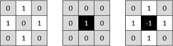
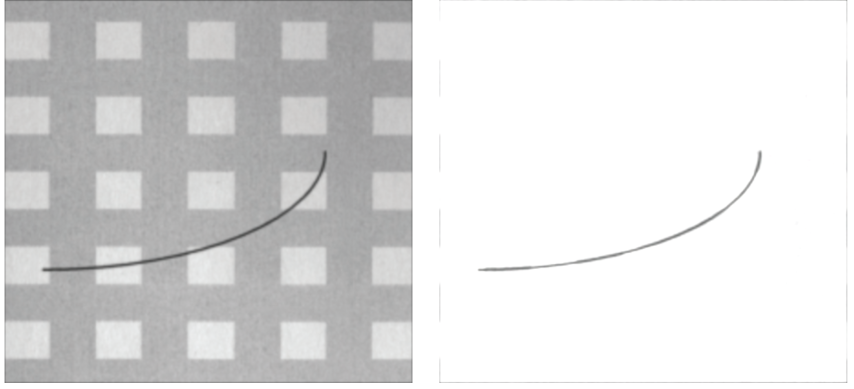
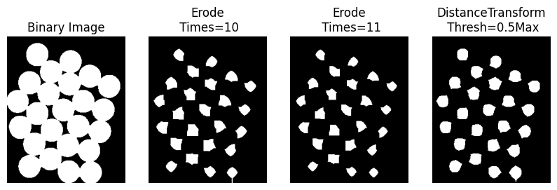
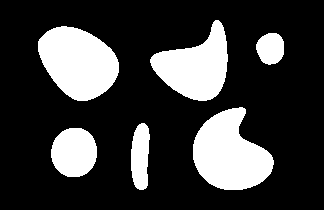
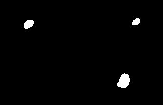
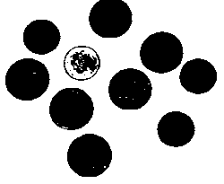
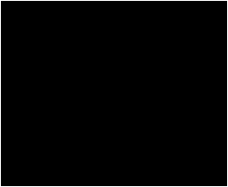
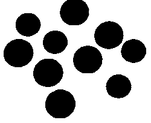

# 形态学的应用

这篇文章目的是讲解形态学函数的用处，具体 OpenCV 关于形态学相关的函数请看[上一篇文章](./1.3.md)。

## 最大值最小值滤波

OpenCV 没有最大值最小值滤波，但是其实可以用腐蚀膨胀来完成。以前没有理解腐蚀膨胀真正概念，网上资料也解释的不好。但其实他们就是最大值最小值滤波。

**按照大白话解释就是：腐蚀是赋值为其在 Kernel 上所有非零位置的最小值；膨胀是赋值其在 Kernel 上所有非零位置的最大值。**

```python
s = np.array([[1,2,3], [4,5,6], [7,8,9]]).astype(np.uint8)
# 这里也可以用 getStructinElement 来配合构造
k = np.array([[0,1,0], [1,1,1], [0,1,0]]).astype(np.uint8)

erode(s, k)[1, 1] == 2
dilate(s, k)[1, 1] == 8
```

## 寻找指定结构（如寻找中间白、四周黑的点）

这个专业术语叫做 Hit or Miss，官方的[文章](https://docs.opencv.org/4.x/db/d06/tutorial_hitOrMiss.html)讲的不错，该操作**对于在二值图像中寻找指定模式是很有用**。它能发现那些邻域像素匹配第一个结构元素B1的形状而同时不匹配第二个结构元素B2的形状的像素。

举例其实就明白了，对于二值化图片，想找到这些像素：自身是白色、上下左右是黑色、其他无所谓；分为两个步骤：

1. 先用 [[0,1,0],[1,0,1],[0,1,0]] 腐蚀原图，经过这个步骤，筛选出上下左右一定是黑色的值。
2. 再用 [[0,0,0],[0,1,0],[0,0,0]] 腐蚀原图反相后的图，此时筛选出自身是白色。
3. 两个筛选出来的图取交集，就能得到要求的点，上面的两个核就分别是 B1 和 B2。

PS: 其实我感觉暴力求（最朴素的，每个像素分别做九次检查）也可以...

使用 Hit or Miss 的要求：原图只能是 U8C1 二值化图，即只有0和255；最终的结果也是如此；而滤波核就是 B1-B2，类型是 int，值只能是零和正负一。

下图就是上面例子的 B1, B2, 最终滤波核，即最终滤波核中 -1 表示必须黑色、1 表示必须白色、0 表示无所谓：



多说一句，为什么只需要知道 B1-B2 就行了，而非 B1 和 B2 具体值呢？如果 B1-B2 某个元素为正负一，这个是可以得出 B1 和 B2 确定值的；但是如果某个元素是 0，那么可能是 1-1 或 0-0，但其实是这样的逻辑：最终滤波核为 0 时表示我们不在意这个地方的元素值，而 B1=0、B2=0 是能达到这样的效果，那么既然可以，源码中遇到输入的最终滤波核为 0 时就让 B1=0、B2=0 即可，此时达到了不在意这个地方的元素值的目的...

代码展示（官方文档也有）：

```python
import cv2 as cv
import numpy as np
 
input_image = np.array((
 [0, 0, 0, 0, 0, 0, 0, 0],
 [0, 255, 255, 255, 0, 0, 0, 255],
 [0, 255, 255, 255, 0, 0, 0, 0],
 [0, 255, 255, 255, 0, 255, 0, 0],
 [0, 0, 255, 0, 0, 0, 0, 0],
 [0, 0, 255, 0, 0, 255, 255, 0],
 [0,255, 0, 255, 0, 0, 255, 0],
 [0, 255, 255, 255, 0, 0, 0, 0]), dtype="uint8")
 
kernel = np.array(([0, 1, 0], [1, -1, 1], [0, 1, 0]), dtype="int")
 
output_image = cv.morphologyEx(input_image, cv.MORPH_HITMISS, kernel)
```

## 提取前后景

可以用膨胀+腐蚀，也就是闭操作，要求前景的物体不要太大，一般都是一些细线之类的。其实就是相当于先求最大值然后求最小值（半径一般不是常规的 3 那么小，比如下面的图用的 21），然后拿原图相减。具体看[这篇文章](./4.5.md)和下面的图：

```python
import cv2
from scipy import ndimage
import numpy as np

src = cv2.imread('./src.png') / 255
src = src[:, :, 0]

now = ndimage.maximum_filter(src, size=21)
now = ndimage.minimum_filter(now, size=21)

now = now - src
now = 1 - now

now = (now * 255).clip(0, 255).astype(np.uint8)
cv2.imwrite('./test.png', now)
```



## 提取前景作为种子

这里的意思看下面的图就明白是什么意思了，使用 distanceTransform 方法，该方法具体的用法请查看[这篇文章](../details/distanceTransform.md)

```python
src = cv2.imread('./image/coins.jpg', -1)
src_gray = cv2.cvtColor(src, cv2.COLOR_BGR2GRAY)

# print('Binary Image', '阈值 + 形态学处理去除噪声')
ret, bin_img = cv2.threshold(src_gray, 0, 255, cv2.THRESH_BINARY_INV + cv2.THRESH_OTSU)
kernel = cv2.getStructuringElement(cv2.MORPH_RECT, (3, 3))
bin_img = cv2.morphologyEx(bin_img, cv2.MORPH_OPEN, kernel, iterations=2)

# print('使用腐蚀，迭代10次')
sure_fg = cv2.erode(bin_img, kernel, iterations=10)

# print('使用腐蚀，迭代11次')
sure_fg = cv2.erode(bin_img, kernel, iterations=11)

# print('使用 DistanceTransform，阈值 0.5Max')
dist = cv2.distanceTransform(bin_img, cv2.DIST_L2, 3)
ret, sure_fg = cv2.threshold(dist, 0.5 * dist.max(), 255, cv2.THRESH_BINARY)
sure_fg = sure_fg.astype(np.uint8)  
```



distanceTransform 方法相比膨胀腐蚀更健壮一些，因为腐蚀膨胀需要考虑半径和次数，不好把握。而且明显看出后者更保持了形状。

## Floodfill

这里就是指图上标记了几个点，然后把那些和种子在一块的区域显示出来。很简单，按理来说可以直接 BFS 即可。这里分享另一个方法：其实就是不断做膨胀操作，然后膨胀完的图去和原始图片做交集。直到最后交集后没变化为止。

```python
I = cv2.imread('src1.png', -1)[..., 0]
J = cv2.imread('src2.png', -1)[..., 0]

M = np.array([[1, 1, 1], [1, 1, 1], [1, 1, 1]], dtype=np.uint8)
for i in range(100):
    J = cv2.dilate(J, M)
    J = np.bitwise_and(J, I)
```

原图：



种子文件：


结果：



## 消除细小物体

开运算可以用来**消除图像中的细小对象**，在纤细点处分离物体和平滑较大物体的边界而又不明显改变其面积和形状。开运算本质是先腐蚀再膨胀。其实如果单纯的腐蚀也可以消除小块，但是呢，又会让物体变“瘦”。

## 填充孔洞、连接断开的线

闭运算可以用来**填充目标内部的细小孔洞**，将断开的邻近目标连接。其原理就是先膨胀再腐蚀。

## 填充孔洞 Plus

上一条的填充孔洞需要手动输入参数，有的时候不太好把控，现在分享一个新的方法。

本质上和 floodfill 一样，只不过这里用上下左右的边界作为起始种子，然后执行 floodfill 即可。也就是每次执行膨胀操作，然后和原图相交。这种操作也叫形态学重构。

一般是填充黑孔中的白洞，如果反过来把原始图片反相即可。**注意这里只能填充第一层的空洞，也就是假如黑孔里有个白洞，白洞里再有个黑洞，最后最大的黑孔都会被填满。**

```python
I = cv2.imread('./src.png')

J = np.zeros_like(I).astype(np.uint8)
J[0] = J[-1] = J[:, 0] = J[:, -1] = 255

M = np.array([[0, 1, 0], [1, 1, 1], [0, 1, 0]]).astype(np.uint8)

for i in range(200):
    J = cv2.dilate(J, M)
    J = np.bitwise_and(J, I)
    cv2.imwrite(f'./result-2.png', (J).astype(np.uint8))
```

原图：



起始种子（四周边界是白色的）：



结果：



## 突出边缘

形态学梯度操作能描述图像亮度变化的剧烈程度；当我们想要**突出高亮区域的外围时**，则可以选用形态学梯度来突出边缘，可以保留物体的边缘轮廓。其实没啥，就是普通的梯度，只不过是二维图像。
