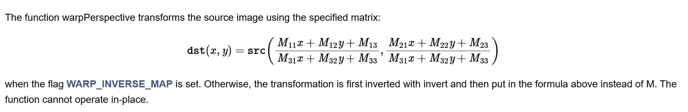

## 1.4 变换矩阵的求和用

### 前提知识

高中知识，两张图片之间的关系（拉伸扭曲等）可以用一个矩阵相乘来模拟，按细节程度分为三种：刚体、仿射、透视。

### 函数说明：

求矩阵的函数分为两种：一种是许多映射点之后求最优解矩阵；另一种是只有几个映射点，可以求出唯一解矩阵。

- estimateRigidTransform：已废弃
- [estimateAffinePartial2D](https://docs.opencv.org/4.x/d9/d0c/group__calib3d.html#gad767faff73e9cbd8b9d92b955b50062d "Computes an optimal limited affine transformation with 4 degrees of freedom between two 2D point sets...")：多点求最优解；2X3矩阵、4自由度（即最终2X3矩阵其可由4个参数控制）
- [estimateAffine2D](https://docs.opencv.org/4.x/d9/d0c/group__calib3d.html#ga27865b1d26bac9ce91efaee83e94d4dd "Computes an optimal affine transformation between two 2D point sets.")：多点求最优解；2X3矩阵、6自由度
- [findHomography](https://docs.opencv.org/4.x/d9/d0c/group__calib3d.html#ga4abc2ece9fab9398f2e560d53c8c9780 "Finds a perspective transformation between two planes.")：多个点求最优解；3x3矩阵
- getRigidTransform：两个点求刚体矩阵唯一解；**OpenCV里面没有这个函数..**
- [getAffineTransform](https://docs.opencv.org/4.x/da/d54/group__imgproc__transform.html#ga8f6d378f9f8eebb5cb55cd3ae295a999 "Calculates an affine transform from three pairs of the corresponding points.")：三个映射点求仿射矩阵唯一解；2x3矩阵、6自由度
- [getPerspectiveTransform](https://docs.opencv.org/4.x/da/d54/group__imgproc__transform.html#ga20f62aa3235d869c9956436c870893ae "Calculates a perspective transform from four pairs of the corresponding points.")：四个映射点求透视矩阵唯一解；3x3矩阵

用矩阵函数有两个：`warpPerspective` 和 `warpAffine`，一个3x3，一个2x3，利用求解出的矩阵去变换原始图片

### 具体细节

具体用的时候还是要查文档

#### estimateAffine2D

- form, to: nx2 的列表，表示变换前后的点
- outlier: 最后输出的一个结果，表示对应索引点是否是异常点（0异常）
- method: 计算最优解的方法，具体查阅手册；其中最常见有最小二乘（需要至少有50%的正常点）、RANSAC；最小二乘对噪声较敏感
- 后面的就是求最优解的一些参数，比如置信度这些，**具体需要理解算法原理以及实际慢慢调参了**，具体说明参见 Opencv 文档，默认值上面也有

#### findHomograhpy

- 参数和上面基本一致，其中 method 多了一个新的方法 RHO，还多一个 mask 参数，是输出的一个掩膜结果，过于细节，不细究

#### getPerspectiveTransform

- 前两个参数一样，变换前后的点。
- solveMethod: 【矩阵分解】参数，不同矩阵分解方法侧重点不同，不过用在这个场景（求3x3线性方程组）其实都差不多（个人看法，说错了希望可以指正）

#### warpPerspective, warpAffine

- src, M: 分别是原始图片和变换的矩阵
- dsize：变换后图片的大小，**注意是 (宽度，高度)！！**
- flags: 非常重要的一个参数，分为两部分：第一部分是插值算法，即变换后并不完全是整数怎么办，线性插值或者最近替代；第二部分是否WARP_INVERSE_MAP，这个很重要：
  
- borderMode: 变换后可能有的地方是空值，比如缩小那么四周就是空的，这个参数就是指定这些地方应该是上面值：常数或者边界拓展
- borderValue: 这个就是上面这个参数，如果是常数，应该是多少

### 注意点

1. 3x3矩阵变换不是单纯的只要1x3结果前面的两个值，都要除以最后一个值。
2. 变换前后的图片要分清楚究竟是哪一张，之前花了好长时间栽在这上面。尤其是那两个warp函数里面flags有一个WARP_INVERSE_MAP选项，需要仔细考虑。
3. 两个warp函数中的dsize是宽度、高度，顺序不要乱了，即顺序是多少列、多少行。而变换前后的点的坐标则是表示第几行、第几列的顺序。
