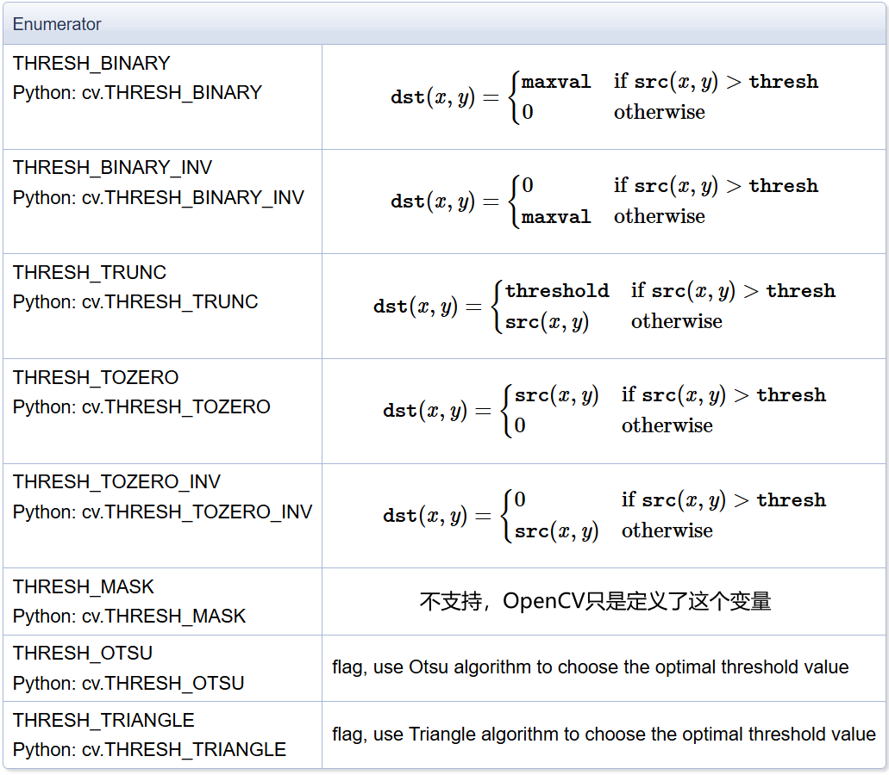
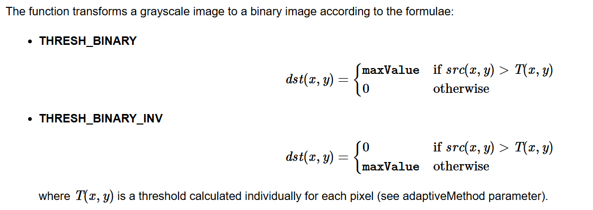
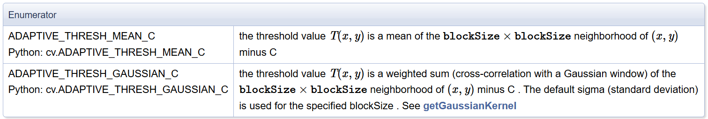
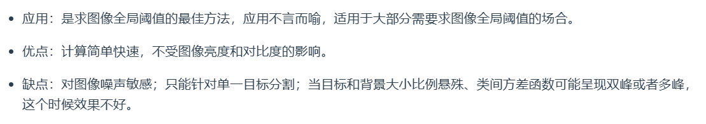
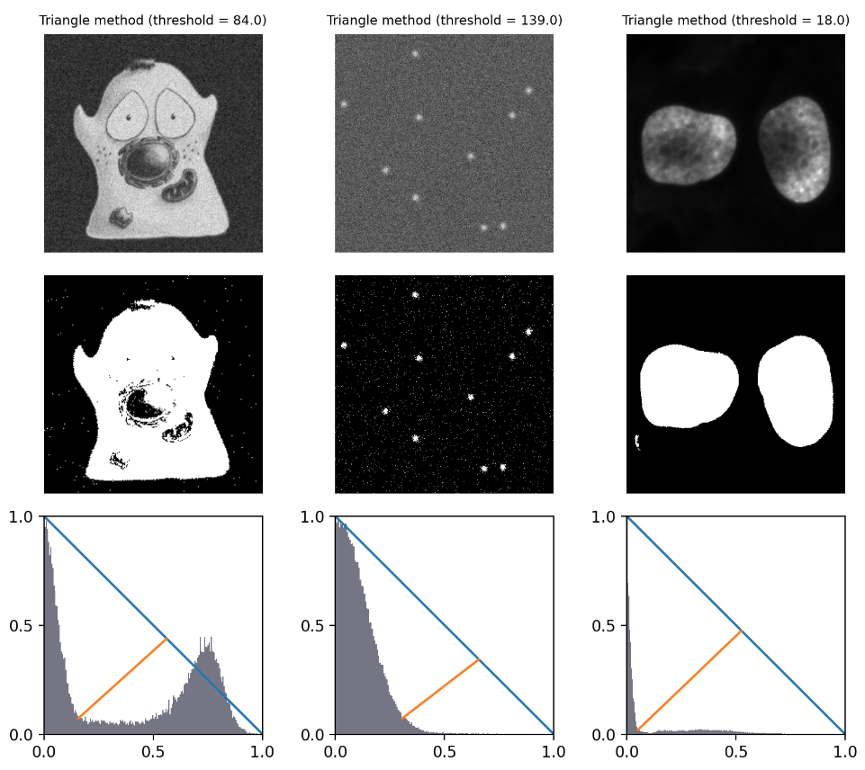
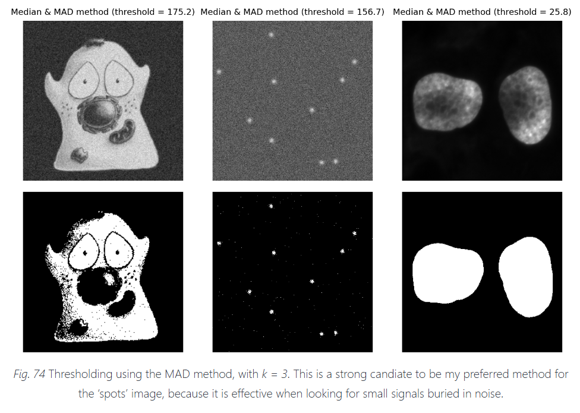

## 1.5 阈值处理

### 函数说明：

一共三个：[threshold](https://docs.opencv.org/4.x/d7/d1b/group__imgproc__misc.html#gae8a4a146d1ca78c626a53577199e9c57)、[adaptiveThreshold](https://docs.opencv.org/4.x/d7/d1b/group__imgproc__misc.html#ga72b913f352e4a1b1b397736707afcde3)、[ximgproc 模块的 niBlackThreshold](https://docs.opencv.org/4.x/df/d2d/group__ximgproc.html#gab042a5032bbb85275f1fd3e04e7c7660)

### 具体细节

用的时候还是得去查阅官方手册，个人代码在 [test_threshold.ipynb](../code/test_threshold.ipynb) 中。

#### threshold

double cv::threshold (InputArray src, OutputArray dst, double thresh, double maxval, int type)

- 输入图片是 U8 或 F32，通道数不限，但每个通道都是一样的操作；此外 the Otsu's and Triangle methods are implemented only for 8-bit single-channel images.
- type 就是上面的表格，最基础的做法就是 `threahold(src, 0, 255, cv2.THRESH_BINARY)` 产生二值化图片，其他的自行查阅表格，Otsu 和 Triangle 在文章最后会提一下

#### adaptiveThreshold

void cv::adaptiveThreshold	(InputArray src, OutputArray dst, double maxValue, int adaptiveMethod, int thresholdType, int blockSize, double C)

- 如名字所阐述的，就是一个动态阈值：

- adaptiveMethod 有两种，均值和高斯，后面的 blockSize 和 C 都是为它服务的，分别是窗口半径、计算后的值再减去一个数：

#### niBlackThreshold

void cv::ximgproc::niBlackThreshold	(InputArray _src, OutputArray _dst, double maxValue, int type, int blockSize, double k, int 	binarizationMethod = BINARIZATION_NIBLACK, double r = 128)

- type: 就是上面的 THRESH_BINARY 这些，都支持。
- blockSize: 考虑邻近点的窗口直径
- k: 方法的参数，方法具体原理看下一章，一般在 [-1, 1]
- binarizationMethod: 具体的方法，有四个。NIBLACK、SAUVOLA、WOLF、NICK

### 一些常用阈值方法

#### Ostu

也是经典方法了，数字图像处理那本书讲的可以。网上这个[文章](https://www.zywvvd.com/notes/study/image-processing/otsu-thre/otsu-thre/)不错。就是一个根据图像自动找寻最佳阈值的方法，最佳阈值这里是指按照这个阈值分类后，类间方差最大（具体原理看文章）。

#### Triangle

这篇[文章](https://bioimagebook.github.io/chapters/2-processing/3-thresholding/thresholding.html#triangle-method)讲的不错，下面相当于翻译：Triangle 是一种流行的确定阈值的方法，**在有一个主要背景峰值的图像中尤其有效**，此时理想的阈值应该在该峰值的底部。总体思路是，从直方图峰值到包含任何像素的最后一个区间绘制一条线。然后，寻找这条线到直方图上哪一个区间距离最大，这里的距离是指区间上方对这条线做垂线。线的方向取决于峰值是朝向直方图的左侧还是右侧；另一侧的所有计数都被忽略。直方图的宽度和高度被归一化，以处理像素值和强度计数处于完全不同的单位。看下面的图很容易理解：

#### Median & Median Absolute Deviation

这是很有意思的一个方法，也是来自上面的[文章](https://bioimagebook.github.io/chapters/2-processing/3-thresholding/thresholding.html#median-median-absolute-deviation)。首先什么是 Median & Median Absolute Deviation(MAD)：第一步，按照像素值排序，找到中位数；第二步，所有像素减去中位数并取绝对值；第三步，排序第二步得出的值，找到中位数。

MAD 的一个有趣的有用特性是，它可以按1.482进行缩放，以类似于标准差。但 MAD 更加稳健，维基百科有详细的[解释](https://en.wikipedia.org/wiki/Median_absolute_deviation)。 通常会使用 【中位数+ k\*MAD\*1.482】，k 是可调整系数。结果如下：

这个方法挺冷门的，但是上面的文章作者很喜欢在处理噪声多的荧光图像时这个方法，他提了几个注意点：第一，图像的大部分应该是背景，并且有噪声（否则中位数是 0 了）；第二，噪声应该（或多或少）遵循正态分布；第三，图像不应该太大，因为涉及中位数计算（如果很大，考虑一些中位数计算的优化算法）。

#### AdaptiveThreshold

对于每个像素，计算周围窗口的均值或者加权均值（高斯），然后减去一个固定数（函数中的参数 C），最后和这个结果进行比较。

#### NiBlack

和 AdaptiveThreshold 很像，不过多考虑了方差。

1. NIBLACK
$$
T(x, y) = boxMean + k * boxStd
$$

2. SAUVOLA
$$
T(x, y) = boxMean + k * (\frac{boxStd}{r} - 1) * (boxMean)
$$

3. WOLF
$$
T(x ,y) = boxMean + k * \frac{boxStd}{imgMax} * (boxMean - imgMin)
$$

4. NICK
$$
T(x, y) = boxMean + k * \sqrt{boxStd^{2} + Mean(Box^2)}
$$