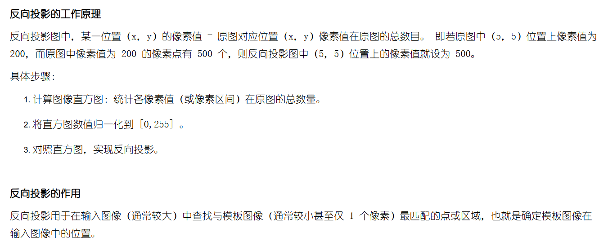

## 1.6 直方图

### 函数说明：

- [calcHist](https://docs.opencv.org/4.x/d6/dc7/group__imgproc__hist.html)：计算直方图函数，基础函数
- [compareHist](https://docs.opencv.org/4.x/d6/dc7/group__imgproc__hist.html#gaf4190090efa5c47cb367cf97a9a519bd)：比较两个直方图，通常可以用于求解图片相似度
- [EMD, wrapperEMD](https://docs.opencv.org/4.x/d6/dc7/group__imgproc__hist.html#ga902b8e60cc7075c8947345489221e0e0)：也是一个直方图比较算法，其优势是对直方图的平移不敏感，即两个形状相同、只是相对平移的直方图，使用朴素的距离指标可能有问题
- [calcBackProject](https://docs.opencv.org/4.x/d6/dc7/group__imgproc__hist.html#ga3a0af640716b456c3d14af8aee12e3ca)：直方图反向投影，通常用于模块匹配等
- [equalizeHist](https://docs.opencv.org/4.x/d6/dc7/group__imgproc__hist.html#ga7e54091f0c937d49bf84152a16f76d6e): 直方图均衡算法，不谈（现在这个年代还需要这个算法吗？？）
- [createCLAHE](https://docs.opencv.org/4.x/d6/dc7/group__imgproc__hist.html#gad3b7f72da85b821fda2bc41687573974): CLAHE 直方图均衡算法

### 具体细节

#### void cv::calcHist

这是一个相当离谱的函数，非常反人类，下面讲一下具体的点

- **输入是数组，表示多张图片**，格式为 8U, 16U, 32F，通道数不限；要用参数 nimages 指定数目（Python 不用）；chanel 参数表示处理的通道
- **虽然说可以处理多张图片、多个通道，但使用时尽量只用一张图片的一个通道！！**，它的多图片多通道逻辑时很奇怪的。
- **histSize和ranges都对结果有影响，本质上是计算各个bin的范围**，所以如uint8那么就推荐用 `histSize=256, ranges=[0,256]`
- accumulate 在 Python 中好像不起作用，这个参数本意是做统计前不会清空输出列表，这样多次调用这个函数，相当于最后输出列表进行了累加
- Python 没有 **uniform** 参数，默认是非归一化的，即有多少数值结果就是多少。这个在 calcBackProject 中是个坑点，因为那个函数默认传入的直方图是归一化的，具体看那个函数的说明。

测试代码，我感觉平时用这些就够了。可以看到，代码中就是只是用单图片单通道：

```python
src = np.zeros((256, 256, 3), dtype=np.uint8)
for i in range(256):
    src[i, :, 0] = i
for i in range(128):
    src[2*i:2*i+2, :, 1] = i

# 求蓝色通道的直方图
result = cv2.calcHist([src], channels=[0], mask=None, histSize=[256], ranges=[0,256])
print(result[0:10, 0])

# 求蓝色、绿色合起来的直方图
# 做法一
result = cv2.calcHist([src[..., 0:2].reshape(-1, 1)], channels=[0], mask=None, histSize=[256], ranges=[0,256])
# 做法二
result = [cv2.calcHist([src], channels=[i], mask=None, histSize=[256], ranges=[0,256]) for i in range(2)]
result = np.sum(result, axis=0)

# 求蓝色、绿色各自的直方图
for i in range(2):
    result = cv2.calcHist([src], channels=[i], mask=None, histSize=[256], ranges=[0,256])
    print(result[0:10, 0])

# 求两张图片的蓝色通道的直方图
imgs = [src, src]
result = [cv2.calcHist([imgs[i]], channels=[0], mask=None, histSize=[256], ranges=[0,256]) for i in range(2)]
result = np.sum(result, axis=0)
print(result[0:10, 0])

# 验证 accumluate 作用，Python 中貌似不起作用
hist_ = np.zeros((256, 1))
result = cv2.calcHist([src], channels=[0], mask=None, hist=hist_, histSize=[256], ranges=[0,256], accumulate=False)
result = cv2.calcHist([src], channels=[0], mask=None, hist=hist_, histSize=[256], ranges=[0,256], accumulate=True)
print(hist_[0:10, 0], result[0:10, 0])
```

#### double cv::compareHist

- 用于比较两张图片相似度；没有特别的奇怪参数，通过 method 参数传入比较指标

### EMD(Earth mover's distance)

- EMD 具体细节需要进一步学习，目前只需要知道是什么即可（TODO）

### void cv::calcBackProject



- 反向投影的原理和作用，如图所示，来自一篇很好的[文章](https://www.cnblogs.com/bjxqmy/p/12452420.html)
- **直方图归一化非常重要**。因为 Python 中 calcHist 和 calcBackProject 都没有是否归一化选项，而这两一个是按照 False 处理，另一个是按照 True 处理....
- 彩色图片推荐转成 HSV，并且用其中的 H 通道来做

```python
# 读取图片（假设是灰色图）
src = cv2.imread('./test_img.png', -1)

# 计算直方图 -> 归一化 -> calcBackProject
hist_ = cv2.calcHist([src], channels=[0], mask=None, histSize=[256], ranges=[0,256])
hist_ = (hist_ / np.max(hist_) * 255).astype(np.uint8)
result = cv2.calcBackProject([src], channels=[0], hist=hist_, ranges=[0,256], scale=1.0)

# 存储图片
cv2.imwrite('./backproject_result.png', result)
```

### createCLAHE

- CLAHE 直方图均衡算法，这个原理网上一搜一大堆，函数本身没有奇怪参数，懂原理就立马知道代表什么意思
- 使用方式需要先通过这个函数得到一个对象，然后这个对象使用 `apply` 方法即可
