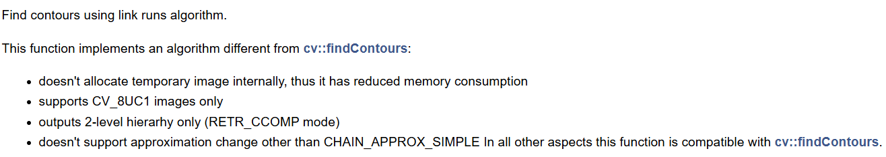
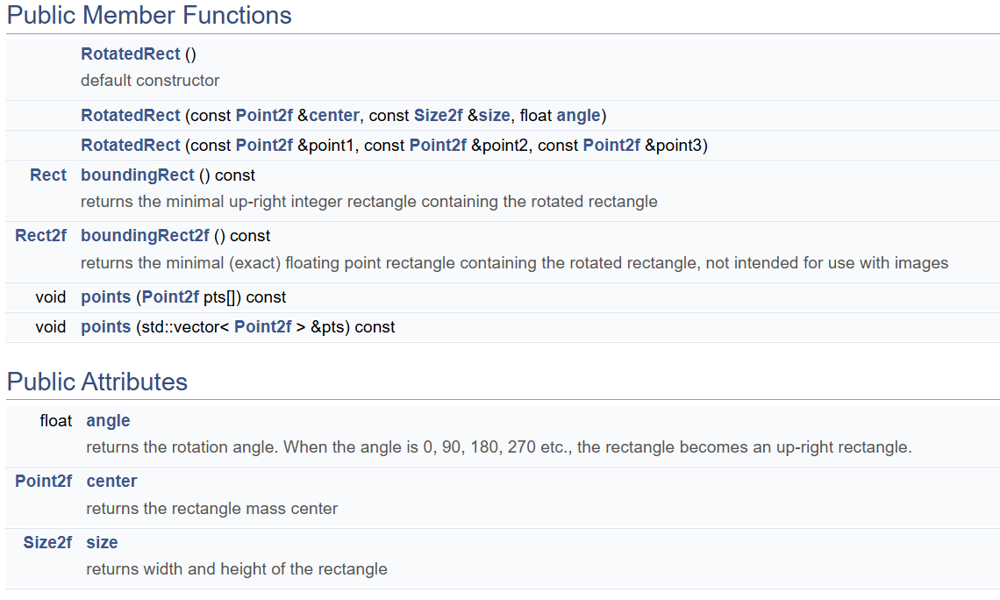
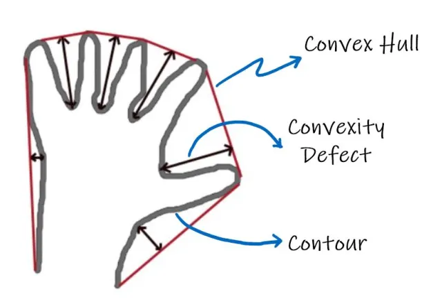

## 1.7 二维几何

### 函数说明：

**最重要的是记住，这里的函数基本都是纵坐标在前、横坐标在后！！**

基础函数：寻找轮廓、近似轮廓；OpenCV 本身的文档就很不错：[链接](https://docs.opencv.org/4.x/d3/d05/tutorial_py_table_of_contents_contours.html)

- [findContours]()：用法在 [find_contours.ipynb](../code/find_contours.ipynb) 文件中
- [findContoursLinksRuns]()：另一种寻找轮廓的方法，相对更省内存，但是也有一些限制，见下面说明
- [applyProxDP]()：把密集的轮廓（即轮廓上有许多点）近似为较小的点，用法在 [dealwith_points.ipynb](../code/dealwith_points.ipynb)

处理一堆点时的函数：在 [dealwith_points.ipynb](../code/dealwith_points.ipynb) 文件中有详细使用

- 要求点集必须是轮廓:

| 功能                     | 函数名称                            |
| ------------------------ | ----------------------------------- |
| 轮廓周长                 | arcLength                           |
| 轮廓面积                 | contourArea                         |
| 轮廓的矩                 | moment, HuMoment                    |
| 检测轮廓是否是凸集       | isContourConvex                     |
| 判断某个点是否在轮廓以内 | pointPolygonTest(measureDist=False) |
| 判断某个点到轮廓的距离   | pointPolygonTest(measureDist=True)  |

- 点集不一定构成轮廓（当然如果是轮廓也能用）:

| 功能                           | 函数名称                                    |
| ------------------------------ | ------------------------------------------- |
| 包围点集的最小矩形（正方向）   | boundingRect                                |
| 包围点集的最小矩形（任意方向） | minAreaRect + boxPoints                     |
| 包围点集的凸包                 | convexHull                                  |
| 包围点集的椭圆                 | fitEllipse, fitEllipseAMS, fitEllipseDirect |
| 包围点集的圆                   | minEnclosingCircle                          |
| 点集模拟的线                   | fitLine                                     |

- 处理两个轮廓:

| 功能                                         | 函数名称                     |
| -------------------------------------------- | ---------------------------- |
| 寻找两个轮廓的交集（必须是凸多边形）         | intersectConvexConvex        |
| 寻找两个矩形的交集（和上面的区别见具体细节） | rotatedRectangleIntersection |
| 比较两个轮廓                                 | matchShapes                  |

其他杂项：

- convextiyDefects: 凸包缺陷检测
- connectedComponents, connectComponentsWithStats: 连通域相关的函数

### 具体细节

大部分函数的实现都在 [find_contours](../code/find_contours.ipynb) 和 [dealwith_points.ipynb](../code/dealwith_points.ipynb) 文件中，没有的也都是很简单纯粹的函数，下面是几个还需要再讲讲的函数。

#### findContoursLinksRuns

官方文档写的就不错，而且这个函数不用啥参数，直接就是一张图片就行：



#### moments, HuMoments

什么是 moments，这篇[文章](https://blog.csdn.net/Caesar6666/article/details/103257632) 和 这篇[文章](https://learnopencv.com/shape-matching-using-hu-moments-c-python/) 讲的非常不错，用法也直接参考第一篇文章就行。

简单而言，moments 叫做矩，两个作用：可以用来求轮廓质心、求 HuMoments；而 HuMoments 则是图像的 Hu 不变矩，是指目标具有旋转、缩放不变性，即目标的 Hu 不变矩不会随其大小、方向变化而变化。

#### RotatedRect 类型



Python 中默认把函数返回的 RotatedRect 类型作为 tuple，而有时需要利用 RotatedRect 的方法。返回的方式为 `(center, size, angle)`，所以只要用构造方法即可:

```python
# 获取 rotatedRect 的点
point_set = np.array([[20, 20], [20, 13], [28, 19], [33, 18], [17, 31]])
rect1 = cv2.minAreaRect(point_set)
points1 = cv2.RotatedRect(*rect1).points()
```

#### rotateRectangleIntersection

和 `intersectConvexConvex` 的区别就在于，rotate 输入的是 [`RotatedRect` 类型](https://docs.opencv.org/4.x/db/dd6/classcv_1_1RotatedRect.html)，intersect 输入的是轮廓。如果两个都是 rotatedRect，那就用前者；否则就用后面。

#### convextiyDefect

凸包缺陷检测，即传入轮廓和凸包，得到凸包和轮廓之间的间隙，参考这篇[文章](https://theailearner.com/tag/cv2-convexitydefects/)，写的极好，他的图片介绍也很好：



### connectedComponents

这篇[文章](https://blog.csdn.net/qq_40784418/article/details/106023288)写的极好，本身函数没有太大的坑点，只要知道这是负责得到图片的各个连通域的。后续可以用这些连通域进行分割等操作。
