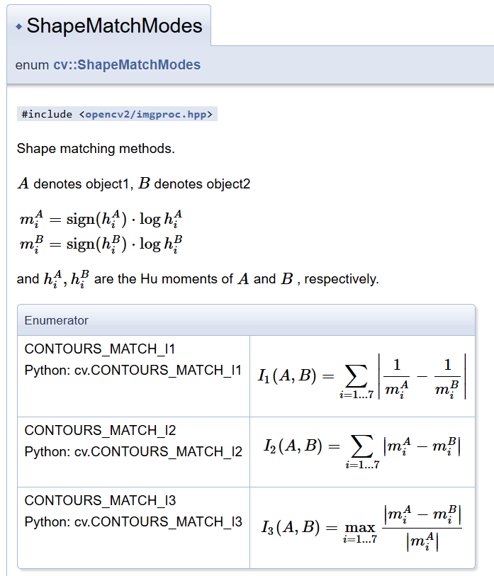
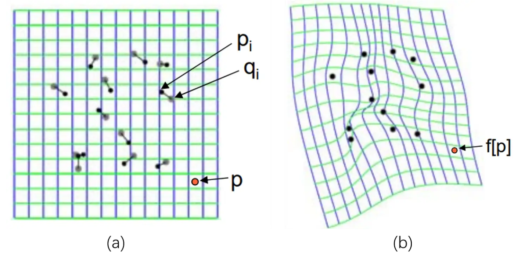
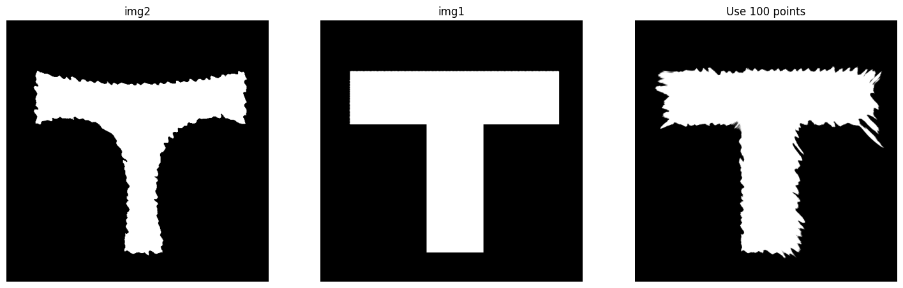
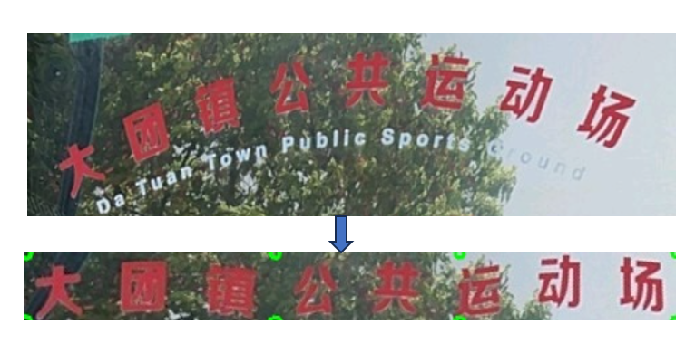

## 1.8 轮廓匹配

轮廓匹配的方法比较多，一个是 main module 的 matchShapes 方法，这个是用的是形状的 HuMoments；还有一个 shape 模块是专门做这个的，用的是其他方法；还有一个是 ximgproc 模块里面的 transformFD，它使用傅里叶描述子来做的。

### matchShapes

[matchShapes](https://docs.opencv.org/3.4/d3/dc0/group__imgproc__shape.html#gaadc90cb16e2362c9bd6e7363e6e4c317) 很简单，`cv.matchShapes(contour1, contour2, method, parameter)`。**contour 参数要求是一个轮廓，即 (n, 1, 2) 或 (1, n, 2) 大小的 ndarray，两种形状都可以，结果是一样的**；method 如下图所示，从图上也能看出这是通过 HuMoments 来进行匹配的；parameter 是无用参数，固定为 0。需要注意的是，**它适用于旋转但不适用于缩放**。



返回值是相似程度，越小表示越可能。

### ximgproc.transformFD
[ximgproc Fourier Descriptors](https://docs.opencv.org/4.x/dd/ddc/group__ximgproc__fourier.html) 的方法，用的是傅里叶描述子，直接看代码即可

```python
img1 = cv2.imread('./image/shape/13.png', -1)
contours1, _ = cv2.findContours(img1, cv2.RETR_TREE, method=cv2.CHAIN_APPROX_NONE)

img2 = cv2.imread('./image/shape/14.png', -1)
contours2, _ = cv2.findContours(img2, cv2.RETR_TREE, method=cv2.CHAIN_APPROX_NONE)

# sampling contour we want 256 points
fit = cv2.ximgproc.createContourFitting(1024,16)
fit.setFDSize(16)

cs1 = cv2.ximgproc.contourSampling(contours1[0].reshape((-1, 1, 2)), 256)
cs2 = cv2.ximgproc.contourSampling(contours2[0].reshape((-1, 1, 2)), 256)
alphaPhiST, _ = fit.estimateTransformation(cs1, cs2)

out_shape = cv2.ximgproc.transformFD(cs1, alphaPhiST, fdContour=False)

show_images([
    ('img1', draw_points(img1, contours1[0])),
    ('img2', draw_points(img2, contours2[0])),
    ('Use Fourier Descriptors', draw_points(img2, out_shape)),
])
```

### shape 模块

[shape 模块](https://docs.opencv.org/4.x/d1/d85/group__shape.html)是专门用于比较两个轮廓的，他的类可以分为三个部分：

```
# class  	cv::ShapeTransformer
    # class  	cv::AffineTransformer
    # class  	cv::ThinPlateSplineShapeTransformer
 
# class  	cv::HistogramCostExtractor
    # class  	cv::ChiHistogramCostExtractor
    # class  	cv::EMDHistogramCostExtractor
    # class  	cv::EMDL1HistogramCostExtractor
    # class  	cv::NormHistogramCostExtractor
 
# class  	cv::ShapeDistanceExtractor
    # class  	cv::HausdorffDistanceExtractor
    # class  	cv::ShapeContextDistanceExtractor
```

#### Extractor

两个 Extractor 基类都是用来计算两个轮廓的差距的，代表着两类不同方向的方法；其中 ShapeDistanceExtractor 调用 computeDistance 方法、HistogramCostExtractor 调用 buildCost 方法。

示例代码如下，详细的代码在 [test_shape.ipynb](../code/test_shape.ipynb) 中：

```python
'''
Shape Distance Extractor 使用说明
'''
# class  	cv::ShapeDistanceExtractor -> computeDistance
    # class  	cv::HausdorffDistanceExtractor
    # class  	cv::ShapeContextDistanceExtractor
extractor = cv2.createShapeContextDistanceExtractor()

src = cv2.imread('./image/shape/13.png', -1)
src_contours, _ = cv2.findContours(src, cv2.RETR_TREE, method=cv2.CHAIN_APPROX_NONE)
src_points = make_points(src_contours[0], n=500)

for imgname in os.listdir('./image/shape'):
    now = cv2.imread(f'./image/shape/{imgname}', -1)
    now_contours, _ = cv2.findContours(now, cv2.RETR_TREE, method=cv2.CHAIN_APPROX_NONE)
    now_points = make_points(now_contours[0], n=500)

    # 传入的必须是 (x, 1, 2) 或 (1, x, 2) 这种 shape 的 ndarray，两个 ndarray 的 x 不强制要一样
    result1 = extractor.computeDistance(src_points.reshape(1, -1, 2), now_points.reshape(1, -1, 2))
    result2 = extractor.computeDistance(src_points.reshape(-1, 1, 2), now_points.reshape(-1, 1, 2))
    print(imgname, result1, result2)
    break
```

#### ShapeTransformer

##### 子类说明

cv::AffineTransformer，这个无需多言，就是最传统的仿射变换。

cv::ThinPlateSplineShapeTransformer，这是薄板样条插值变换，会根据每个点的前后变换进行各个点插值拟合，最终效果类似于扭曲。可以用于脸部变形，或者把一个成弧度的形状拉直便于处理（比如硬币上的中国人民银行）。如下图所示：



##### 使用场景

ShapeTransformer 基类用于变换轮廓形状，有两种使用场景（便于讲述，假设当前有一个变量 transformer）：

1. 单独使用，需要调用 `estimateTransformation(shape1, shape2, matches)` 来计算出内部的转换方式。其中 shape1 和 shape2 是 vector `<point2d>`，长度要一样；而 matches 则是同 vector 长度一样的列表，里面的元素是 cv2.DMatch(i,i,x)，这个和普通的 DMatch 是一样的，i 表示索引，x 表示距离。一般而言用 estimate 都把 x 设为 0，即前后变换的点是对应的关系。执行 estimate 后，transformer 内部的转换方式就确定了，可以调用 `applyTransformation` 或 `warpImage` 了。
2. 配合 ShapeDistanceExtractor 使用，extractor 调用 `setTransformAlgorithm(transformer)`。当 extractor 调用 `computeDistance(contour1, contour2)` 后，此时 transformer 内部的转换方式就确定了，就可以调用 `applyTransformation` 或者 `warpImage` 这样的方法把输入的轮廓/图片进行变换了。**但是实验发现不行，所以还是要用上面第一种方法，即使用到了 computeDistance，也要在 applyTransformation 前多写一句 estimateTransformation。**

关于单独使用，我还想多说几句。刚开始的时候我看到有 matches，以为是调用 SIFT 之类的特征点，然后进行匹配。但这样是不对的，要牢记 ShapeTransformer 针对的是形状，他要传入的点必须是可控的。下面通过两个例子说明：

例子一，如下图，我希望 img2 变为 img1 的形状。此时是我已经正确做法是：img2 找轮廓，获取轮廓上的一些点；计算这些点应该变换为什么位置，当然由于已经有了 img1，所以只要在 img1 上找轮廓，采同样的点就可以了。



例子二，如下图，我希望把文字拉直。正确做法就是先算出一开始弯曲的文字的大致轮廓，然后计算出包住这个轮廓的矩形框，之后在弯曲的轮廓上采点后，能计算出其在矩形框上对应的点：




总而言之，本质是因为 SIFT 得到的点不可控：一方面是 SIFT 得到的点很可能不在轮廓上，即使强制在轮廓上，也很少；另一方面更重要的是我们现在的目的是为了变换轮廓，即需要精细控制两个点变换前后的位置，而不是为了去匹配两张图。比如例子一，我们通过等间距采样 100 个点达到了上面的变换效果，而采用特征点根本不知道特征点的位置，根本做不到上面的效果。

强烈建议，看一下 [test_shape.ipynb](../code/test_shape.ipynb) 这个代码最后的两个 code 部分，看完就理解了。这里摘抄一下

```python
'''
ShapeTransformer 单独使用
'''
img1 = cv2.imread('./image/shape/13.png', -1)
contours1, _ = cv2.findContours(img1, cv2.RETR_TREE, method=cv2.CHAIN_APPROX_NONE)
points1 = make_points(contours1[0])

img2 = cv2.imread('./image/shape/14.png', -1)
contours2, _ = cv2.findContours(img2, cv2.RETR_TREE, method=cv2.CHAIN_APPROX_NONE)
points2 = make_points(contours2[0])

transformer = cv2.createThinPlateSplineShapeTransformer()

# 所有点都考虑，并不一定是好事情
matches = [cv2.DMatch(i, i, 0) for i in range(points1.shape[0])]
transformer.estimateTransformation(points1.reshape(1, -1, 2), points2.reshape(1, -1, 2), matches)
img3 = transformer.warpImage(img2)

# 采样点，采大约 100 个点
points1 = points1[::points1.shape[0]//100]
points2 = points2[::points2.shape[0]//100]
matches = [cv2.DMatch(i, i, 0) for i in range(points1.shape[0])]
# 重要：applyTransformation 和 warpImage 对 estimateTransformation 的顺序要求是翻过来的
transformer.estimateTransformation(points2.reshape(1, -1, 2), points1.reshape(1, -1, 2), matches)
_, points3 = transformer.applyTransformation(points2.reshape(1, -1, 2))
transformer.estimateTransformation(points1.reshape(1, -1, 2), points2.reshape(1, -1, 2), matches)
img4 = transformer.warpImage(img2)

show_images([
    ('img2', img2),
    ('img1', img1),
    ('Use all points', img3),
    ('Use 100 points', img4),
    ('img2 point', draw_points(img2, points2)),
    ('img1 point', draw_points(img2, points1)),
    ('ApplyTransformation', draw_points(img2, points3)),
], colnum=4)
```

#### 使用的几个注意点（重要）

1. **python 中 estimateTransformation、applyTransformation 必须要传入 (1,n,2) 大小、float32 类型的 ndarry！！！**
2. cpp 中 estimateTransformation、applyTransformation 同样要是 float32，大小由于 CPP 中不是 numpy，所以没啥，就普通的 vector，即参数类型是 vector`<point2f>` 类型。
3. applyTransformation 和 warpImage 对 estimateTransformation 的要求是反过来的；具体看上面的代码。
