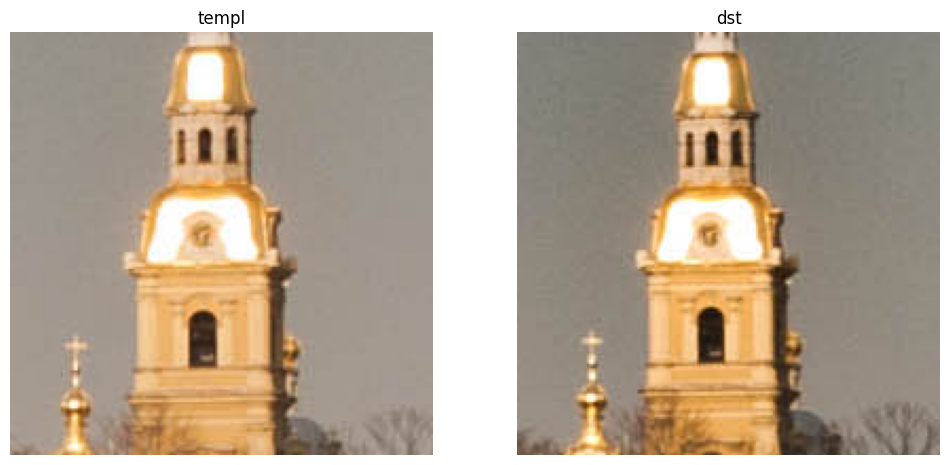
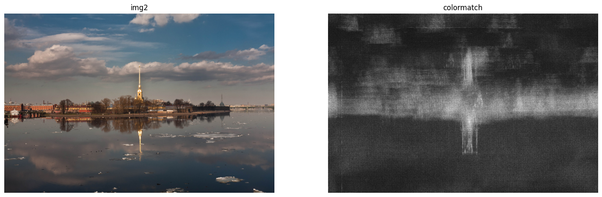

## 1.8 模板匹配

模板匹配可以用在哪儿：目标追踪（要一开始框选目标，这样之后就把框选当成模板，每次帧变化的时候都进行一次模板匹配），识别文字 OCR（事先准备常见的文字图片，使用的时候遍历看看当前图片和哪一个模板文字图片最接近），图像配准（相当于找匹配点）。

`matchTemplate` 方法，这个无脑调用就行了，网上的示例代码很多。说一下注意点：

1. 一共六种方法，如果效果不好就换另一种指标试试，之前用过的时候，只有 TM_CCORR_NORMED 是能比较好识别的...
2. **并不适用于缩放和旋转的场景**

ximgproc 有一个 `colorMatchTemplate` 方法，同样调用就行，区别就是这个是靠颜色匹配，感觉效果一般。

模板匹配也可以用轮廓匹配实现，相当于 找轮廓+轮廓匹配 等于是模板匹配的其中一个实现方法，当然这太过于理想化了。

代码片段：

```python
import cv2

# 图片来源: opencv extra 仓库
img1 = cv2.imread('./image/stitching/boat1.jpg')
img2 = cv2.imread('./image/stitching/boat2.jpg')

templ = img1[1000:1200, 3000:3200]

# 有不同的 method 方法，具体查手册
result = cv2.matchTemplate(img2, templ, method=cv2.TM_SQDIFF_NORMED)
min_val, max_val, min_loc, max_loc = cv2.minMaxLoc(result)
# 1. 可以看到这里的顺序需要颠倒以下
# 2. 只有 SQDIFF[_NORMED] 是 min_loc，其他方法找的都是 max_loc
result = img2[min_loc[1]:min_loc[1]+200, min_loc[0]:min_loc[0]+200]

show_images([ ('templ', templ), ('dst', result) ])

# colorMatchTemplate，实际测试效果不是很好，因此就直接可视化返回的结果
result = cv2.ximgproc.colorMatchTemplate(img2, templ)
min_v, max_v = np.percentile(result, 2), np.percentile(result, 98)
result = (result - min_v) / (max_v - min_v)
result = (result * 255).clip(0, 255).astype(np.uint8)

show_images([ ('img2', img2), ('colormatch', result) ])
```




