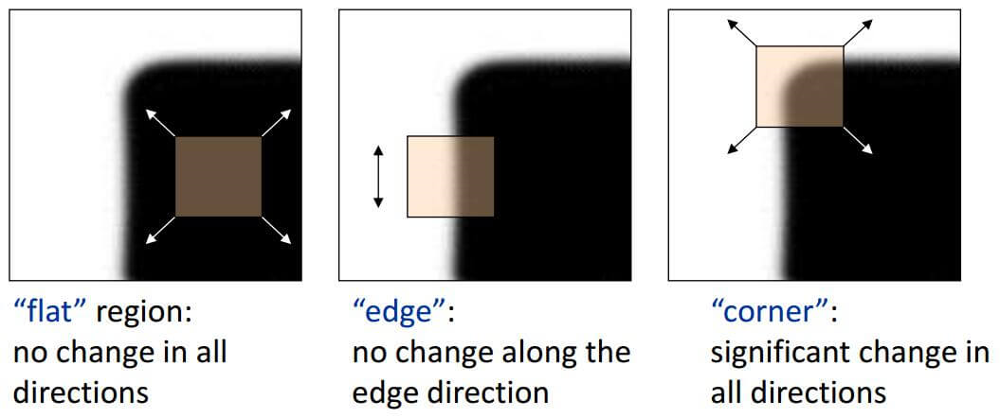
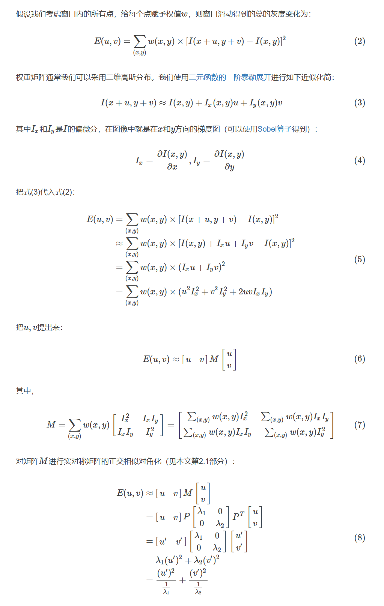
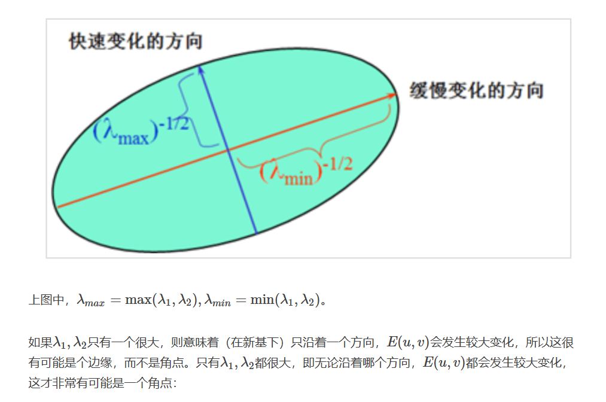
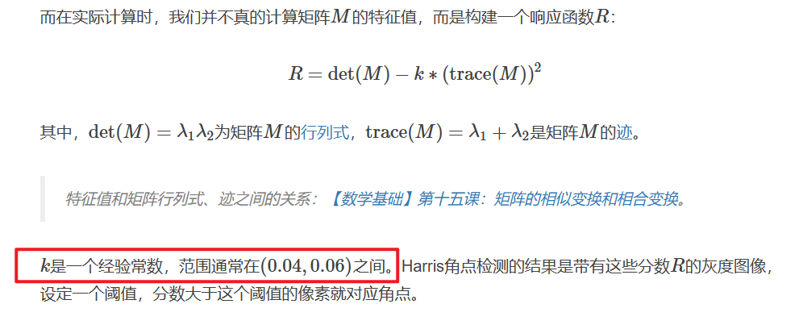

## 2.2 更细节的角点函数

建议看这个博主的[博客](http://shichaoxin.com/2022/05/30/OpenCV%E5%9F%BA%E7%A1%80-%E7%AC%AC%E4%B8%89%E5%8D%81%E4%BA%8C%E8%AF%BE-Harris%E8%A7%92%E7%82%B9%E6%A3%80%E6%B5%8B/)，慢下来从原理开始看，收获太大了！！

### 基本原理说明

知道这章的几个函数，需要了解一些角点的原理。主要是:

1. 角点检测和矩阵的特征值 $\lambda$ 怎么扯起来的？
2. 矩阵的特征值大小和角点检测准确度的联系
3. 函数中有一个参数 k 代表什么含义

这个博主的[博客](http://shichaoxin.com/2022/05/30/OpenCV%E5%9F%BA%E7%A1%80-%E7%AC%AC%E4%B8%89%E5%8D%81%E4%BA%8C%E8%AF%BE-Harris%E8%A7%92%E7%82%B9%E6%A3%80%E6%B5%8B/) 讲的相当好，接下来相当于是复制粘贴了。

#### 问题一



什么是角点：如果在任何方向上滑动窗口，窗口内的灰度都会发生变化，则这是一个角点。窗口滑动的灰度变化可以表示为：



这样角点检测就和某个矩阵的特征值相关联起来了。

#### 问题二



#### 问题三



### 具体函数

理解上面的原理就清楚了，下面主要分成两类，一个是 Harris，一个 Shi-Tomasi；后者其实主要区别就是直接用较小的特征值，这样不用调整上面 k 值。

#### cornerHarris

```cpp
void cornerHarris( 
	InputArray src, OutputArray dst, 
	int blockSize, int ksize, double k,
	int borderType = BORDER_DEFAULT 
);
```

blockSize 是滑动窗口大小；ksize 是计算梯度的Sobel算子尺寸；k 就是上面问题三的那个值

注意这个函数是放回图像各个位置的 R 值，所以之后还是要通过类似 `R[R > 0.01*R.max()]` 挑选出符合条件的点。

#### goodFeaturesToTrack

```cpp
void goodFeaturesToTrack( 
	InputArray image, OutputArray corners,
	int maxCorners, double qualityLevel, double minDistance,
	InputArray mask = noArray(), 
	int blockSize = 3,
	bool useHarrisDetector = false, 
	double k = 0.04 
);
// 官方文档中的示例
goodFeaturesToTrack(gray,25,0.01,10)
```

- maxCorners: 最多返回角点个数。会挑选前 maxCorners 个最优的角点返回。为 0 表示没有返回数量限制
- qualityLevel: 举例而言，最优（即 R 值最大）角点的 R 值为 1500，如果qualityLevel=0.01，则R值小于1500×0.01=15 的角点都会被抛弃。
- minDistance: 返回的角点中，之间最小的欧氏距离
- blocksize, k: 同 Harris
- userHarrisDetector: True 使用 Harris 方法；False 使用 Shi-Tomasi 方法

#### cornerEigenValsAndVecs

这个函数是输入图片，然后计算基本原理所说的两个特征值。这就是为什么要理解原理，不然不知道这函数干什么。

```cpp
void cornerEigenValsAndVecs( 
	InputArray src, OutputArray dst,
	int blockSize, int ksize, int borderType = BORDER_DEFAULT 
);
```

参数同上面的函数，下面是一个示例：

```cpp
int main(int argc, char** argv) {
    img = imread("xxx");

    // 参数
    int blockSize = 3;
    int ksize = 3;
    double k = 0.04;

    // 计算特征值
    img_lambdas = Mat::zeros(src.size(), CV_32FC(6));
    cornerEigenValsAndVecs(img, img_lambdas, blockSize, ksize, 4);
  
    // 计算响应，img_lambdas 就是算出的两个特征值
    R = Mat::zeros(src.size(), CV_32FC1);
    for (int row = 0; row < img_lambdas.rows; row++) {
        for (int col = 0; col < img_lambdas.cols; col++) {
            double lambda1 = img_lambdas.at<Vec6f>(row, col)[0];
            double lambda2 = img_lambdas.at<Vec6f>(row, col)[1];
            R.at<float>(row, col) = lambda1*lambda2 - k*pow((lambda1 + lambda2), 2);
        }
    }
  
    // 挑选出合适的点，模仿 goodFeaturesToTrack 的条件
    int maxCorners = 20;
    double qualityLevel = 0.01;
    double minDisatnce = 10;

    double minR, maxR;
    minMaxLoc(R, &minR, &maxR, 0, 0, Mat());
    float threshold = minR + qualityLevel*(maxR - minR);
    for (int row = 0; row < src.rows; row++) {
        for (int col = 0; col < src.cols; col++) {
            float v = harrisRspImg.at<float>(row, col);
            if (R.at<float>(row, col) > threshold) {
                // OK!
                if (maxCorners < 0) { return 0; }
                maxCorners -= 1;
            }
        }
    }
  
    return 0;
}
```

#### cornerMinEigenVal

同上面的函数，不过计算的是较小特征值（因为只求较小值可能求解速度会快一点），即给 Shi-Tomasi 这种方法用的，参数也同上面的函数。

#### cornerSubPix

亚像素级别的检测，具体参考上面博主的[文章](http://shichaoxin.com/2022/11/07/OpenCV%E5%9F%BA%E7%A1%80-%E7%AC%AC%E4%B8%89%E5%8D%81%E4%BA%94%E8%AF%BE-%E4%BA%9A%E5%83%8F%E7%B4%A0%E7%BA%A7%E5%88%AB%E8%A7%92%E7%82%B9%E6%A3%80%E6%B5%8B/)，非常详细。
