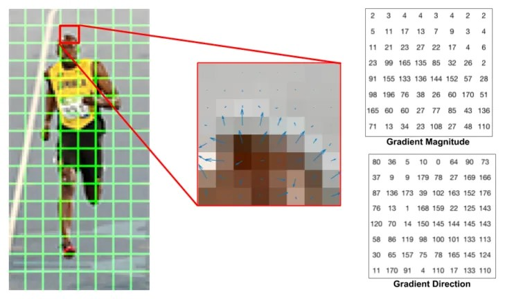
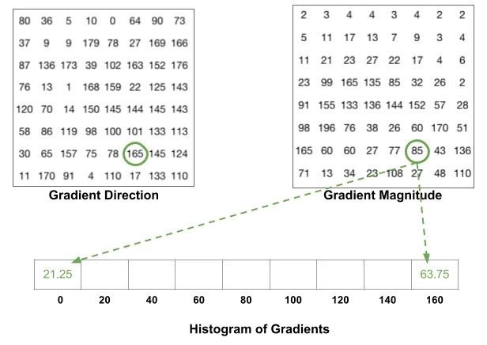
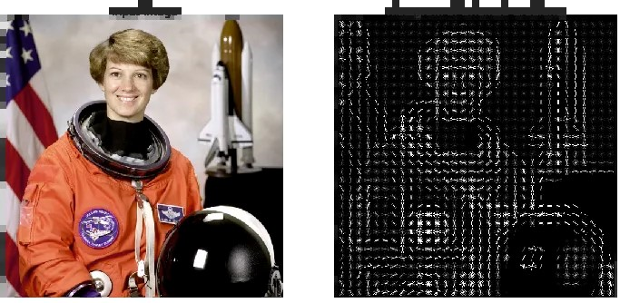

## 2.3 HOG 特征

一个比较特别的特征，简单、古老但是却很有用。通过梯度+直方图的方式，HoG 结合 SVM 分类器非常经典的图像识别应用，非常适合行人检测。

### 步骤说明

#### 1. 预处理图像

通常需要将训练图像块 resize 到 128*64 大小，其实主要是这个尺寸比例比较适合行人检测，而这是 HOG 最常用的领域；如果检测车子等宽体，那肯定要换个大小。([参考](https://answers.opencv.org/question/25908/hogsvm-the-size-of-positive-image-must-be-64128-any-other-choice/))

#### 2. 计算梯度

计算图像的梯度，包括 x 方向和 y 方向的梯度，然后转成梯度幅值和梯度方向。

#### 3. 计算梯度直方图

64\*128 大小的图像，分成 8\*8 的小块，每个小块计算梯度直方图。直方图的横坐标是 9 个 bin，按照 0-180 的角度划分；直方图的纵坐标是各个对应的像素梯度幅值加起来。

看下面的图就好理解了，下面这个博尔特被分为了 8x8 的绿色小块，我们专注其中一个小块，有它各个像素的梯度幅值和方向：



然后根据每个像素的梯度方向作为横坐标依据，梯度幅值加到直方图纵坐标中；注意是要按比例划分，而不是落入哪个区间就全加入到那个区间中：



#### 4. 归一化（可选）

为了减小光照的影响（比如同样边缘的梯度幅值，强光下会比弱光下大）。将每个小块的直方图归一化，归一化公式如下：

$$
H_{norm} = \frac{H}{\sqrt{\sum_{i=1}^{9}H_{i}^{2}} + c}
$$

其中 c 是一个很小的数，防止分母为 0。

#### 5. 特征拼接

64x128 分割 8x8，一共 8x16 个小块，每个小块有 9 个 bin。按照 2x2 的滑块去遍历（现在最小单位是 8x8 的小块了），每次遍历将 2x2 的小块直方图拼接成 36(4x9) 维向量，这样相当于滑动窗口滑出了 7x15 的区域，最终特征向量是 7x15x36=3780 维。([GIF图](./image/2.3/demo.gif)) 其中这个 2x2 的滑块叫做 block。

### 可视化 HOG 特征

搜索 HOG 时，经常会看到一些结果图：



这个其实不是单纯就根据 HOG 特征的值画出像素大小。现在相当于是 8x8 的小块中有 9x1 的值，每个值代表一个方向的强度，所以就按照类似【星形】结构，哪个方向大那就把那个方向的画的长和深，最终将这个 9x1 的值大致表现出不同方向的强度。

### 代码实现

```cpp
cv::HOGDescriptor::HOGDescriptor(
    Size _winSize, Size _blockSize, Size _blockStride, Size _cellSize,
    int _nbins, int _derivAperture = 1, double _winSigma = -1,
    HOGDescriptor::HistogramNormType _histogramNormType = HOGDescriptor::L2Hys,
    double 	_L2HysThreshold = 0.2,
    bool 	_gammaCorrection = false,
    int 	_nlevels = HOGDescriptor::DEFAULT_NLEVELS,
    bool 	_signedGradient = false 
)
```

这是一个类，里面有种种方法，用的时候细查文档，里面貌似直接带了和 SVM 结合的函数：https://docs.opencv.org/4.x/d5/d33/structcv_1_1HOGDescriptor.html

- winSize: 图片大小，默认是(64,128)
- cellSize: 每个单元格的大小，即所说的小块，默认是(8,8)
- blockSize: 每个 block 的大小，即最后第五步中所说的按照2x2小块进行滑动窗口，这个窗口的大小。默认是(16,16)
- blockStride: 每个 block 的步长，即第五步滑动窗口每次滑动多长，很显然一定要是 cell 的大小倍数。默认是(8,8)
- nbins: 每个单元格的直方图中的 bin 的数量，默认是 9
- derivAperture: 求梯度时候的算子大小，默认即可
- winSigma: 高斯窗口的标准差，默认即可。在计算直方图之前，对块边缘附近的像素进行平滑，可以提高 HOG 算法的性能，本质上去除噪声。
- histogramNormType: 归一化类型，默认是 L2Hys，即第四步那个公式
- L2HysThreshold: L2-Hys 归一化类型的阈值，即规定每个bin不能超过多少，超过就按照这个阈值来做
- gammaCorrection: 是否进行 gamma 校正，默认是 false
- nlevels: 图像金字塔的层数，默认是 HOGDescriptor::DEFAULT_NLEVELS

再细节将一个重要函数，detectMultiScale，这个函数即最终的检测，里面参数挺重要的，但这里就讲其中几个，原文来自[这篇文章](https://medium.com/lifes-a-struggle/hog-svm-c2fb01304c0)：

- winStride=(4,4): window 与 window 之间的起始位置要间距多少(x和y方向)。间距越大就只有较少的 window 使用 HOG 寻找特征，程序执行速度就会较快但成效较差; 小则反之
- padding=(8,8): 在使用 HOG 寻找特征之前，会先在周围贴 0，一般而言最好加一些
- scale=1.05: 一样，越小那么速度慢效果好；反之亦然
- 该函数经常和 NMS（即非极大值抑制，去除重叠框的）配合使用

具体别的函数就不讲了，如果哪天需要用到 HOG 再细节看吧。

```python
# opencv HOG 特征计算
img_gray = cv2.cvtColor(cv2.imread('demo.png'), cv2.COLOR_BGR2GRAY)

# Specify the parameters for our HOG descriptor
win_size = img_gray.shape
cell_size = (8, 8)
block_size = (16, 16)
block_stride = (8, 8)
num_bins = 9

# Set the parameters of the HOG descriptor using the variables defined above
hog = cv2.HOGDescriptor(win_size, block_size, block_stride, cell_size, num_bins)

# Compute the HOG Descriptor for the gray scale image
hog_descriptor = hog.compute(img_gray)
```

```python
# opencv的 默认的 hog+svm行人检测器
hog.setSVMDetector(cv2.HOGDescriptor.getDefaultPeopleDetector())
capture = cv2.VideoCapture(cv2.samples.findFileOrKeep('./code/video/vtest.avi'))

while True:
    ret, frame = capture.read()

    # Detect people in the image，这个函数决定了检测情况，尤其是 winStride 和 scale 参数
    (rects, weights) = hog.detectMultiScale(frame, winStride=(4, 4), padding=(8, 8), scale=1.05)
    for (y, x, w, h) in rects:
        cv2.rectangle(frame, (y, x), (y + w, x + h), (0, 255, 0), 2)

    cv2.imshow("hog-detector", frame)
    cv2.waitKey(1)
```
还有一个 [test_hog_default.py](../code/test_hog_default.py) 文件，里面包含了检测之后用 NMS 去除重叠框的代码。