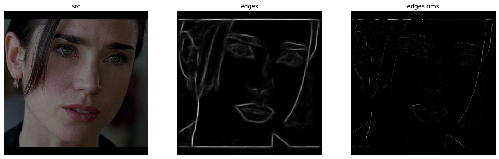

## 2.4 边缘检测

边缘是一个独特的图像特征。

### Canny

经典算法，无需多言。要么输入 8-bit 的 image，要么输入处理后的 16S1/16S3 的微分后的结果 dx 和 dy。

```python
cv.Canny(image, threshold1, threshold2[, edges[, apertureSize[, L2gradient]]]) -> edges
cv.Canny(dx, dy, threshold1, threshold2[, edges[, L2gradient]]) -> edges
```

### StructuredEdgeDetection

来自 [ximgproc 的方法](https://docs.opencv.org/4.x/de/d51/group__ximgproc__edge.html)，一共两个类：RFFeatureGetter 和 StructuredEdgeDetection。前者是训练时需要用到的，暂且不谈，可参考[该文章](https://github.com/fengzhenHIT/OpenCV-contrib-module-Chinese-Tutorials/blob/master/chapter%2020/%E8%AE%AD%E7%BB%83%E7%BB%93%E6%9E%84%E5%8C%96%E6%A3%AE%E6%9E%97.md)。后者则是训练和使用都会用到的类，是核心内容。方法的原论文[链接在此](https://openaccess.thecvf.com/content_iccv_2013/papers/Dollar_Structured_Forests_for_2013_ICCV_paper.pdf)，发表于 ICCV 2013。个人实验代码在 [test_edges.ipynb](../code/test_edges.ipynb) 中，简洁版代码如下，总结而言使用方式就是导入模型 + 无脑调用，图片和模型文件都在 opencv extradata 那个仓库中：

```python
model_pth = './image/edge/StructuredEdgeDetection.yml'
pDollar = cv2.ximgproc.createStructuredEdgeDetection(model_pth)

# 检测边缘的图片要求：RGB、0-1
nowimg = cv2.cvtColor(src, cv2.COLOR_BGR2RGB)
edges = pDollar.detectEdges(np.float32(nowimg) / 255.0)
orimap = pDollar.computeOrientation(edges)
# The function edgenms in edge image and suppress edges where edge is stronger in orthogonal direction.
edges_nm = pDollar.edgesNms(edges, orimap)

show_images([
    ('src', src),
    ('edges', edges),
    ('edges nms', edges_nm)
])
```




### EdgeDrawing

[ximgproc 的方法](https://docs.opencv.org/4.x/d4/d8b/group__ximgproc__edge__drawing.html)，不仅可以检测边缘，也可以检测边缘、检测椭圆。传入参数建立对象，然后调用方法。代码在 [test_edges.ipynb](../code/test_edges.ipynb) 中。

原始论文：
```
Cihan Topal and Cuneyt Akinlar. Edge drawing: a combined real-time edge and segment detector. Journal of Visual Communication and Image Representation, 23(6):862–872, 2012.
```
代码：
```python
rgb_src = cv2.imread('image/edge/sources/06.png')
gray_src = cv2.cvtColor(rgb_src, cv2.COLOR_BGR2GRAY)

ed = cv2.ximgproc.createEdgeDrawing()

edParms = ed.Params()
edParms.GradientThresholdValue = 38
edParms.EdgeDetectionOperator = cv2.ximgproc.EdgeDrawing_SOBEL
edParms.AnchorThresholdValue = 8
ed.setParams(edParms)
# 最开始要执行这个函数，相当于和原图绑定一下
ed.detectEdges(gray_src)

edges_by_ed = np.copy(rgb_src)
segments = ed.getSegments()
for oneseg in segments:
    cv2.polylines(edges_by_ed, [oneseg], False, (0, 255, 0), 1)

# # EdgeDrawing 还可以检测直线和椭圆
# ellipses = ed.detectEllipses()
# lines = ed.detectLines()

show_images([
    ('rgb src', rgb_src),
    ('edges by ed', edges_by_ed),
], colnum=5)
```

### Deriche, Paillou

也是 ximgproc 的方法，Paillou 只能 cpp 调用。查了一下 Deriche，它其实就是在 Canny 上改进了一些东西，比如平滑的方式等等，基本的逻辑是差不多的。代码如下：
```pyhton
gray = cv2.cvtColor(src, cv2.COLOR_BGR2GRAY)

resultX, resultY, result = [], [], []
for i in range(5, 26, 5):
    edgesX = cv2.ximgproc.GradientDericheX(gray, alpha=i/10, omega=1)
    edgesX = edgesX.astype(np.uint8)
    resultX.append((f'X   alpha={i/10}', edgesX))

    edgesY = cv2.ximgproc.GradientDericheY(gray, alpha=i/10, omega=1)
    edgesY = edgesY.astype(np.uint8)
    resultY.append((f'Y   alpha={i/10}', edgesY))

    edges = np.sqrt(edgesX*edgesX + edgesY*edgesY).astype(np.uint8)
    result.append((f'XY   alpha={i/10}', edges))
show_images(resultX, colnum=len(resultX))
show_images(result, colnum=len(result))
```