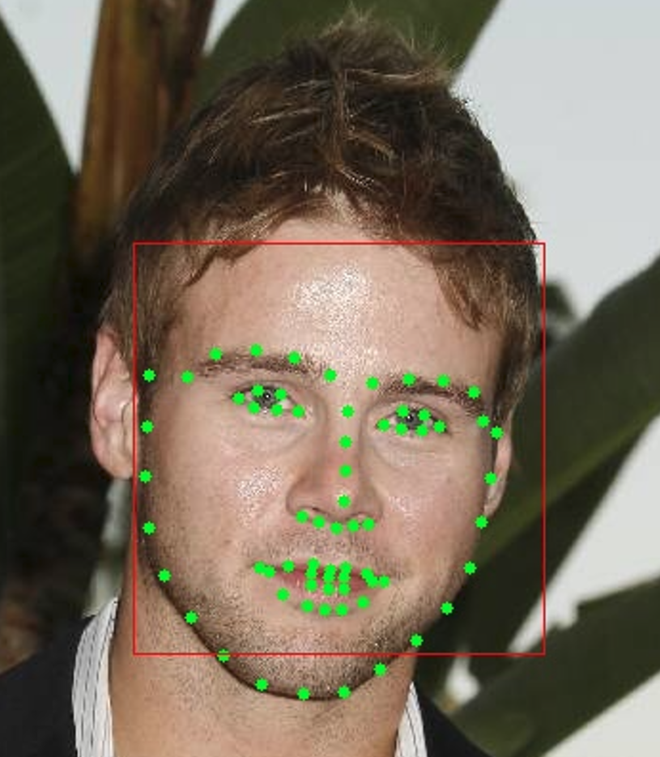

## 特殊的特征：人脸特征点

看这篇文章，需要知道 [Cascade 级联分类器](./3.5.md)。

OpenCV 中人脸特征点的检测逻辑：Cascade 检测出人脸的框，在框内使用人脸特征检测器检测具体点。一共有三种人脸特征检测：FacemarkAAM，FacemarkLBF，FacemarkKazemi。检测的结果就是如下图所示：



### 1. 单纯使用

看代码即可，lbfmodel.yaml 文件在：https://raw.githubusercontent.com/kurnianggoro/GSOC2017/master/data/lbfmodel.yaml；其他两个没找到相关配置。

Cascade 可以有两种：[Harr](https://github.com/mxochicale/openCV/blob/master/examples/data/haarcascades/haarcascade_frontalface_alt.xml) 和 [LBP](https://github.com/opencv-java/face-detection/blob/master/resources/lbpcascades/lbpcascade_frontalcatface.xml)。链接失效搜索 haarcascade_frontalface_alt 和 lbpcascade_frontalcatface 即可。

```cpp
#include "opencv2/face.hpp"
#include "opencv2/core.hpp"
#include "opencv2/imgproc.hpp"
#include "opencv2/highgui.hpp"

#include <stdio.h>
#include <iostream>

using namespace cv;
using namespace cv::face;
using namespace std;

int main(int argc, char** argv)
{
    /* 加载 FaceMarker，已经有训练好的模型；训练参考后面第二节的介绍 */
    // Ptr<FacemarkAAM> facemark = FacemarkAAM::create();
    // facemark->loadModel("AAM.yaml");
    // Ptr<FacemarkKazemi> facemark = FacemarkKazemi::create();
    Ptr<FacemarkLBF> facemark = FacemarkLBF::create();
    facemark->loadModel("lbfmodel.yaml");

    /* Pick one image. */
    Mat rgb_img = imread("./lfpw/testset/image_0002.png");
    Mat gray_img; cvtColor(rgb_img, gray_img, cv::COLOR_BGR2GRAY);

    /* Start to predict: */
    // 1. Cascade 检测具体位置
    vector<Rect> faces;
    CascadeClassifier faceDetector("haarcascade_frontalface_alt.xml");
    faceDetector.detectMultiScale(gray_img, faces);

    // 2. FaceMarker 检测特征点
    vector< vector<Point2f> > landmarks;
    bool success = facemark->fit(rgb_img, faces, landmarks);
    if (success) {
        // 3. 绘制 FaceMarker 检测的特征点
        for (unsigned j = 0; j < landmarks.size(); j++) {
            drawFacemarks(rgb_img, landmarks[j], Scalar(0, 255, 0));
        }
        // 3. 绘制 Cascade 检测出的人脸框
        for (unsigned j = 0; j < faces.size(); j++) {
            rectangle(rgb_img, faces[j], Scalar(0, 0, 255));
        }
    }
    // 也有将 Cascade 作为 FaceMarker 的参数的用法
    // 具体搜索 facemarker 的 setFaceDetector 和 getFaces
    imshow("Result of Image 0", rgb_img);
  
    waitKey(1000*5);
    return 0;
}
```

### 2. 自定义训练

参考 OpenCV 的 turtorial: https://docs.opencv.org/4.x/d5/dd8/tutorial_facemark_aam.html，下载 lfpw 数据集: https://ibug.doc.ic.ac.uk/download/annotations/lfpw.zip

下载需要准备 `images_train.txt` 和 `annotations_train.txt`，他们就是每一行表示各个具体文件的路径，如：

```
images_train.txt
/home/user/lfpw/trainset/100032540_1.jpg
/home/user/lfpw/trainset/100040721_1.jpg
/home/user/lfpw/trainset/100040721_2.jpg
/home/user/lfpw/trainset/1002681492_1.jpg

annotations_train.txt
/home/user/lfpw/trainset/100032540_1.pts
/home/user/lfpw/trainset/100040721_1.pts
/home/user/lfpw/trainset/100040721_2.pts
/home/user/lfpw/trainset/1002681492_1.pts
```

训练的代码:

```cpp
// 设置 parms.scales
FacemarkAAM::Params params;
std::vector<float>scales = {1.0, 2.0, 4.0};
params.scales = scales;
// 设置 parms.model_filename: 表示 train 后生成的 yaml 文件
params.model_filename = "AAM.yaml";

// Moudle
Ptr<FacemarkAAM> facemark = FacemarkAAM::create(params);

// Loads the dataset
std::vector<String> images_train;
std::vector<String> landmarks_train;
loadDatasetList("./lfpw/images_train.txt", "./lfpw/annotations_train.txt", images_train, landmarks_train);

// Training...
std::vector<Point2f> facial_points;
for (size_t i = 0; i < images_train.size(); i++) {
    Mat facial_image = imread(images_train[i].c_str());
    loadFacePoints(landmarks_train[i], facial_points);
    facemark->addTrainingSample(facial_image, facial_points);
}
facemark->training();
```

### 3. 更复杂的使用

我用上面的训练得出了 FacemarkAAM 的 yaml 模型，然后进行检测特征点，发现结果很差，又尝试了下 opencv 的 samples 代码，发现运行很完美。比较了一下，训练是没有问题，就是使用有不同。由于精力有限，这个就放在这里，等好心人或者自己有空再来研究：

```cpp
#include <stdio.h>
#include <fstream>
#include <sstream>
#include "opencv2/core.hpp"
#include "opencv2/highgui.hpp"
#include "opencv2/imgproc.hpp"
#include "opencv2/face.hpp"

#include <iostream>
#include <string>
#include <ctime>

using namespace std;
using namespace cv;
using namespace cv::face;

bool getInitialFitting(Mat image, Rect face, std::vector<Point2f> s0,
    CascadeClassifier eyes_cascade, Mat& R, Point2f& Trans, float& scale);

int main(int argc, char** argv)
{
    // Moudle
    Ptr<FacemarkAAM> facemark = FacemarkAAM::create();
    facemark->loadModel("AAM.yaml");

    //! [base_shape]
    FacemarkAAM::Data data;
    facemark->getData(&data);
    std::vector<Point2f> s0 = data.s0;

    CascadeClassifier face_cascade("haarcascade_frontalface_alt.xml");
    CascadeClassifier eyes_cascade("haarcascade_eye.xml");

    Mat rgb_img = imread("./lfpw/testset/image_0002.png");

    //! [detect_face]
    Mat gray_img; cvtColor(rgb_img, gray_img, cv::COLOR_BGR2GRAY);
    std::vector<Rect> faces;
    face_cascade.detectMultiScale(gray_img, faces);

    if (faces.size() > 0) {
        //! [get_initialization]
        std::vector<FacemarkAAM::Config> conf;
        std::vector<Rect> faces_eyes;
        for (unsigned j = 0; j < faces.size(); j++) {
            float scale;
            Point2f T;
            Mat R;

            if (getInitialFitting(rgb_img, faces[j], s0, eyes_cascade, R, T, scale)) {
                conf.push_back(FacemarkAAM::Config(R, T, scale, 0));
                faces_eyes.push_back(faces[j]);
            }
        }

        //! [fitting_process]
        if (conf.size() > 0) {
            std::vector<std::vector<Point2f> > landmarks;
            facemark->fitConfig(rgb_img, faces_eyes, landmarks, conf);
            for (unsigned j = 0; j < landmarks.size(); j++) {
                drawFacemarks(rgb_img, landmarks[j], Scalar(0, 255, 0));
            }
            imshow("fitting", rgb_img);
            waitKey(1000 * 5);
        }
    }
}


bool getInitialFitting(Mat image, Rect face, std::vector<Point2f> s0, CascadeClassifier eyes_cascade, Mat& R, Point2f& Trans, float& scale) {
    std::vector<Point2f> mybase;
    std::vector<Point2f> T;
    std::vector<Point2f> base = Mat(Mat(s0) + Scalar(image.cols / 2, image.rows / 2)).reshape(2);

    std::vector<Point2f> base_shape, base_shape2;
    Point2f e1 = Point2f((float)((base[39].x + base[36].x) / 2.0), (float)((base[39].y + base[36].y) / 2.0)); //eye1
    Point2f e2 = Point2f((float)((base[45].x + base[42].x) / 2.0), (float)((base[45].y + base[42].y) / 2.0)); //eye2

    Mat faceROI = image(face);
    std::vector<Rect> eyes;

    //-- In each face, detect eyes
    eyes_cascade.detectMultiScale(faceROI, eyes, 1.1, 2, CASCADE_SCALE_IMAGE, Size(20, 20));
    if (eyes.size() == 2) {
        int j = 0;
        Point2f c1((float)(face.x + eyes[j].x + eyes[j].width * 0.5), (float)(face.y + eyes[j].y + eyes[j].height * 0.5));

        j = 1;
        Point2f c2((float)(face.x + eyes[j].x + eyes[j].width * 0.5), (float)(face.y + eyes[j].y + eyes[j].height * 0.5));

        Point2f pivot;
        double a0, a1;
        if (c1.x < c2.x) {
            pivot = c1;
            a0 = atan2(c2.y - c1.y, c2.x - c1.x);
        }
        else {
            pivot = c2;
            a0 = atan2(c1.y - c2.y, c1.x - c2.x);
        }

        scale = (float)(norm(Mat(c1) - Mat(c2)) / norm(Mat(e1) - Mat(e2)));

        mybase = Mat(Mat(s0) * scale).reshape(2);
        Point2f ey1 = Point2f((float)((mybase[39].x + mybase[36].x) / 2.0), (float)((mybase[39].y + mybase[36].y) / 2.0));
        Point2f ey2 = Point2f((float)((mybase[45].x + mybase[42].x) / 2.0), (float)((mybase[45].y + mybase[42].y) / 2.0));


#define TO_DEGREE 180.0/3.14159265
        a1 = atan2(ey2.y - ey1.y, ey2.x - ey1.x);
        Mat rot = getRotationMatrix2D(Point2f(0, 0), (a1 - a0) * TO_DEGREE, 1.0);

        rot(Rect(0, 0, 2, 2)).convertTo(R, CV_32F);

        base_shape = Mat(Mat(R * scale * Mat(Mat(s0).reshape(1)).t()).t()).reshape(2);
        ey1 = Point2f((float)((base_shape[39].x + base_shape[36].x) / 2.0), (float)((base_shape[39].y + base_shape[36].y) / 2.0));
        ey2 = Point2f((float)((base_shape[45].x + base_shape[42].x) / 2.0), (float)((base_shape[45].y + base_shape[42].y) / 2.0));

        T.push_back(Point2f(pivot.x - ey1.x, pivot.y - ey1.y));
        Trans = Point2f(pivot.x - ey1.x, pivot.y - ey1.y);
        return true;
    }
    else {
        Trans = Point2f((float)(face.x + face.width * 0.5), (float)(face.y + face.height * 0.5));
        return false;
    }
}
```
