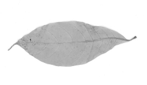
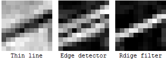
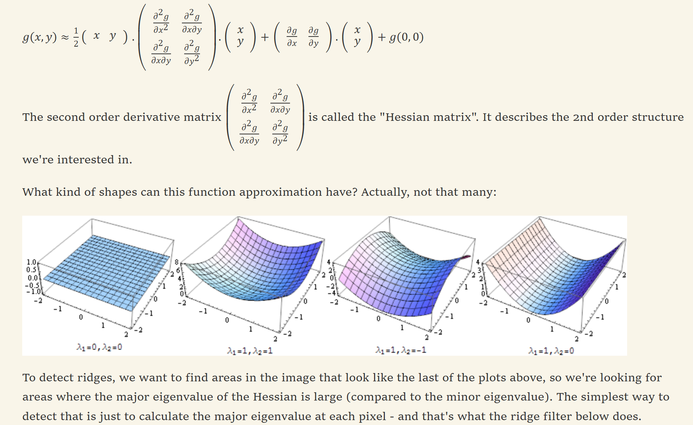

## Ridgets 特征

来自于 StackExchange 上一个特别好的回答：https://dsp.stackexchange.com/questions/1714/best-way-of-segmenting-veins-in-leaves/1735#1735

有人想提取一个叶子的骨干，但是边缘提取效果很不好。下面的回答就介绍了这种情况应该是 Ridgets 而不是 Edges。



### Edges 和 Ridgets 的区分：

Edges 是提取两边差异较大的那些地方，如从黑到白；而 Ridgets 提取的是比两边差异都较大的那些地方，比如黑白黑，就会提取出白。

所以很显然，如果用 Edges 提取叶子骨干，很容易出现 "double line pattern"，即提取的是叶子骨干的两边了。如下面的图，第一行是原始图，一条黑线，它的两边是白色的，用 Edges 就会提取出它的两边，用 Ridgets 才会提取到黑线本身。



### 寻找 Ridgets 原理

Edges 一般是一阶导，如 Sobel；想要找 Ridgets 就要在二阶导上作文章。这个就是对 Hessian 矩阵求特征向量来做的，相当于求抛物线极值点。这是一个经典的问题，多元函数求极值，网上很多资料，比如[这篇文章](https://www.cnblogs.com/jzssuanfa/p/7341602.html)不错。



### Opencv 中使用 Ridget

具体代码在 [test_edges.ipynb](../code/test_edges.ipynb) 中，这里摘抄一下，ximgproc 里面有现成的 API：

```pyhton
src = cv2.imread('image/edge/sources/06.png')

now_filter = cv2.ximgproc.RidgeDetectionFilter.create()
result = now_filter.getRidgeFilteredImage(src)

show_images([
    ('result', result),
])
```
