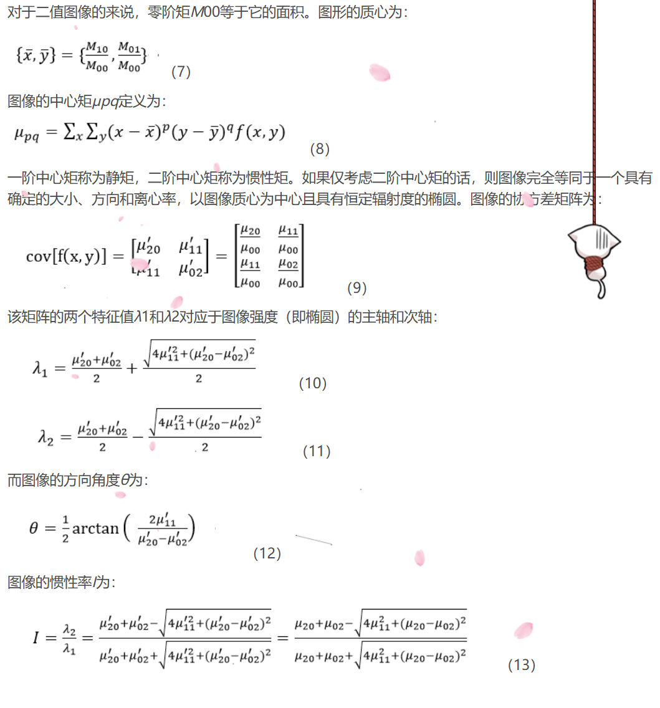

## 3.2 斑点检测

OpenCV 自带了斑点检测的类，SimpleBlobDetector。可以根据如下方式检测：

1. 颜色、大小：blobColor=0 表示黑色的点，颜色只适用于二值图像；minArea, maxArea 表示斑点的大小范围；
2. 圆形程度：minCircularity, maxCircularity；这个是通过(4pi)*(面积/周长平方)来获取的，如正方形就是 0.785；
3. 凸性：minConvexity, maxConvexity；这个是斑点面积/凸包的面积；
4. 惯性比：minInertiaRatio, maxInertiaRatio；这个其实就是衡量伸长程度，是斑点主轴与次轴长度的比值，圆形是 1，直线是 0；

```python
import cv2

img = cv2.imwrite('./test.png', -1)

# 创建一个SimpleBlobDetector对象
params = cv2.SimpleBlobDetector_Params()

# 设置过滤器的参数
params.filterByArea = True
params.minArea = 1500

# Filter by Circularity
params.filterByCircularity = True
params.minCircularity = 0.1

blob_detector = cv2.SimpleBlobDetector.create(params)
keypoints = blob_detector.detect(img)
```

更详细的补充：


