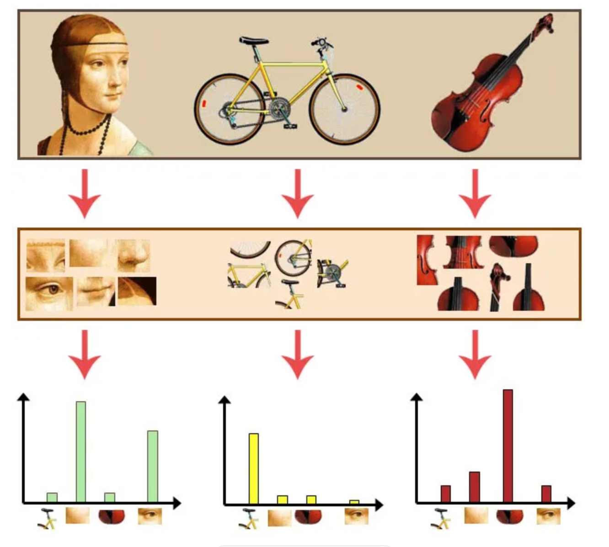

## 3.3 从 SVM 到 BOW 词袋

参考：

- https://www.cnblogs.com/wangguchangqing/p/9435269.html
- https://blog.csdn.net/qq_43328040/article/details/109299478
- https://machinelearningmastery.com/opencv_object_detection

---

在 [HOG](./2.3.md) 中，里面提到 SVM+HOG 是一种非常经典的图像分类或识别方法。其实又何止 HOG 呢，任何一个特征提取方法（如SIFT等），都可以和 SVM 结合起来，形成一种分类器。

然后开始介绍词袋模型（Bag of Words, BoW），这在深度学习时代前可是很不错很主流的做法。思想从 NLP 那边借鉴而来，NLP 概念 引入到 CV 中，那就是将【一副图像】作为【文本】，图像中的不同特征可以看成不同词汇。这样就可以使用图像特征在图像中出现的频率，使用一个一维的向量来描述图像。

那么如人的眼睛、自行车座是怎么提取出的？特征点呗，通常用 SIFT 特征点。其实想象这不就是【特征点+SVM】的方法吗。而 BoW 优化在哪里呢？**其实就是加了聚类和直方图统计**：如果只用特征点，那么一副图片由很多的特征点，更不用说多张图片了，这样导致比较一副图片的特征点特征时效率会很慢、存储空间大。而加了聚类步骤，把特征点分类，分成合适数量的类；而且还不是把他们拼接起来，而是采用直方图统计的方式。这样处理新的图片时，提取特征点，找到各个特征点对应的类，计算出各个类出现的次数，这样特征点组成的向量就会少很多。

因此，标题中从 SVM 到 BOW 还是有点道理的，BOW 在传统 SVM 基础上增加了聚类+直方图的步骤。

词袋模型的步骤：提取特征点（通常是SIFT）；特征点聚类，分成几个类；对于一张图片，统计各个类出现的频率，如图所示：



### 代码实现

#### HOG + SVM
代码实现先从 SVM 开始，在 [HOG](./2.3.md) 中有过用 OpenCV 自带的行人检测模型实现 HOG+SVM 检测，这里就着重来进行 SVM 训练。图片、代码和学习记录参考了两篇文章，特此感谢（[文章一](https://blog.csdn.net/qq_43328040/article/details/109299478)、[文章二](https://machinelearningmastery.com/opencv_object_detection/)，整体代码在 [test_hog_svm.ipynb](code/test_hog_svm.ipynb) 中。

1. 整体出训练集和测试集，这个其实就是每次读一张图片，然后存储 HOG 特征 和 正负标签。
```python
# 以负样本为例，每次读取图片，计算 HOG
for fname in os.listdir(f'{datadir}/neg'):
    img = cv2.imread(f'{datadir}/neg/{fname}', -1)
    datas.append((hog.compute(img), -1))
```

2. 使用 SVM 训练
```python
svm = cv2.ml.SVM_create()
svm.setType(cv2.ml.SVM_C_SVC)
svm.setKernel(cv2.ml.SVM_LINEAR)
svm.setTermCriteria((cv2.TERM_CRITERIA_MAX_ITER, 100, 1e-6))

# 训练 SVM，train_features 就是各个图片的 HOG，train_labels 就是各个图片的标签
svm.train(np.array(train_features), cv2.ml.ROW_SAMPLE, np.array(train_labels))

# 训练完可以检测，看看训练出来的怎么样
predict_labels = svm.predict(np.array(test_features))[1].flatten()
print('Wrong rate:', sum(predict_labels != np.array(test_labels))/len(predict_labels))
```

3. HOG + SVM 融合
```python
# 新建 HOG 类，将其检测设为训练好的 SVM
hog = cv2.HOGDescriptor()
hog.setSVMDetector(svm.getSupportVectors()[0])

# 从训练集图片中读取一张图片进行检测
img = cv2.imread(f'test.jpg', -1)
(rects, weights) = hog.detectMultiScale(img, winStride=(4, 4), padding=(8, 8), scale=1.05)
x, y, w, h = rects[np.argmax(weights.flatten())]
cv2.rectangle(img, (x, y), (x+w, y+h), (255,0,0), 1)
show_image(img)
```

#### SIFT + BoW + SVM
下面讲解 用了 BoW 的代码实现，通常而言都用 SIFT 特征，参考了这篇[文章](https://www.cnblogs.com/wangguchangqing/p/9435269.html)和这个 [Github仓库](https://github.com/gurkandemir/Bag-of-Visual-Words)，整体代码在 [test_bow_sift.ipynb](code/test_bow.ipynb) 中。

1. 处理训练集，获取所有特征
```python
# 直接默认就好
sift = cv2.SIFT_create()

# 读取所有图片，记录出现过的特征
datadir = './image/classification_imgs/train'
features = []
for idx, fname in enumerate(label_names):
    for imgname in os.listdir(f'{datadir}/{fname}'):
        img = cv2.imread(f'{datadir}/{fname}/{imgname}', -1)
        now_features = sift.detectAndCompute(img, None)[1]
        features.extend(list(now_features))
features = np.array(features)
```

2. KMeans 聚类
```python
# KMeans 分类，50 个种类，其中 random_state 要保持始终是同一个值
from sklearn.cluster import KMeans
kmeans = KMeans(n_clusters=50, random_state=10).fit(features)
print('原始有', features.shape[0], '现在有', 50)
```

3. 重新遍历训练集，这次是统计训练集中各张图片的特征中 Kmeans 聚类后的各个类别的次数，注意要归一化。
```python
# 重新遍历训练集，统计在 Kmeans 分类中各个类出现次数（即直方图统计）
datadir = './image/classification_imgs/train'
train_features, train_labels = [], []
for idx, fname in enumerate(label_names):
    for imgname in os.listdir(f'{datadir}/{fname}'):
        img = cv2.imread(f'{datadir}/{fname}/{imgname}', -1)
        now_features = sift.detectAndCompute(img, None)[1]

        # Kmeans 计算本图中所有 SIFT 特征各自归属哪个类
        now_count = np.array([0 for _ in range(50)])
        for k in kmeans.predict(now_features):
            now_count[k] += 1
        # 归一化哦
        now_count = now_count / np.sum(now_count)
        train_features.append(now_count)
        train_labels.append(idx)
train_features = np.array(train_features, dtype=np.float32)
train_labels = np.array(train_labels, dtype=int)
```

4. 训练 SVM + 处理测试集
```python
# 训练 SVM，这里面有重要的参数 C 和 gamma，自己尽量不同尝试吧
svm = cv2.ml.SVM_create()
svm.setType(cv2.ml.SVM_C_SVC)
svm.setKernel(cv2.ml.SVM_RBF)
svm.setC(100)
svm.setGamma(100)

svm.train(train_features, cv2.ml.ROW_SAMPLE, train_labels)

# 查看训练的误差
predict_labels = svm.predict(train_features)[1].flatten()
print('Train Wrong rate:', sum(predict_labels != train_labels)/(train_features.shape[0]))

# SVM 检测，准备测试集的代码就跳过了
predict_labels = svm.predict(test_features)[1].flatten()
print('Test Wrong rate:', sum(predict_labels != test_labels)/(test_features.shape[0]))
```