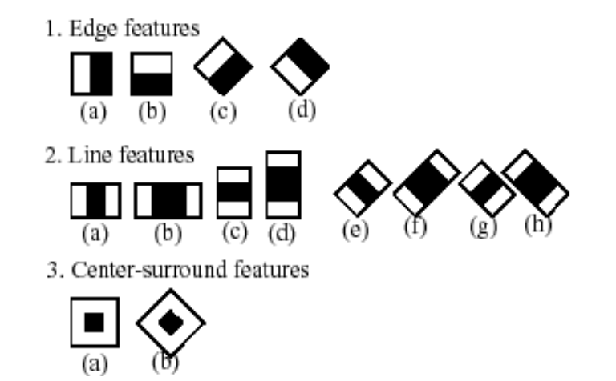
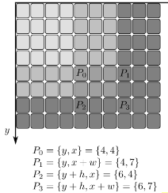
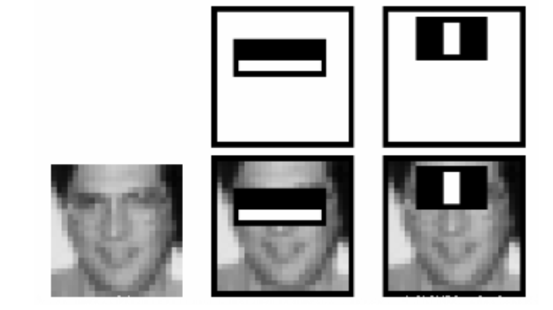

## 3.4 级联分类器

主要是对 OpenCV 官方 tutorial 的解读：https://docs.opencv.org/4.x/db/d28/tutorial_cascade_classifier.html ，感觉官方说的不是很清楚。

本质上是对 Rapid Object Detection using a Boosted Cascade of Simple Features[J].CVPR, 2001 的说明。参考了这篇[文章](https://www.cnblogs.com/YiXiaoZhou/p/5875492.html)。

### 积分图上的特征提取

首先是 Harr-like Feature，就是人工构造的卷积核，进行一些特征提取呗。通过这个处理把输入图片转成多个特征值，这个意义无需多言，更快更准呗，现在卷积神经网络的类似步骤早就深入人心。回到 Harr features，学者有如下的一些设计，白色为 1， 黑色为 -1（其实下图是后续学者们的改进，初始论文只有几个，并且有的效果不是很好）：

然后这里为了加快速度，用的积分图。积分图之前有提到过，其实就是计算零点到当前点的和（下图）。如上图所示，Harr feature 全是一大片矩形块的 1 和 -1，那么很适合用积分图来做，无非就是事先计算好的积分图上加加减减，不用每次计算都要按照像素点求和来做。

### 特征选择

这里查阅了很多资料才明白是什么意思。这里的特征其实就是用各个 Harr feature 块对图片进行滑动操作最后产生的结果。也就是说，每个点上每个 Harr feature 都是一个特征，最后拼出一个很长的一维向量。

> 关于特征选择的思考：
> 所以这里挺类似卷积神经网络，但很遗憾它没有利用二维的信息，走了另一条暴力的路：即所有点的所有 harr feature 作为一个一维向量进行分类。
> 更新：后来又一想，不对啊，这个其实就是一个卷积层的神经网络。而在这个唯一的卷积层中，卷积核是人工构造的 harr 矩形块。输出了许多特征后，这些特征作为一维向量进行处理。而神经网络无非是多个层，层里面有激活函数；但最后也还是要把输出当成一维向量处理（比如扔到全连接层里面）。

输出很长的一维向量，然而只有一少部分是有用的，这就是官方文档给的那个例子的意思：如下图所示，有两个 harr feature 能比较好检测到眼睛，那么这两个 harr 块处理**以眼睛为中心的块**得到的特征是有用的；但是这两个 harr feature 去处理图片其他部分，得到的特征就是基本没用的。

所以需要选择主要特征，这个就是通过 Adboost 方法寻找而来的。具体的细节做法请查阅别的文章。最后的效果 from 160000+ features to 6000 features，非常大的降低。

> 个人感觉难怪神经网络之前的方法多少效果还是不够好，这个选主要特征的方法还是不太好，因为没考虑位置信息啊。比如图片的眼睛是很大概率不在同一个位置上，只要不是同一个位置，对他们进行特征提取出的特征在一维向量中的位置就是不同的。而在提取主要特征的时候，不同位置的特征是独立的关系。如果极端情况：只保留一个主要特征，那么最后待预测图片的眼睛必须要和大部分训练图片的眼睛位置一样，但凡翻转一下都不对。

### 级联

而文章也给了一个很好更快的思想，级联分类器。AdaBoost 高准确率（真的认为真的）很容易，但低误检率（假的认为真的）很难。

参考文章中给的数据：假设要实现 99% 的正确率，1% 的误检率需要 200 维特征，而实现具有 99.9% 正确率和 50% 的误检率的 AdaBoost 分类器仅需要 10 维特征。（没错低维度反而可以达到高准确率，可以理解成低维度相当于放宽准入条件，所以符合的更加不会被漏掉，只不过代价是许多漏网之鱼准入了）

如果只用一个分类器，必须它这一个分类器就要做到高准确率，低误检率，这样特征维度要求太高了。但利用高准确率很容易达到的特点，使用级联可以很有效果，**即多个分类器串联**。即如果要输出真，那么必须多个串联分类器全同意。

计算一下，拿上两段所说的 200 维和 10 维为例，如果 10 个 10 维，那么：
- 准确率 = (99.9%)^10 = 99.004%
- 误检率 = (50%)^10 = 0.09%

用了 10*10=100 维度，级联分类器可以打败 200 维度的一个分类器。