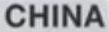
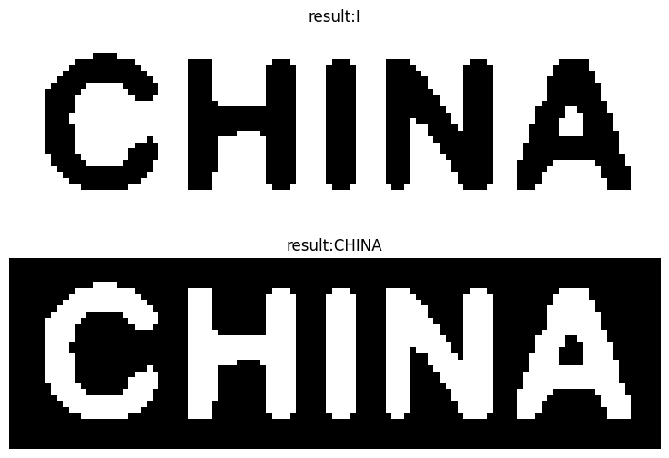

## 常见检测：文字（text 模块）

OpenCV 有一个专门的 text 模块，负责处理文字识别。

### 文字位置寻找

先说文字位置寻找，这个通常是文字识别的第一步：即你起码要能在一个场景中先把文字给框出来，不然那还搞什么文字识别.. [OpenCV 的链接](https://docs.opencv.org/4.x/da/d56/group__text__detect.html)在这里也记录一下。

可以看 OpenCV 的那个链接，有四个类和许多方法，但总共其实就分成三类方法，看下面的代码就行:

```python
######################################   EM  ############################################
def EM(src):
    channels = cv2.text.computeNMChannels(src)
    # 这一步的意义：Append negative channels to detect ER- (bright regions over dark background)
    channels = list(channels) + list([255-x for x in channels])

    er_filter1 = cv2.text.createERFilterNM1(cv2.text.loadClassifierNM1('./image/text/trained_classifierNM1.xml'), 16, 0.00015, 0.13, 0.2, True, 0.1)
    er_filter2 = cv2.text.createERFilterNM2(cv2.text.loadClassifierNM2('./image/text/trained_classifierNM2.xml'), 0.5)

    nowimg = np.copy(src)
    for idx, channel in enumerate(channels):
        # CPP 可以进行如下等价操作，Python 不支持 
        # er_filter1->run(channel, region);   er_filter2->run(channel, region);
        regions = cv2.text.detectRegions(channel, er_filter1, er_filter2)
        rects = cv2.text.erGrouping(src, channel, [r.tolist() for r in regions])

        for rect in rects:
            cv2.rectangle(nowimg, (rect[0], rect[1]), (rect[0]+rect[2], rect[1]+rect[3]), color=(0, 255, 0), thickness=5)
    return nowimg

######################################   SWT  ############################################
def SWT(src):
    nowimg = np.copy(src)
    rects, _, _ = cv2.text.detectTextSWT(src, dark_on_light=True)
    for rect in rects:
        cv2.rectangle(nowimg, (rect[0], rect[1]), (rect[0]+rect[2], rect[1]+rect[3]), color=(0, 255, 0), thickness=5)
    return nowimg

######################################   CNN  ############################################
def CNN(src):
    # TextBoxes_icdar13.caffemodel：https://github.com/PacktPublishing/OpenCV-3-Computer-Vision-with-Python-Cookbook/blob/master/data/TextBoxes_icdar13.caffemodel
    textSpotter = cv2.text.TextDetectorCNN_create("./image/text/textbox.prototxt", "./image/text/TextBoxes_icdar13.caffemodel")
    rects, outProbs = textSpotter.detect(src)

    nowimg = np.copy(src)
    for rect, outProb in zip(rects, outProbs):
        if outProb > 0.5:
            cv2.rectangle(nowimg, (rect[0], rect[1]), (rect[0]+rect[2], rect[1]+rect[3]), color=(0, 255, 0), thickness=5)
    return nowimg

result = []
for i in range(2, 4):
    src = cv2.imread(f'./image/text/scenetext0{i}.jpg', -1)
    result.extend([['ByEM', EM(src)], ['SWT', SWT(src)], ['ByCNN', CNN(src)]])

show_images(result, colnum=3)
```

### 文字识别

文字位置查找后，接下来是[文字识别模块](https://docs.opencv.org/4.x/d8/df2/group__text__recognize.html)，主要三个方法：`OCRBeamSearchDecoder`，`OCRHMMDecoder`，`Tesseract`。

其中前两个只负责文字识别，所以要求图片是包含一段文字的图片，而不是一整张图片，不然基本识别不出来啥，如下图。最后一个 `tesseract` 本质是用 Google 的 Tessearct 文字识别工具，他的要求就可以是一整张图片，相当于实现文字位置查找 + 文字识别整体流程。但Python 调用推荐用 `pytesseract` 而不是 OpenCV 的相关代码。



#### 1. OCRBeamSearchDecoder

看代码即可，文件都能在 https://github.com/opencv/opencv_contrib/tree/master/modules/text/samples 中找到:

```python
chartables = "abcdefghijklmnopqrstuvwxyzABCDEFGHIJKLMNOPQRSTUVWXYZ0123456789"

classifier = cv2.text.loadOCRBeamSearchClassifierCNN('./image/text/OCRBeamSearch_CNN_model_data.xml.gz')

# 默认的文件: (created from ispell 42869 English words list)
fs = cv2.FileStorage('./image/text/OCRHMM_transitions_table.xml',cv2.FILE_STORAGE_READ)
transition_p = fs.getNode('transition_probabilities').mat()

emission_p = np.eye(len(chartables), len(chartables)).astype(float)

# 要求 transition 和 emission 必须和 vocabulary 一样大小
assert(transition_p.shape[0] == transition_p.shape[1] == len(chartables))
decoder = cv2.text.OCRBeamSearchDecoder.create(
    classifier, 
    vocabulary=chartables, 
    transition_probabilities_table=transition_p,
    emission_probabilities_table=emission_p
)

src = cv2.imread(f'./image/text/scenetext_word01.jpg', -1)
src = cv2.cvtColor(src, cv2.COLOR_BGR2GRAY)
text = decoder.run(src, min_confidence=0)
```

需要说明的是，这个方法他的 [`run` 方法](https://docs.opencv.org/4.x/da/d07/classcv_1_1text_1_1OCRBeamSearchDecoder.html#a8107fa523397a2432a0adb7d821ef8a1)有两个:

```cpp
virtual void cv::text::OCRBeamSearchDecoder::run(
    Mat & 	image, Mat & 	mask,
    std::string & 	output_text,
    std::vector< Rect > * 	component_rects = NULL,
    std::vector< std::string > * 	component_texts = NULL,
    std::vector< float > * 	component_confidences = NULL,
    int 	component_level = 0 
)
String cv::text::OCRBeamSearchDecoder::run	(
    InputArray 	image, InputArray 	mask,
    int 	min_confidence,
    int 	component_level = 0 
)
```

但是 Python 中只能调用第二种。而且之前还有问题，没有检测空指针，还得感谢这个问题，给 OpenCV 贡献了第一个 commit: https://github.com/opencv/opencv_contrib/pull/3790

#### 2. OCRHMMDecoder

和 OCRBeamSearchDecoder 基本差不多，除了 load 方法不一样而已...

```python
chartables = "abcdefghijklmnopqrstuvwxyzABCDEFGHIJKLMNOPQRSTUVWXYZ0123456789"

# 默认的文件: (created from ispell 42869 English words list)
fs = cv2.FileStorage('./image/text/OCRHMM_transitions_table.xml',cv2.FILE_STORAGE_READ)
transition_p = fs.getNode('transition_probabilities').mat()

# 要求 transition 和 emission 必须和 vocabulary 一样大小
assert(transition_p.shape[0] == transition_p.shape[1] == len(chartables))

emission_p = np.eye(len(chartables), len(chartables)).astype(float)

# 都可以，反正根据第二个参数，来选择第一个参数的文件
classifier = cv2.text.loadOCRHMMClassifier(
    './image/text/OCRHMM_knn_model_data.xml.gz', cv2.text.OCR_KNN_CLASSIFIER)
classifier = cv2.text.loadOCRHMMClassifier(
    './image/text/OCRBeamSearch_CNN_model_data.xml.gz', cv2.text.OCR_CNN_CLASSIFIER)

decoder = cv2.text.OCRHMMDecoder.create(
    classifier = classifier,
    vocabulary=chartables, 
    transition_probabilities_table=transition_p,
    emission_probabilities_table=emission_p
)

# 测试图片一
src = cv2.imread(f'./image/text/scenetext_word01.jpg', -1)
gray = cv2.cvtColor(src, cv2.COLOR_BGR2GRAY)

# 需要的是二值图像，并且是黑底白字
thresh1 = cv2.threshold(gray, 128, 255, cv2.THRESH_BINARY)[1]
result1 = decoder.run(thresh1, min_confidence=0)
```

**从代码上也能看出，需要二值图像，并且是黑底白字。** 如下图所示，这是两张图片黑底白字和白底黑字的结果：



#### 3. Pytesseract

如上一段所述，本质是用 Google 的 Tessearct 文字识别工具，他的要求就可以是一整张图片，相当于实现文字位置查找 + 文字识别整体流程。Python 调用推荐用 `pytesseract` 而不是 OpenCV 的相关代码。

其实文字识别就用 tesseract 就完事了，一般在网上搜大家也都是用的这个，几个我当时用时遇到的注意点：
1. 需要安装 tesseract，设置好 `pytesseract.pytesseract.tesseract_cmd`
2. 需要先处理一下图片，让图片放大一些，不然识别效果不好
3. 使用 `image_to_string` 时可以用 `config` 参数，有奇效，见代码中的相关片段
4. 有的时候 tesseract v3 反而比 v5 要好，最好都下载然后使用看看结果

整体代码如下：
```python
import pytesseract
from PIL import Image

# pytesseract 最好处理一下图片，让图片大一些
def adjust_img(img):
    gray = np.copy(img) if len(img.shape)==2 else cv2.cvtColor(img, cv2.COLOR_BGR2GRAY)
    ratio = 300 // gray.shape[0]
    new_size = (gray.shape[1]*ratio, gray.shape[0]*ratio)

    gray = Image.fromarray(gray)
    gray = gray.resize(new_size, Image.Resampling.LANCZOS)
    return gray

pytesseract_dir = 'C:\\Program Files\\Tesseract-OCR'
pytesseract.pytesseract.tesseract_cmd = f'{pytesseract_dir}\\tesseract.exe'

# 测试图片一和二
src1 = cv2.imread(f'./image/text/scenetext_word01.jpg', -1)
text1 = pytesseract.image_to_string(adjust_img(src1))
src2 = cv2.imread(f'./image/text/scenetext_word02.jpg', -1)
text2 = pytesseract.image_to_string(adjust_img(src2))

# 测试图片（数字）
src3 = cv2.imread(f'./image/text/small_word.png', -1)
text3 = pytesseract.image_to_string(adjust_img(src3))
# 增加配置，如 digits 表示强行只识别为数字，这个需要具体要看文件夹里有没有这个 digits 文件
text4 = pytesseract.image_to_string(adjust_img(src3), config=f'--psm 6 {pytesseract_dir}\\tessdata\\config\\digits')

# 有的时候 tesseract 5 反而不如 3，不知道为啥
pytesseract_dir = 'C:\\Program Files\\Tesseract-3'
pytesseract.pytesseract.tesseract_cmd = f'{pytesseract_dir}\\tesseract.exe'
text5 = pytesseract.image_to_string(adjust_img(src3))
# 可以看到 5 和 3 的 config 有轻微不同，如分别时 --psm 和 -psm
text6 = pytesseract.image_to_string(adjust_img(src3), config=f'-psm 6 {pytesseract_dir}\\digits')

print('small_image result')
print(f'tesseract 5:{text3.strip()}(no config), {text4.strip()}(has config)')
print(f'tesseract 3:{text5.strip()}(no config), {text6.strip()}(has config)')
show_images([
    (f'result:{text1}', src1),
    (f'result:{text2}', src2),
    (f'small_image\n', src3),
], colnum=1)
```