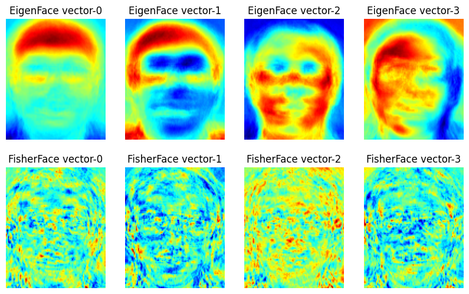
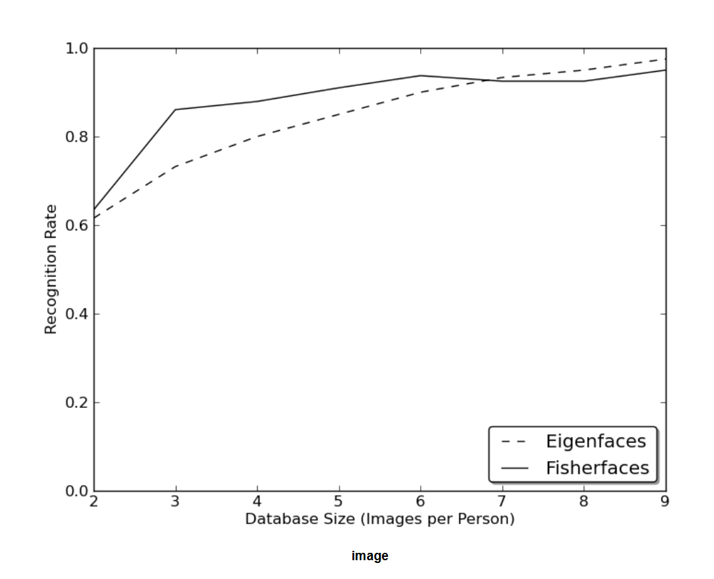
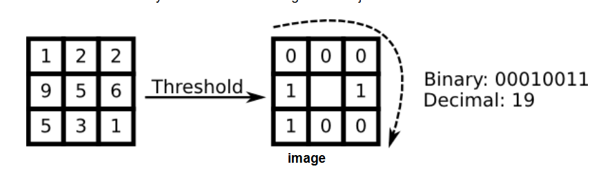
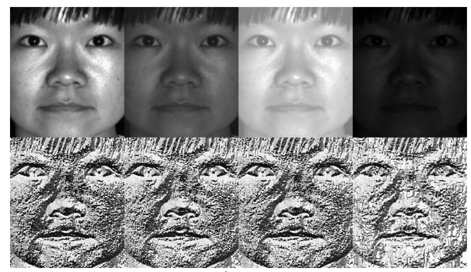
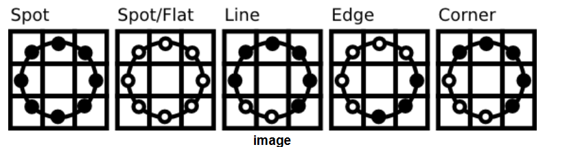

## OpenCV 的人脸识别

参考 [OpenCV 的 turtoial](https://docs.opencv.org/4.x/da/d60/tutorial_face_main.html)，本文相当于摘抄。

### Face Recognition

人脸识别对于人类太简单了，但对于计算机而言一直都是非常有挑战的事情。面部识别既有内部特征（眼睛、鼻子、嘴巴）又有外部特征（头型、发际线），有研究表明，脑拥有专门对场景中特定局部特征做出反应的神经细胞，比如线条、边缘、角度或运动。由于我们不是将世界看作分散的碎片，我们的视觉皮层必须以某种方式将不同的信息源结合起来，形成有用的模式。自动面部识别就是从图像中提取这些有意义的特征，将它们放入有用的表示中，并对其进行某种分类。

最早的人脸识别是基于 geometric features，标记处眼睛、耳朵、鼻子等位置，构建特征向量（点之间距离、角度...）。通过计算特征向量之间的欧式距离来识别。其实这个方法有一个好处：对光照有鲁棒性。但是缺点很明显，就是标记这些点本身就有难度，并且是标记非常精确。有研究表明仅靠 geometric features 并不能面部识别。

然后有了 Eigenface 方法：从高维图像空间中的脸降维到一个低维表示，在低维进行分类比较容易。找到低维子空间是通过 PCA 主成分分析来做的，其识别具有最大方差的轴。这是经典方法了，有一个缺点：没有考虑任何类别标签。有的时候，最大方差是由外部来源产生的，比如光线。此时具有最大方差的轴并不能帮我们分类。于是有改进方法，用了 LDA 方法来做，LDA 比 PCA 在基本思想不同的是在最小化类别内部的方差的同时，最大化类别之间的方差。

此外近些年来有许多方法进行了各种局部特征提取。即只描述图像的局部区域，提取的特征对部分遮挡、照明和小样本大小更具有鲁棒性。用于局部特征提取的算法包括 Gabor Wavelets, Discrete Cosinus Transform, Local Binary Patterns。提取局部特征后，需要仍然要保持空间信息，即比如一张脸提取了局部特征产生的图，最好也是眼睛在上面，嘴巴在下面。

### Face Database

原文推荐了三个数据集：AT&T、Yale Facedatbase A、Extended Yale Facedatabase B；我这里就直接下第一个，[链接](http://www.cl.cam.ac.uk/research/dtg/attarchive/facedatabase.html)在此，其包含了 `s1` 到 `s40` 目录，每个目录代表一个人，每个目录下面有一些 `pgm` 文件，这就是一种图片格式，OpenCV 可以直接读取。

### EigenFaces 和 FisherFace

这用有两种方法，具体原理不在这里展开，网上有许多资料，因此直接看代码即可，很简单的调用：

```python
# 读取 ATT 数据集，注意要转为灰度图
images, labels = [], []
dirnames = [x for x in os.listdir('./image/faces') if x[0]=='s']
for onedir in dirnames:
    filenames = [y for y in os.listdir(f'./image/faces/{onedir}')]
    for onefile in filenames:
        images.append(cv2.imread(f'./image/faces/{onedir}/{onefile}', cv2.IMREAD_GRAYSCALE))
        labels.append(int(onedir[1:]))
images, labels = np.array(images), np.array(labels)

rows, cols = images[0].shape[0:2]

train_images, train_labels = images[0:-1], labels[0:-1]
test_images, test_labels = images[-1:], labels[-1:]

model0 = cv2.face.EigenFaceRecognizer.create()
model1 = cv2.face.FisherFaceRecognizer.create()

model0.train(train_images, train_labels)
model1.train(train_images, train_labels)

predict_label, predict_confidence = model0.predict(test_images[0])
print(f'Actual: {test_labels[0]}, Predict: {predict_label}')
predict_label, predict_confidence = model1.predict(test_images[0])
print(f'Actual: {test_labels[0]}, Predict: {predict_label}')
```

然后说一下两个方法的区别，EigenFace 如第一节所说，对光照很明显，FisherFace 就是改进，下面代码就是把他们的主要特征向量输出一下。其中特征向量是一幅图，所以代码中把灰度转为了伪彩色，越红表示越大。可看到 EigenFace 很容易受光照影响，有的是左半脸较红，有的是头顶，而这可能因为训练图片左半边光照更多；FisherFace 相对好一点。**需要注意：只在光线良好的图片上学习 Fisherfaces，然后在光线不好的场景中识别，结果可能会差，因为没有机会学习光照。**

```python
# 可视化显示 EigenFace 和 FisherFace 的前几个特征向量，灰度转为了伪彩色，越红表示越大
# 可看到 EigenFace 很容易受光照影响，有的是左半脸较红，有的是头顶，而这可能因为训练图片左半边光照更多；FisherFace 相对好一点
# 需要注意：只在光线良好的图片上学习 Fisherfaces，然后在光线不好的场景中识别，结果可能会差，因为没有机会学习光照
result = []

# Here is how to get the eigenvalues, eigenvectors of this Eigenfaces model:
eigenvalues0 = model0.getEigenValues()
eigenvectors0 = model0.getEigenVectors()

# Display or save the Eigenfaces:
for idx in range(eigenvectors0.shape[1]):
    if idx > 3:
        break
    img = to_8bit(eigenvectors0[:, idx].reshape(rows, cols))
    # 用伪彩色表示灰度图，这样效果更明显一点，越红就越大
    img = cv2.applyColorMap(img, cv2.COLORMAP_JET)
    result.append((f'EigenFace vector-{idx}', img))

eigenvalues1 = model1.getEigenValues()
eigenvectors1 = model1.getEigenVectors()

# Display or save the Eigenfaces:
for idx in range(eigenvectors1.shape[1]):
    if idx > 3:
        break
    img = to_8bit(eigenvectors1[:, idx].reshape(rows, cols))
    img = cv2.applyColorMap(img, cv2.COLORMAP_JET)
    result.append((f'FisherFace vector-{idx}', img))

show_images(result)
```

结果：



### Local Binary Patterns Histograms

上面方法还是不错的，但现实生活并不完美。无法保证图像中有完美的光线设置，或者一个人有10张不同的图像。如果每个人只有一张图像怎么办？此时对子空间的协方差估计可能极其错误，识别也会如此。以下是AT&T人脸数据库上面两个方法的 Rank-1 识别率，这是一个相当简单的图像数据库，但结果显示必须要要 8 张左右才可以有好结果。也有[文章](https://docs.opencv.org/4.x/d0/de3/citelist.html#CITEREF_KM01)进行了更详细的分析，分析了小样本时的情况和训练对策。



所以第一节提到的从图像中提取局部特征是很有作用的。提取的局部特征隐含地具有低维性，但局部特征要由鲁班性，就像 SIFT 特征点一样，起码要面对图像中的尺度、平移或旋转等问题。本文介绍 LBP（Local Binary Patterns）方法，其起源于 2D 纹理分析。LBP 的基本思想是通过比较每个像素与其邻域来总结图像中的局部结构。对于某个中心像素，如果其邻域像素小于它，则用 0 表示，反之为 1，最后组成一个二进制数；滑动窗口遍历整个图片，每个像素都有一个值：



从定义上看，LBP 对单调灰度变换具有鲁棒性。如下图所示的实验结果，上面是人为改变像素值的图片，下面是 LBP 后的结果，像素值虽然被人为单调变化了，但 LBP 的结果很有鲁棒性：



LBP 能够在纹理分类方面与最先进的结果竞争。在该操作符发布后不久，人们注意到固定的邻域无法编码不同尺度的细节。因此，LBP 顺理成章被扩展了，注意的是领域没有被扩展成了更大的正方形，而是半径可设置的圆，只考虑圆上不考虑内部。其中如果算出M某个圆上的点的位置不是整数，那就用 bilinear 插值去计算那个点：



提取特征后，有研究将 LBP 后的图片划分为局部区域，并从每个区域提取直方图。然后通过连接（而不是合并）局部直方图来获得空间增强的特征向量。这些直方图被称为 Local Binary Patterns Histograms。代码如下：

```python
model = cv2.face.LBPHFaceRecognizer.create()
model.train(images, labels)
print('Predict:', model.predict(test_images[0]))

# print(model.getRadius(), model.getNeighbors(), model.getGridX(), model.getGridY(), model.getThreshold())
histograms = model.getHistograms()
# len(histograms) 就是划分的区域总数，每个区域都会统计直方图
print(histograms[0].shape, len(histograms))
```