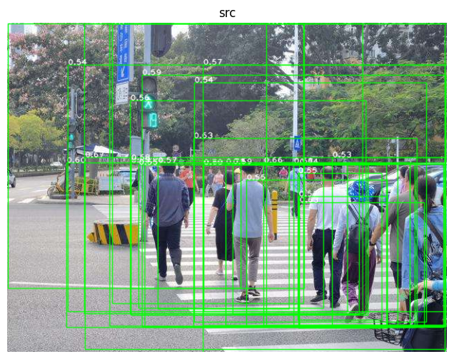

## EdgeBoxes

[ximgproc 中实现的方法](https://docs.opencv.org/4.x/d4/d0d/group__ximgproc__edgeboxes.html)，原文[链接在此](https://pdollar.github.io/files/papers/ZitnickDollarECCV14edgeBoxes.pdf)，发表于 ECCV 2014。

有两篇文章讲的还可以（[文章一](https://blog.csdn.net/wsj998689aa/article/details/39476551)、[文章二](https://www.cnblogs.com/yxh23/p/13619629.html)），能让人意会这篇文章的大致原理。总而言之，没用机器学习的知识，利用边缘信息确定框框内的轮廓个数和与框框边缘重叠的轮廓个数（这点很重要，如果我能够清楚的知道一个框框内完全包含的轮廓个数，那么目标有很大可能就在这个框中。）并基于此对框进行评分，进一步根据得分的高低顺序确定 proposal 信息（proposal 可以理解为目标大概可能的位置，类似于人眼的第一直觉）。后续工作就是在 proposal 内部运行相关检测算法。

可以忽略上一段的解释，其实我自己还没太看懂。顺便提一句，该方法有边缘检测的步骤，用的方法是 StructuredEdgeDetection，这个也是 ximgproc 实现的方法（[个人笔记](./2.4.md)），遇到这个词，知道是边缘检测方法就行了。

看代码吧：

```python
edge_boxes = cv2.ximgproc.createEdgeBoxes()
edge_boxes.setMaxBoxes(30)

# 边缘检测，原论文中用到就是这个 StructureEdgeDetection
# https://github.com/fengzhenHIT/OpenCV-contrib-module-Chinese-Tutorials/blob/master/chapter%2020/%E8%AE%AD%E7%BB%83%E7%BB%93%E6%9E%84%E5%8C%96%E6%A3%AE%E6%9E%97.md
model_pth = './image/edge/StructuredEdgeDetection.yml'
pDollar = cv2.ximgproc.createStructuredEdgeDetection(model_pth)
# 检测边缘的图片要求：RGB、0-1
nowimg = cv2.cvtColor(src, cv2.COLOR_BGR2RGB)
edges = pDollar.detectEdges(np.float32(nowimg) / 255.0)
orimap = pDollar.computeOrientation(edges)

boxes = edge_boxes.getBoundingBoxes(edges, orimap)
boxes, scores = edge_boxes.getBoundingBoxes(edges, orimap)

if len(boxes) > 0:
    boxes_scores = zip(boxes, scores)
    for b_s in boxes_scores:
        box = b_s[0]
        x, y, w, h = box
        cv2.rectangle(src, (x, y), (x+w, y+h), (0, 255, 0), 1, cv2.LINE_AA)
        score = b_s[1][0]
        cv2.putText(src, "{:.2f}".format(score), (x, y), cv2.FONT_HERSHEY_PLAIN, 0.8, (255, 255, 255), 1, cv2.LINE_AA)
        print("Box at (x,y)=({:d},{:d}); score={:f}".format(x, y, score))

show_images([ ('src', src) ])
```


