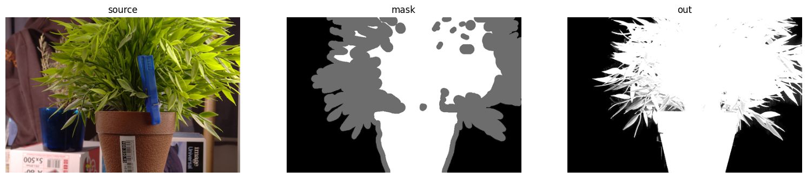

## 4.1 调包：GrabCut, WaterShed, AlphaMatting

无脑调包完事。

### GrabCut

这是一个交互式方法。需要输入一个 mask，里面的值代表你认为的前景和背景的点，算法会根据这个 mask 进行处理。不满意则继续在 mask 上面加点，进行运行算法，直到算法输出的结果满意为止（有点像画图里面的油漆桶）。这个 mask 可以是空的（全0全1），算法会自动判别认为的背景和前景。

关于原理的介绍，有一篇[文章](https://blog.csdn.net/zouxy09/article/details/8534954)写的很好，可惜是CSDN... 这个函数推荐是跑一下，比看文章好多了，跑完就明白怎么用了，[链接](../code/image_segemnt.ipynb)。

### WaterShed

原理就可以等价于 BFS，初始有几个点，然后开始做 BFS。函数需要先对第二个参数 markers 进行处理，需要有一些起始点。[官方教程](https://docs.opencv.org/4.x/d3/db4/tutorial_py_watershed.html)的文章非常好，讲了一个如何用 watershed 来提取碰在一起的硬币边界。在 [image_segement.ipynb](../code/image_segemnt.ipynb) 中也有那个例子的代码。非常好的例子，算是形态学、watershed、findcontours 结合起来的综合方法。

### AlphaMatting

一样的，调包就可以。具体原理在这个[链接](https://openaccess.thecvf.com/content_cvpr_2017/papers/Aksoy_Designing_Effective_Inter-Pixel_CVPR_2017_paper.pdf)，以后再看再写。貌似原理是认为图片是前景和背景的加权和，目标是前景和背景过渡部分的两个占比合理一些，即最小化一个设计的值。

这个需要自己编译 opencv + contrib 才可以用，也是传入一个 mask 灰度图，同样里面含义表示前景、背景、不确定的部分。

```python
img = cv2.imread('./image/alpha_matting_src.jpg', -1)
mask = cv2.imread('./image/alpha_matting_trimap.png', -1)[..., 0]
out = cv2.alphamat.infoFlow(img, mask)
```


