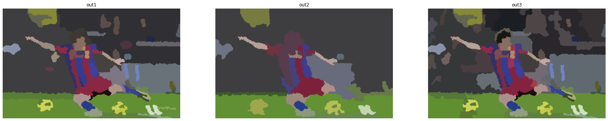

## 4.3 Hierarchical Feature Selection for Efficient Image Segmentation

ECCV 2016 的一篇文章，OpenCV 其中一个 extra 模块专门就是它。这里直接复制 OpenCV 的官方介绍：

> This algorithm is executed in 3 stages:
>
> In the first stage, the algorithm uses SLIC (simple linear iterative clustering) algorithm to obtain the superpixel of the input image.
>
> In the second stage, the algorithm view each superpixel as a node in the graph. It will calculate a feature vector for each edge of the graph. It then calculates a weight for each edge based on the feature vector and trained SVM parameters. After obtaining weight for each edge, it will exploit EGB (Efficient Graph-based Image Segmentation) algorithm to merge some nodes in the graph thus obtaining a coarser segmentation After these operations, a post process will be executed to merge regions that are smaller then a specific number of pixels into their nearby region.
>
> In the third stage, the algorithm exploits the similar mechanism to further merge the small regions obtained in the second stage into even coarser segmentation.
>
> After these three stages, we can obtain the final segmentation of the image. For further details about the algorithm, please refer to the original paper: Hierarchical Feature Selection for Efficient Image Segmentation, ECCV 2016

### 如何用

这个才是关键，相关的使用全在 [HfsSegment](https://docs.opencv.org/4.x/d2/de0/classcv_1_1hfs_1_1HfsSegment.html) 类里面了。

还是老一套 `create` -> `setParm` -> `process` 这三步，即创建对象、设置参数、执行。

#### 1. create

```cpp
static Ptr< HfsSegment > cv::hfs::HfsSegment::create (
    int 	height,    int 	width,
    float 	segEgbThresholdI = 0.08f,
    int 	minRegionSizeI = 100,
    float 	segEgbThresholdII = 0.28f,
    int 	minRegionSizeII = 200,
    float 	spatialWeight = 0.6f,
    int 	slicSpixelSize = 8,
    int 	numSlicIter = 5 
)
```

前面两个参数就是要处理图片的高和宽，后面一大堆就是算法的参数。要么在 `create` 里面设好，也有对应的 `set` 方法。

#### 2. set / get

直接复制了[官方的说明](https://docs.opencv.org/4.x/d2/de0/classcv_1_1hfs_1_1HfsSegment.html)了，每一个 setXXX 也有对应的 getXXX 函数。

```cpp
virtual void 	setMinRegionSizeI (int n)=0
 	: set and get the parameter minRegionSizeI. This parameter is used in the second stage mentioned above. After the EGB segmentation, regions that have fewer pixels then this parameter will be merged into it's adjacent region.
 
virtual void 	setMinRegionSizeII (int n)=0
 	: set and get the parameter minRegionSizeII. This parameter is used in the third stage mentioned above. It serves the same purpose as minRegionSizeI
 
virtual void 	setNumSlicIter (int n)=0
 	: set and get the parameter numSlicIter. This parameter is used in the first stage. It describes how many iteration to perform when executing SLIC.
 
virtual void 	setSegEgbThresholdI (float c)=0
 	: set and get the parameter segEgbThresholdI. This parameter is used in the second stage mentioned above. It is a constant used to threshold weights of the edge when merging adjacent nodes when applying EGB algorithm. The segmentation result tends to have more regions remained if this value is large and vice versa.
 
virtual void 	setSegEgbThresholdII (float c)=0
 	: set and get the parameter segEgbThresholdII. This parameter is used in the third stage mentioned above. It serves the same purpose as segEgbThresholdI. The segmentation result tends to have more regions remained if this value is large and vice versa.
 
virtual void 	setSlicSpixelSize (int n)=0
 	: set and get the parameter slicSpixelSize. This parameter is used in the first stage mentioned above(the SLIC stage). It describes the size of each superpixel when initializing SLIC. Every superpixel approximately has slicSpixelSize x slicSpixelSize pixels in the beginning.
 
virtual void 	setSpatialWeight (float w)=0
 	: set and get the parameter spatialWeight. This parameter is used in the first stage mentioned above(the SLIC stage). It describes how important is the role of position when calculating the distance between each pixel and it's center. The exact formula to calculate the distance is colorDistance + spatialWeight x spatialDisgtance. The segmentation result tends to have more local consistency if this value is larger.
```

#### 3. process

```
virtual Mat 	performSegmentCpu (InputArray src, bool ifDraw=true)=0
 	do segmentation with cpu This method is only implemented for reference. It is highly NOT recommanded to use it.
 
virtual Mat 	performSegmentGpu (InputArray src, bool ifDraw=true)=0
 	do segmentation gpu
```

如上所述，直接使用 `performSegmentGpu` 就行了。

#### Example

```python
src = cv2.imread('./image/messi5.jpg', -1)
hfs_member = cv2.hfs.HfsSegment().create(src.shape[0], src.shape[1])

out1 = hfs_member.performSegmentGpu(src)

# 默认0.08
hfs_member.setSegEgbThresholdI(1.0)
out2 = hfs_member.performSegmentGpu(src)

hfs_member.setSegEgbThresholdI(0.01)
out3 = hfs_member.performSegmentGpu(src)
```


