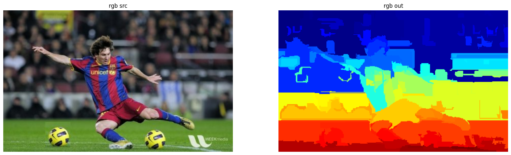

## GraphSegmentation

ximgproc 里面的 GraphSegmentation 类，在 [ximgproc 的 Image Segementation 页面]（https://docs.opencv.org/4.x/d5/df0/group__ximgproc__segmentation.html）中，你会看到有两大类。除了前面这个，还有一个叫 SelectiveSearchSegmentation，这个其实我认为更偏向于目标检测，只不过背后原理用到了分割。

那就只专注 GraphSegmentation，也是那种简单无脑调用的方式，看代码即可：

```python
rgb_src = cv2.imread('image/edge/sources/06.png')

gs = cv2.ximgproc.segmentation.createGraphSegmentation()

gs.setK(300)
gs.setSigma(0.5)
gs.setMinSize(100)

# output：每个像素都有一个 label
output = gs.processImage(rgb_src)

# 把 output 的 label 放缩到 0-255，然后用伪彩色填充
output = (output - output.min()) / (output.max() - output.min()) * 255
rgb_out = cv2.applyColorMap(output.astype(np.uint8), cv2.COLORMAP_JET)

show_images([
    ('rgb src', rgb_src),
    ('rgb out', rgb_out)
])
```


