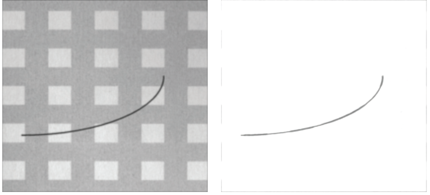

# 形态学膨胀腐蚀去进行前后景分离

这是看这篇链接理解的：https://www.cnblogs.com/Imageshop/p/16382511.html



链接的文章讲了很多，其实归根结底就是先膨胀再腐蚀。

也就是先用最大值滤波去求一张图，在其基础上再用最小值滤波去求，得出的图片相减，最后反相即可。

```python
import cv2
from scipy import ndimage
import numpy as np

src = cv2.imread('./src.png') / 255
src = src[:, :, 0]

now = ndimage.maximum_filter(src, size=21)
now = ndimage.minimum_filter(now, size=21)

now = now - src
now = 1 - now

now = (now * 255).clip(0, 255).astype(np.uint8)
cv2.imwrite('./test.png', now)
```
