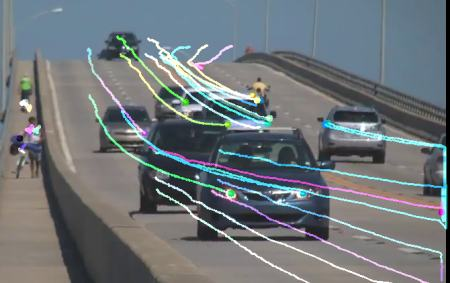

## 整体配准二：feature-based（特征点、稀疏光流）

feature-based: 找两张图片上一些对应点，即找出一些点在前后两张图片的各自位置。然后用它们反算出矩阵。

特征点的方法也是耳熟能详的方法了，特征点寻找、匹配、变换。网上也是一搜一大片。这里随便抄个代码，便于直接查看：

```python
import numpy as np
import cv2 as cv
import matplotlib.pyplot as plt
 
img1 = cv.imread('image1.jpg', cv.IMREAD_GRAYSCALE)  # referenceImage
img2 = cv.imread('image2.jpg', cv.IMREAD_GRAYSCALE)  # sensedImage
 
# Initiate AKAZE detector
akaze = cv.AKAZE_create()
# Find the keypoints and descriptors with SIFT
kp1, des1 = akaze.detectAndCompute(img1, None)
kp2, des2 = akaze.detectAndCompute(img2, None)
 
# BFMatcher with default params
bf = cv.BFMatcher()
matches = bf.knnMatch(des1, des2, k=2)
 
# Apply ratio test
good_matches = []
for m,n in matches:
    if m.distance < 0.75*n.distance:
        good_matches.append([m])
       
# Draw matches
img3 = cv.drawMatchesKnn(img1,kp1,img2,kp2,good_matches,None,flags=cv.DrawMatchesFlags_NOT_DRAW_SINGLE_POINTS)
cv.imwrite('matches.jpg', img3)

# Select good matched keypoints
ref_matched_kpts = np.float32([kp1[m[0].queryIdx].pt for m in good_matches]).reshape(-1,1,2)
sensed_matched_kpts = np.float32([kp2[m[0].trainIdx].pt for m in good_matches]).reshape(-1,1,2)
 
# Compute homography
H, status = cv.findHomography(ref_matched_kpts, sensed_matched_kpts, cv.RANSAC,5.0)
 
# Warp image
warped_image = cv.warpPerspective(img1, H, (img1.shape[1]+img2.shape[1], img1.shape[0]))
           
cv.imwrite('warped.jpg', warped_image)
```

然后也有说用稀疏光流的，即用光流算出两张图片的对应点。但是后来想了想，其实还是不推荐：**因为配准意味着两张图片是属于静态的运动，即全局在动；而光流通常是用于运动的物体，即图片上是局部在动。如下图，光流是找出运动的物体，用来配准似乎有点走偏了：**


