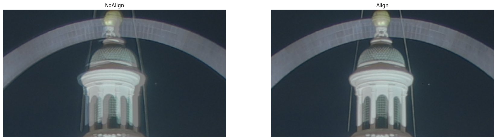
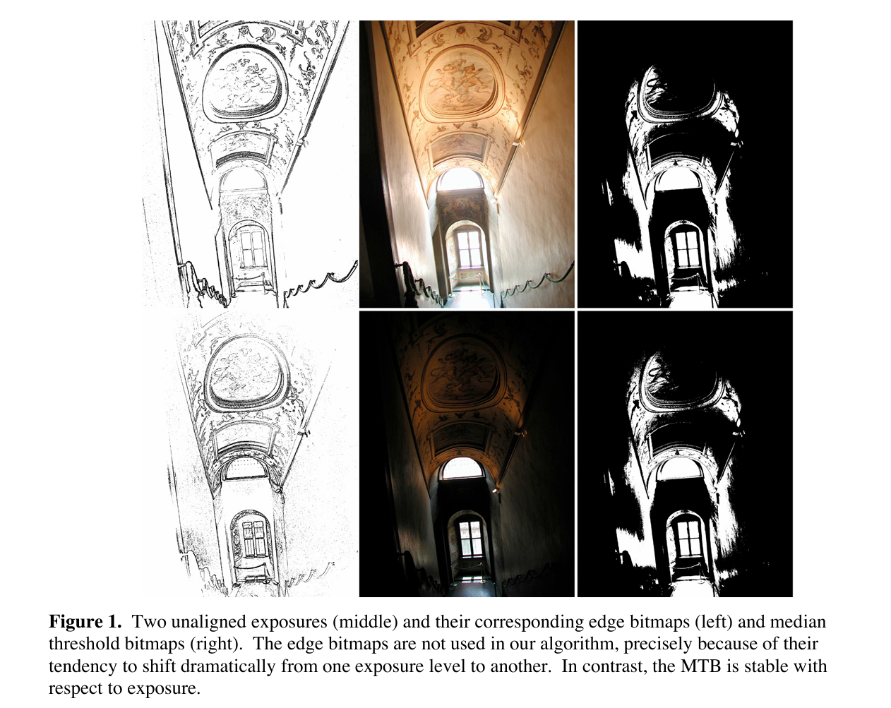

## 不同亮度的配准

配准是图像处理中许多地方都及其重要有效的操作。在长短曝光下 HDR 中也需要配准（[个人学习记录文章](./0.1.md)），如下图所示。



但是特别之处是**要配准的图片的亮度是非常不同的，有些图片有过曝或欠曝**。常用方法可能错误，如利用特征点：短曝光和长曝光可能两张图片各自能被人眼轻易看出的区域都不一样，所以找的特征点也是不一样，比如短曝光只能找到A区域的特征点，结果长曝光只能找到B区域的特征点。

在 HDR 配准这里有一个经典的配准方法 MTB（median threshold bitmap），原文来自：Fast, Robust Image Registration for Compositing High Dynamic Range Photographs from Handheld Exposures.

其实思想很简单，就是相机感光基本是线性的，所以虽然是不同曝光，但要是拍没太大变换的同一场景时，得到的图片各个像素的像素值顺序是基本一致的，如下图所示，左边是边缘检测结果，右边是各个像素和所有像素的中位数进行比较的结果。对于 HDR 长短曝光这种特殊场景，边缘检测或者特征点检测，很显然每张图片有比较大的不同（如左图），花了大力气反而是没有右边直接和中位数比较的效果好的。



得到上图中右边图之后，就可以对这个阈值图进行配准了。补充说明三点：

1. 老生常谈，可以用金字塔加速；
2. 不局限于和中位数比较，可以和任一个指定的百分比的值进行比较；
3. 事先可剔除掉前后百分之多少的像素点，来防止这些极端点的干扰，这个前后的依据可以是根据像素值或者根据直方图（即数量），这也是图像处理常见方法了。

附上代码，两句话... 直接从 HDR 那边当时写的[代码](../code/test_hdr.ipynb) copy 过来的：

```python
alignMTB = cv2.createAlignMTB()
alignMTB.process(images, images)
```
