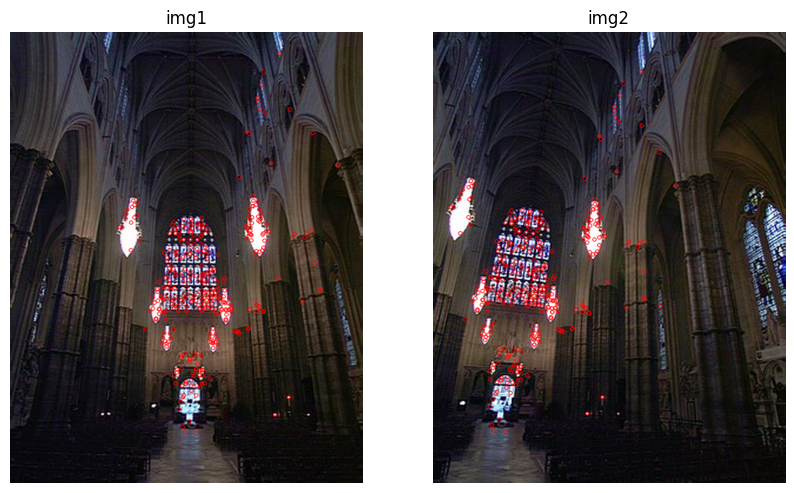
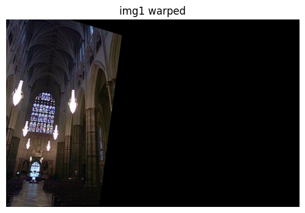
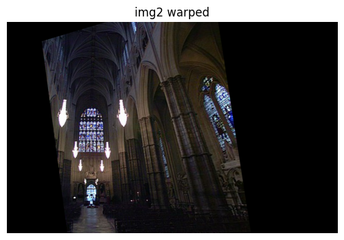

## 从配准到拼接

### 普通的配准

配准后进行拼接，无比自然的事情。不少文章也是介绍图片拼接才介绍的图片配准。如下图所示：



找到特征点后，对某张图片进行变换即可，如下图，变换后直接拼起来就好了。



但其实这里面还有很多的学问，以下两篇文章写的特别好，作者们都做了一些思考，并且去查看了 Opencv 的实现：

- https://www.cnblogs.com/skyfsm/p/7411961.html
- https://www.cnblogs.com/curiositywang/p/17480796.html

主要是有两个问题：

1. 特征点如何保证多：两次特征点。先对图一进行特征点提取和筛选匹配（1->2），再对图二进行特征点的提取和匹配（2->1），可以保证更多的匹配点被选中，匹配点越多，findHomography求出的变换越准确。这个思路值得借鉴。【文章一】
2. 左右图片亮部不一致，过度的比较明显：可以通过简单的插值来做，但这样还是可能有鬼影。OpenCV 是利用【曝光补偿】的方式，让左右图片亮度尽量一样，然后重叠的部分直接选其中一张，这样就不可能有鬼影了（因为没有插值，是原来其中一张图片的内容）。【文章二】

### Stitiching High API

OpenCV 有专门的 stitching 来处理图片配准，如果没有特别精细的要求（如运行时间等），可以直接调用它的 Hight API 即可，如下所示：

```python
import cv2
imgs = [cv2.imread(f'./image/stitching/a{i}.png') for i in range(1, 4)]

stitcher = cv2.Stitcher.create()
status, outimg = stitcher.stitch(imgs)
```

没错，就是这么简单。

但 stitching 其实很复杂，该模块有 detail 层，通过对这些层的调用就能改变或丢弃一些流程。官方给了一个 stitching_details 的 sample 代码，写的非常好。因为比较多，所以单独另写一篇文章进行说明，可以见[下一篇文章](./5.6.md)。
