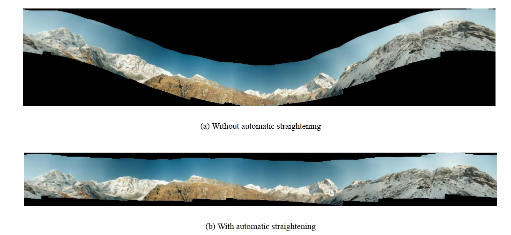

## 图像配准细节（Stitching Details）

在 [OpenCV 的 Image Stitching 页面](https://docs.opencv.org/4.x/d1/d46/group__stitching.html)上，看到还有好几个 Module 和一个很复杂的流程图。的确，如果是直接无脑用 stitching 很简单，但如果涉及到一些更精细的调节就需要深入了解了。

OpenCV 提供了一个 stitching_details 的文件，有 CPP 也有 Python，写的非常好，[可以去他的 tutorial 下载](https://docs.opencv.org/4.x/d8/d19/tutorial_stitcher.html)，在最后面。

下面进行逐步解释，需要说明的是，有许多地方和官方的 sample 代码不一致，我的具体代码在 [test_stitching.ipynb](../code/test_stitching.ipynb)。此外，这篇文章写的也特别好，涉及的细节很多，推荐查看：https://www.cnblogs.com/huty/p/8516981.html

先说个下面的 `compute_scale` 函数，这个在原来的 sample 代码没有。他的作用是计算出一幅图像如果缩放到某 M 个像素时，此时缩放比例是多少。之所以不直接给一个缩放比例，因为图片尺寸不保证一样。当然其实直接给缩放比例也是可以的，处理时的图片尺寸不一定要一样，主要还是参考了 sample 代码，为了保持一致。

```python
def compute_scale(megapix, img):
    if megapix > 0:
        return min(1.0, math.sqrt(megapix * 1e6 / (img.shape[0] * img.shape[1])))
    return 1.0
```

### 1. 找特征点

如代码所示，这一步很常规，默认是用 SURF；唯一需要注意点的是可以用缩放，来加快速度。

```python
# 用哪个 feature 方法来找特征点；surf, orb, sift, akaze
finder = cv2.xfeatures2d.SURF.create()
# finder = cv2.SIFT.create()
imgs, img_sizes = [], []

features = []
for nowname in img_names:
    nowimg = cv2.imread(nowname)
    img_sizes.append(np.array(nowimg.shape[0:2]))

    # work_megapix: 图片缩放到多少个像素再去处理；可以加快速度
    work_megapix = 0.6
    work_scale = compute_scale(work_megapix, nowimg) 

    img = cv2.resize(nowimg, None, fx=work_scale, fy=work_scale, interpolation=cv2.INTER_LINEAR_EXACT)
    # 每次计算返回 cv2.detail.ImageFeatures
    features.append(cv2.detail.computeImageFeatures2(finder, img, mask=None))
    imgs.append(img)
```

### 2. 寻找匹配

得到的结果（代码中的 `pairwise_matching`）后面会多次用到。

```python
# match_conf: 置信度，默认值：surf 0.65; orb 0.3
match_conf = 0.65

# 选择哪个 Match
# matcher = cv2.detail.AffineBestOf2NearestMatcher.create(try_use_gpu=False, match_conf=match_conf)
matcher = cv2.detail.BestOf2NearestMatcher.create(try_use_gpu=False, match_conf=match_conf)
# 如果使用这个，uses range_width to limit number of images to match with. #TODO：暂时不清楚啥意思
# matcher = cv2.detail.BestOf2NearestRangeMatcher(range_width=5, try_use_gpu=False, match_conf=match_conf)
pairwise_matching = matcher.apply2(features)
matcher.collectGarbage()
```

### 3. 筛选图片

上一步得到匹配后，筛选出合适的图片，即有些图片可能其实匹配程度很低，这种图片没必要去强行拼接，把它们丢弃掉。根据一个参数 `conf_thresh` 来实现。

```python
# conf_thresh: 置信度阈值；即用它来挑选算出的 match
conf_thresh = 1.0

# 打印通过 conf_thresh 的匹配
print(cv2.detail.matchesGraphAsString(img_names, pairwise_matching, conf_thresh))

# 筛选出通过 conf_thresh 的匹配，即有些图片如果和其他图片的匹配程度都很低，就不要这张图片了
indices = cv2.detail.leaveBiggestComponent(features, pairwise_matching, conf_thresh)

imgs = [imgs[x] for x in indices]
img_names = [img_names[x] for x in indices]
img_sizes = [img_sizes[x] for x in indices]
```

### 4. 初略计算相机参数

如下代码，根据匹配的特征点，计算相机参数。返回的 `cameras` 就是参数，每张图片都会返回一个相机参数。

```python
estimator = cv2.detail_HomographyBasedEstimator()
# estimator = cv.detail_AffineBasedEstimator()
is_success, cameras = estimator.apply(features, pairwise_matching, None)
print(cameras[0].focal, cameras[0].K, cameras[0].R)
```

### 5. 光束法平差调整相机参数

Bundle Adjustment（光束法平差）算法主要是解决所有相机参数的联合。这是全景拼接必须的一步，因为**多个成对的单应性矩阵合成全景图时，会忽略全局的限制，造成累积误差**。因此每一个图像都要加上光束法平差值，使图像被初始化成相同的旋转和焦距长度。如下图，不做调整，到了最右边的图片误差会很大。

光束法平差的目标函数是一个具有鲁棒性的映射误差的平方和函数。即每一个特征点都要映射到其他的图像中，计算出使误差的平方和最小的相机参数。具体的推导过程可以参见 Automatic Panoramic Image Stitching using Invariant Features.pdf 的第五章。


```python
# 用于调整相机参数的类
adjuster = cv2.detail_BundleAdjusterRay()
# adjuster = cv2.detail_BundleAdjusterReproj()
# adjuster = cv2.detail_BundleAdjusterAffinePartial()
# adjuster = cv2.detail_NoBundleAdjuster()

adjuster.setConfThresh(conf_thresh)

# 设置相机内参 K 的掩码矩阵，1 表示 考虑，下面就是常见的情况；
# https://www.cnblogs.com/silence-cho/p/16498114.html
refine_mask = np.array([[1,1,1], [0,1,1], [0,0,0]], np.uint8)
adjuster.setRefinementMask(refine_mask)

# OpenCV 的范例 python 代码有 BUG，如果没有这句话后面会报错，需要手动 64F 转为 32F
for camera in cameras:
    camera.R = camera.R.astype(np.float32)

# 调整计算出的相机参数
print(cameras[0].R, '\n', cameras[0].focal, '\n')
is_success, cameras = adjuster.apply(features, pairwise_matching, cameras)
print(cameras[0].R, '\n', cameras[0].focal, '\n')
```

### 6. 波形校正调整相机参数

拍摄者拍摄图片的时候不一定是水平的，轻微的倾斜会导致全景图像出现飞机曲线，因此我们要对图像进行波形校正，主要是寻找每幅图形的【上升向量】（up_vector）。



```python
wave_correct = cv2.detail.WAVE_CORRECT_HORIZ
# wave_correct = cv2.detail.WAVE_CORRECT_VERT
if wave_correct is not None:
    rmats = [np.copy(camera.R) for camera in cameras]
    rmats = cv2.detail.waveCorrect(rmats, wave_correct)
    for camera, rmat in zip(cameras, rmats):
        camera.R = rmat
```

该步骤完成后，终于可以对图片变换了。

### 7. 利用相机参数变换图片

得出了参数之后，就可以对每个图片进行变换了。变换（PyRotationWarper）对象需要传入一个 scale 参数，这个就是根据图片计算的相机参数中的焦距值。而每张图片都有一个焦距，所以我们选择其中的中位数，作为最终参数。

变换有一个缩放比例（warp_scale），我们在步骤一的特征点寻找也有缩放比（work_scale），相机的参数是在这个 work_scale 下获取的，所以还需要乘以一个比例。

该步骤之后其实就可以直接去融合了。但后面还有一些光照补偿、缝隙估计等操作，这些操作会利用变换的图片，计算出 mask，即用来表示有哪些地方需要再进行更细节的调整。

```python
# 找出每个相机参数的焦段，求出中位数，该参数很重要，其之后会作为 Warp 对象中的 scale 属性。 
median_focal = np.median([cam.focal for cam in cameras])
print('median_focal =', median_focal, '\n')

warp_megapix = 0.6

# 实际上还有很多的 warp_type，看官方的代码
warp_type = [ 'spherical', 'plane', 'affine', 'cylindrical' ][0]

# 如果尺寸一样或者能保证每个图片用的 scale 一样，其实可以直接放到 for 循环外边
# warper = cv.PyRotationWarper(warp_type, median_focal * (seam_scale / work_scale))

corners = []
warped_masks, warped_imgs = [], []
masks = [cv2.UMat(255 * np.ones(img.shape[0:2], np.uint8)) for img in imgs]
for name, mask, camera in zip(img_names, masks, cameras):
    # 一共有两个 scale：找特征点的 scale、变换时的 scale
    work_scale = compute_scale(work_megapix, nowimg)
    warp_scale = compute_scale(warp_megapix, nowimg) 

    # 因为相机参数是在 work_scale 下获取的，而此时 warp 是在 warp_scale 下进行的，所以这里要乘以一个 warp_scale / work_scale
    warper = cv.PyRotationWarper(warp_type, median_focal * (warp_scale / work_scale))  # warper could be nullptr?
    img = cv2.resize(cv2.imread(name), None, fx=warp_scale, fy=warp_scale, interpolation=cv2.INTER_LINEAR_EXACT)

    # Warp Image
    K = camera.K().astype(np.float32)

    # Corners：该图变换后的左上角位置
    corner, warped_img = warper.warp(img, K, camera.R, cv2.INTER_LINEAR, cv2.BORDER_REFLECT)
    corners.append(corner)
    warped_imgs.append(warped_img.astype(np.float32))

    # Warp Mask
    _, warped_mask = warper.warp(mask, K, camera.R, cv2.INTER_NEAREST, cv2.BORDER_CONSTANT)
    warped_masks.append(warped_mask.get())
```

Python 中是直接根据 PyRotationWarper 来初始化变换对象的，可以比较一下 CPP 的方式：

```cpp
if (warp_type == "plane")
    warper_creator = makePtr<cv::PlaneWarper>();
else if (warp_type == "affine")
    warper_creator = makePtr<cv::AffineWarper>();
else if (warp_type == "cylindrical")
    warper_creator = makePtr<cv::CylindricalWarper>();
else if (warp_type == "spherical")
    warper_creator = makePtr<cv::SphericalWarper>();
else if (warp_type == "fisheye")
    warper_creator = makePtr<cv::FisheyeWarper>();
Ptr<RotationWarper> warper = warper_creator->create(static_cast<float>(warped_image_scale * seam_work_aspect));
```

### 8. 更细节的调整：光照补偿 + 缝隙估计

拍摄的图片有可能因为光圈或者光线的问题，亮度并不一致，拼接后很明显。简单的解决方法是通过线性插值，可以看[这篇文章](https://www.cnblogs.com/curiositywang/p/17480796.html)。但这样只要有稍微的运动物体，就会有鬼影。OpenCV 解决的方式是对图像进行亮度补偿，（只对重叠区域进行了亮度补偿，所以融合处虽然光照渐变，但是图像整体的光强没有柔和的过渡）。

```python
expos_comp_type = [
    cv.detail.ExposureCompensator_GAIN_BLOCKS,
    cv.detail.ExposureCompensator_GAIN,
    cv.detail.ExposureCompensator_CHANNELS,
    cv.detail.ExposureCompensator_CHANNELS_BLOCKS,
    cv.detail.ExposureCompensator_NO,
][0]
expos_comp_nr_feeds = 1
expos_comp_block_size = 32
# expos_comp_nr_filtering = args.expos_comp_nr_filtering
if expos_comp_type == cv.detail.ExposureCompensator_CHANNELS:
    compensator = cv.detail_ChannelsCompensator(expos_comp_nr_feeds)
    # compensator.setNrGainsFilteringIterations(expos_comp_nr_filtering)
elif expos_comp_type == cv.detail.ExposureCompensator_CHANNELS_BLOCKS:
    compensator = cv.detail_BlocksChannelsCompensator(
        expos_comp_block_size, expos_comp_block_size,
        expos_comp_nr_feeds
    )
    # compensator.setNrGainsFilteringIterations(expos_comp_nr_filtering)
else:
    compensator = cv.detail.ExposureCompensator_createDefault(expos_comp_type)
compensator.feed(corners=corners, images=warped_imgs, masks=warped_masks)
```

缝隙估计有6种方法，默认就是第三种方法，seam_find_type == "gc_color"，该方法是利用最大流方法检测。

```python
SEAM_FIND_CHOICES['gc_color'] = cv.detail_GraphCutSeamFinder('COST_COLOR')
SEAM_FIND_CHOICES['gc_colorgrad'] = cv.detail_GraphCutSeamFinder('COST_COLOR_GRAD')
SEAM_FIND_CHOICES['dp_color'] = cv.detail_DpSeamFinder('COLOR')
SEAM_FIND_CHOICES['dp_colorgrad'] = cv.detail_DpSeamFinder('COLOR_GRAD')
SEAM_FIND_CHOICES['voronoi'] = cv.detail.SeamFinder_createDefault(cv.detail.SeamFinder_VORONOI_SEAM)
SEAM_FIND_CHOICES['no'] = cv.detail.SeamFinder_createDefault(cv.detail.SeamFinder_NO)
seam_finder = SEAM_FIND_CHOICES['gc_color']
# warped_masks 被更新，考虑了缝隙
warped_masks = seam_finder.find(warped_imgs, corners, warped_masks)
```

### 9. 计算融合后的尺寸和各个图片的位置

如下面的代码。融合时有一个缩放比例，而相机参数是在另一个缩放比例下做的，所以要进行一个比例相乘。其实如果没有上一步更细节的调整（光照补偿和缝隙估计），这一步可以覆盖前两步的变换图片步骤，因为这一步本身就是有变换图片的操作的。

```python
compose_megapix = 0
corners, sizes = [], []
for idx, name in enumerate(img_names):
    img = cv2.imread(name)

    # 之前计算相机各个参数是在 work_scale 下计算的，现在融合是在 compose_scale 下计算的，所以需要乘一个系数
    work_scale = compute_scale(work_megapix, img)
    compose_scale = compute_scale(compose_megapix, img)

    now_ratio = compose_scale / work_scale
    cameras[idx].focal *= now_ratio
    cameras[idx].ppx *= now_ratio
    cameras[idx].ppy *= now_ratio

    # 传入的 scale 参数也要乘以调整的系数
    warper = cv2.PyRotationWarper(warp_type, scale = median_focal * now_ratio)

    # 注意这里要颠倒一下顺序，width 在前
    nowshape = (np.array(img.shape[0:2]) * compose_scale).astype(int)
    roi = warper.warpRoi((nowshape[1], nowshape[0]), cameras[idx].K().astype(np.float32), cameras[idx].R)

    corners.append(roi[0:2])
    sizes.append(roi[2:4])

fullshape = cv.detail.resultRoi(corners=corners, sizes=sizes)
```

### 10. 初始化 blend

进行多波段融合，首先要初始化 blend，确定 blender 融合方式，默认是多波段融合（MULTI_BAND）。上一个步骤得到了处理后的尺寸（`fullshape` 变量），要传入给 blend 初始化。

```python
blend_strength = 5
blend_width = np.sqrt(full_shape[2] * full_shape[3]) * blend_strength / 100
blender = cv.detail_MultiBandBlender()
blender.setNumBands((np.log(blend_width) / np.log(2.) - 1.).astype(np.int32))
blender.prepare(full_shape)
```

### 11. 使用 blend 融合

最后就对每张图片，进行图像变换，而且我们为了更好的效果，有光照补偿和缝隙估计的步骤，这个对每张图片处理时也要加上去。

```python
# 每张图片都进行 变换 + 光照补偿 + 缝隙估计
for idx, name in enumerate(img_names):
    nowimg = cv.imread(name)
    img = cv.resize(src=nowimg, dsize=None, fx=compose_scale, fy=compose_scale, interpolation=cv.INTER_LINEAR_EXACT)

    # 变换图片
    K = cameras[idx].K().astype(np.float32)
    corner, image_warped = warper.warp(img, K, cameras[idx].R, cv.INTER_LINEAR, cv.BORDER_REFLECT)

    # 光照补偿 + 缝隙估计
    mask = 255 * np.ones((img.shape[0], img.shape[1]), np.uint8)
    _, mask_warped = warper.warp(mask, K, cameras[idx].R, cv.INTER_NEAREST, cv.BORDER_CONSTANT)

    compensator.apply(idx, corners[idx], image_warped, mask_warped)
    dilated_mask = cv.dilate(warped_masks[idx], None)
    seam_mask = cv.resize(dilated_mask, (mask_warped.shape[1], mask_warped.shape[0]), 0, 0, cv.INTER_LINEAR_EXACT)
    mask_warped = cv.bitwise_and(seam_mask, mask_warped)

    # 处理后的图片放入 blender 中，这一步必须要先转成 int16，而且不能在 cv2.Umat() 里面在转换...
    image_warped_s = image_warped.astype(np.int16)
    blender.feed(cv.UMat(image_warped_s), mask_warped, corners[idx])

# blender 最终融合
result, result_mask = blender.blend(dst=None, dst_mask=None)
```

### 12. 显示和保存图片

没什么好说的。

```python
cv.imwrite(result_name, result)
zoom_x = 600.0 / result.shape[1]
dst = cv.normalize(src=result, dst=None, alpha=255., norm_type=cv.NORM_MINMAX, dtype=cv.CV_8U)
dst = cv.resize(dst, dsize=None, fx=zoom_x, fy=zoom_x)
cv.imshow(result_name, dst)
cv.waitKey()
```

### 13. 其他说明

本文的代码效率很低，可以参考官方 sample 代码进行调整。比如其实拼接时图片大概率都是一样尺寸，所以没有必要像本文代码一样，每个图片都要算一下 scale，每个图片都单独初始化一个 Warper。

本文的代码很多都展示了默认的参数，如特征点用 SURF。具体每个步骤都有很多方法可供选择，可以查看官方的 sample 代码，写的很好。
