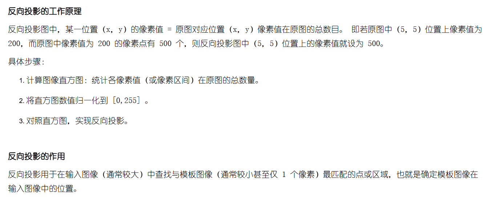

## 追踪：MeanShift 和 CamShift

代码很好写，重点是知道这一类方法的大致逻辑是什么样的。主要步骤：计算目标区域的直方图，用目标区域的直方图进行反向投影，匹配出反向投影最密集的部分。计算直方图不谈，后面两步很关键。

还是先说反向投影，反向投影定义：



当时就疑惑，这个反向投影的作用究竟有什么用，这不就来了：找模板。即用**模板的直方图**去在另外一张图上进行反向投影，由于计算反向投影时只用的是**模板直方图**，所以可以想象反向投影结果：和模板接近的部分基本上大部分像素在模板出现过，所以对应的反向投影上都有值；而和模板不像的地方，出现了模板没出现的像素，反射投影后为 0，所以和模板不像的地方往往会有比较多的 0。

所以反向投影后，匹配出反向投影最密集的部分，很大概率是模板。而怎么找到最密集的部分，那就是 MeanShift 和 CamShift 负责的了，具体的数学原理就要细看了。老算法了，用 【MeanShift 原理】关键词能搜到太多文章了，搜了一下[这篇文章](https://www.cnblogs.com/ydxt/archive/2012/04/27/2472974.html)看起来不错。

---

还有一个问题，基本上所有代码都会将 RGB 转为 HSV，然后用其中的 H 来算直方图，用这样的直方图来计算反向投影，这种直方图也被叫做颜色直方图。为什么偏偏要用色调（H），他有什么神奇的地方吗？终于在 [StackOverflow 上看到了回答](https://stackoverflow.com/questions/72417908/opencv-meanshift-tracking-hsv)，答案很简单：原始论文里面是做人脸追踪的，而作者认为对于人脸，无论白黑黄，色调都是在很稳定的数值范围内...

> Except for albinos, humans are all the same color (hue). Dark- skinned people simply have greater flesh color saturation than light-skinned people, and this is separated out in the HSV color system and ignored in our flesh-tracking color model.

最后给出 python 代码，其实基本上是从 [Opencv Turtorials](https://docs.opencv.org/4.x/d7/d00/tutorial_meanshift.html) 上复制来的，用到的视频文件链接[在此](https://www.bogotobogo.com/python/OpenCV_Python/images/mean_shift_tracking/slow_traffic_small.mp4)：
```python
import numpy as np
import cv2

cap = cv2.VideoCapture('./code/video/slow_traffic_small.mp4')

ret, frame = cap.read()

channel = 0
x, y, w, h = 300, 200, 100, 50 # simply hardcoded the values
track_window1 = (x, y, w, h)
track_window2 = (x, y, w, h)

# 计算目标区域的直方图，用于之后反向投影，用 HSV 来做
hsv_frame = cv2.cvtColor(frame, cv2.COLOR_BGR2HSV)
hsv_roi = hsv_frame[y:y+h, x:x+w]
mask = cv2.inRange(hsv_roi, np.array((60., 0., 100.)), np.array((180., 60.,255.)))

# # 推荐先检查：看一下选的目标在通道中是否明显..
# check_frame = np.copy(hsv_frame[..., 0])
# check_frame[y:y+h, x:x+w][mask == 0] = 0
# cv2.rectangle(check_frame, (x, y), (x+w, y+h), 255, 2)
# cv2.imshow('test', check_frame)
# cv2.waitKey(1000 * 5)

# 计算直方图，之后每一帧都用这个直方图进行反向投影，然后即可以看哪个区域比较亮
roi_hist = cv2.calcHist([hsv_roi], [0], mask, [180], [0,180])
cv2.normalize(roi_hist, roi_hist, 0, 255, cv2.NORM_MINMAX)

# Setup the termination criteria, either 10 iteration or move by at least 1 pt
term_crit = ( cv2.TERM_CRITERIA_EPS | cv2.TERM_CRITERIA_COUNT, 10, 1 )
while ret:
    ret, frame = cap.read()
    if ret == True:
        hsv = cv2.cvtColor(frame, cv2.COLOR_BGR2HSV)

        # 计算反向投影
        dst = cv2.calcBackProject([hsv], [0], roi_hist, [0,180], scale=1.0)

        # MeanShift
        _, track_window1 = cv2.meanShift(dst, track_window1, term_crit)
        # Draw it on image
        x,y,w,h = track_window1
        cv2.rectangle(frame, (x,y), (x+w,y+h), [0,0,255], 2)

        # CamShift
        rect, track_window2 = cv2.CamShift(dst, track_window2, term_crit)
        # Draw it on image
        pts = cv2.boxPoints(rect)
        cv2.polylines(frame, [pts.astype(int)], True, [255,0,0], 2)
        cv2.imshow('result', frame)

        k = cv2.waitKey(10) & 0xff
        if k == 27:
            break
```