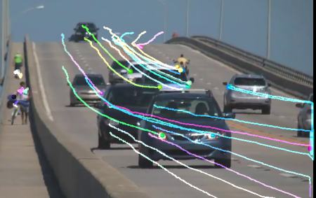
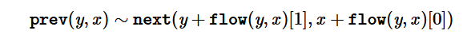
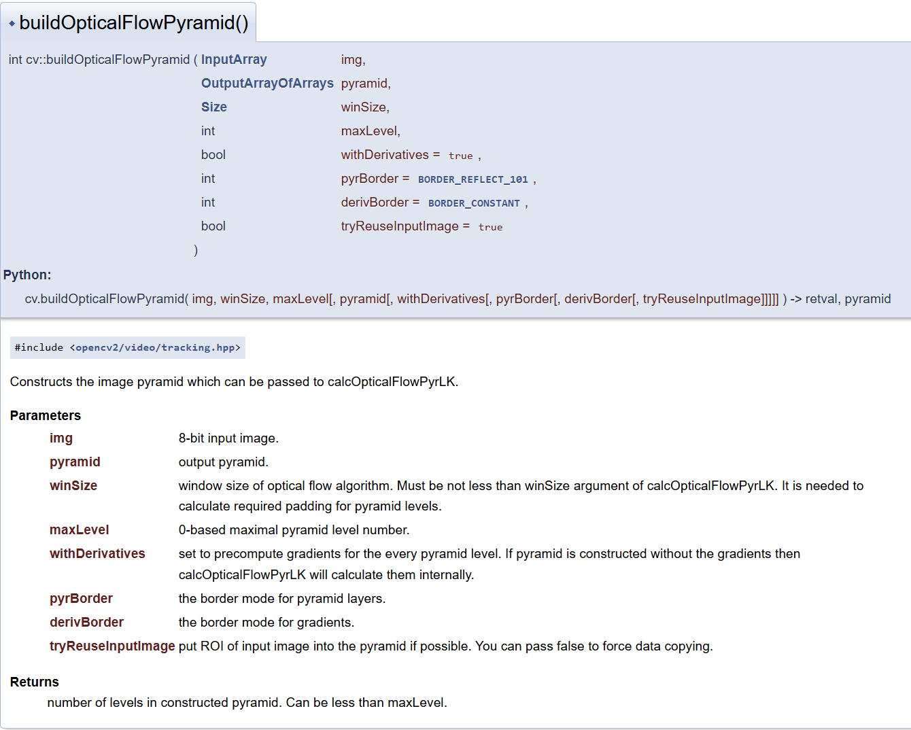

## 6.3 光流法

需要知道光流是什么，其实就是每个物体有自己运动的状态，一图说明：



光流背后的原理不谈，本质上也是一个简单的数学模型（复杂程度和 Retina 那种差不多，基本就一个公式），然后推到出具体的计算方法。

其中可以分为稠密和稀疏，二者优缺点从名字就能看出了。

- 稀疏: KLT(GoodFeaturesToTrack找特征点 + LK 求解光流变化)
- 稠密: FB, DIS

### calcOpticalFlowPyrLK

```cpp
void cv::calcOpticalFlowPyrLK (
    InputArray prevImg, InputArray nextImg, 
    InputArray prevPts,
    InputOutputArray 	nextPts,
    OutputArray status, OutputArray err,
    Size 	winSize = Size(21, 21),
    int 	maxLevel = 3,
    TermCriteria 	criteria = TermCriteria(TermCriteria::COUNT+TermCriteria::EPS, 30, 0.01),
    int 	flags = 0,
    double 	minEigThreshold = 1e-4 
)
cv.calcOpticalFlowPyrLK(prevImg, nextImg, prevPts, nextPts) ->	nextPts, status, err
```

稀疏光流，经典方法。OpenCV 的文档写的已经非常好，这里简单随便写一下，也可以参考代码 [test_optical.ipynb](../code/test_optical.ipynb)：

- prevImg, nextImg: 前后两张图。除了 8-bit，还可以输入金字塔（通过 `buildOpticalFlowPyramid` 函数构造）
- prevPts: 前面一张图的角点，可以用不同方法，最后是一个 (n, 1, 2) 大小的 ndarray
- nextPts: Python 中直接用 None；后面一张图对应的角点，这个函数会自动计算；也可以传入粗略估计的位置，函数会更新，需要 flag 设为 OPTFLOW_USE_INITIAL_FLOW
- status: (n, 1) 大小的 ndarray，表示对应角点是否找到，1 找到，0 未找到
- err: 没了解
- winSize: 每个金字塔层级的搜索窗口大小
- maxLevel: 金字塔层级，0 表示不用金字塔；否则为 n+1 级
- criterial, minEigThreshold: 具体看代码或者文档，需要知道算法具体的原理

该函数相当于除了前后两张图，还需要输入第一张图的角点位置，输出是第二张图角点位置。文章最上面的那张图片的那些彩色线条就是相当于画直线得来。

### calcOpticalFlowFarneback

```cpp
void cv::calcOpticalFlowFarneback (
    InputArray prev, InputArray next, 
    InputOutputArray flow,
    double 	pyr_scale, 
    int levels, int winsize,
    int 	iterations,
    int 	poly_n,
    double 	poly_sigma,
    int 	flags
)
```

稠密光流。



可参考代码 [test_optical.ipynb](../code/test_optical.ipynb)，随便写一下，很多就直接复制粘贴了，不过分纠结原理：

- prev, next: 前后两张图，不像上面可以传金字塔
- flow: 输出的光流，大小 (w, h, 2)，类型 32FC2，代表每个点分别两个方向移动了多少单位，如上图所示
- pyr_scale: specifying the image scale (<1) to build pyramids for each image; pyr_scale=0.5 means a classical pyramid, where each next layer is twice smaller than the previous one.
- levels, winsize: 和上面函数一样
- iterations: number of iterations the algorithm does at each pyramid level.
- poly_n: size of the pixel neighborhood used to find polynomial expansion in each pixel; larger values mean that the image will be approximated with smoother surfaces, yielding more robust algorithm and more blurred motion field, typically poly_n =5 or 7.
- poly_sigma: standard deviation of the Gaussian that is used to smooth derivatives used as a basis for the polynomial expansion; for poly_n=5, you can set poly_sigma=1.1, for poly_n=7, a good value would be poly_sigma=1.5.

### DISOpticalFlow

新的稠密光流计算方法。参考：https://cloud.tencent.com/developer/article/1519647

> OpenCV中KLT稀疏光流算法与FB稠密光流算法都是十年前的算法，没有反应出光流算法的最新进展，这个跟OpenCV其它模块相比，光流算法模块的更新明显滞后、OpenCV4发布终于把DIS光流算法包含到正式的发布版中。相对于FB光流基于多项式实现光流移动估算，DIS光流采用反向搜索与梯度下降寻求最优化来解决移动估算，不但降低了计算量、而且提升了精准度与实时性能。是一种可以实时运行的视频运动分析算法。

具体的可参考代码 [test_optical.ipynb](../code/test_optical.ipynb)

其实第一个和第二个函数也是有对应的类：`SparsePyrLKOpticalFlow` 和 `FarnebackOpticalFlow`，不过这里就直接写他们的函数版本了，不重复写了。

### buildOpticalFlowPyramid

为了第一个函数服务的，结果可以作为第一个函数的 prevImg 和 nextImg。我干脆直接截图了，用的时候再细调：



### readOpticalFlow, writeOpticalFlow

读写光流 .flo 文件，如函数名所属，没有好讲的。
