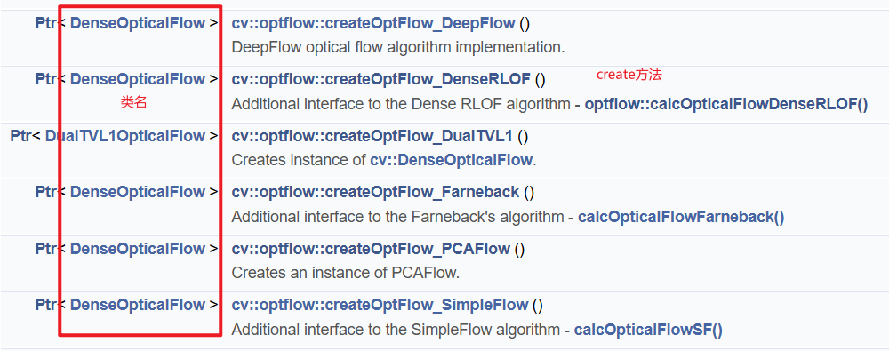

## 6.3 光流法

需要知道光流是什么，其实就是每个物体有自己运动的状态，一图说明，总之算出前后两帧的变换情况呗：


光流背后的原理不谈，本质上也是一个简单的数学模型，然后有不同的计算方法。

其中可以分为稠密和稀疏，二者优缺点从名字就能看出了。实验代码为 [test_optical_sparse.py](../code/test_optical_sparse.py) 和 [test_optical_dense.py](../code/test_optical_dense.py)。

- 稀疏: KLT(GoodFeaturesToTrack找特征点 + LK 求解光流变化)
- 稠密: FB, DIS

### 代码说明

OpenCV 中涉及到光流的有两个部分：[Main Module 里面的 Video Analysis](https://docs.opencv.org/4.x/dc/d6b/group__video__track.html)；还有一个专门的 [optflow 模块](https://docs.opencv.org/4.x/d2/d84/group__optflow.html)。

点击链接会吓一跳，怎么这么多类、这么多的方法！！！其实 OpenCV 里面组织的很直观：

1. 首先是那么多的类好理解，XXXOpticalFlow 就是各种各样的光流算法类。这些类都有两个基本方法：`create()`, `calc(img1, img2, ...)`。即创建一个对象，和计算前后两张图片中的光流。

   1. `create` 创建对象，不传参数就用默认参数。有的类可能还有专门的 XXXOpticalFlowParms 这种专门的参数类；有些类就是直接的 `a=xx, b=yy` 这种普通参数。但本质上都一样，前者反而麻烦一点，还要专门创建一个对象传进去。
   2. `calc` 计算光流，前后两张图片是肯定要有的，其他的参数就不同方法不一样了。

2. 然后方法其实分成就两种，其实都是有语法糖：

   1. `createOpticalFlowXXX()` 就是创建上面的类的一个对象。
   2. `calcOpticalFlowXXX(img1, img2, ...)` 就是直接计算光流，没必要记这些方法，创建对象后调用 calc 更好。

推荐：用 `createXXX` 创建对象，然后调用 `calc` 方法。用 `calc` 是统一方便，每个方法只要创建好对象都是调用 `calc`，不用太困扰。

而使用 `createXXX` 因为有些方法共用一个类，区别只是对象调用的 `create()` 的参数不同。可以看下面的截图理解：第一个和第二个都是 `DenseOpticalFlow`，但 `createXXX` 相当于做了一层包装，调用 `createA` 相当于调用 `create()` 时传入 A 方法中应该的默认参数，很方便。当然有的类没有直接调用的 `createXXX` 方法...



有的类的名字和方法名字并不完全对应，也有的类没有对应直接可以调用的 `craeteOpticalFlow` 和 `calcOpticalFlow` 方法，不过没关系，直接看文档或者代码，就知道怎么用了。

### 稠密光流

稠密光流有下面几种：

```python
cv2.DISOpticalFlow
cv2.FarnebackOpticalFlow
cv2.optflow.createOptFlow_DualTVL1()
cv2.optflow.createOptFlow_SimpleFlow()
cv2.optflow.createOptFlow_DeepFlow()
cv2.optflow.createOptFlow_DenseRLOF()
cv2.optflow.createOptFlow_PCAFlow()
cv2.optflow.createOptFlow_SparseToDense()
```

如前所述，创建一个对象之后，就可以直接用 `calc(img1, img2)` 计算了。除了 `DenseRLOF` 必须要是彩色图片，其他都可以是灰度图。最后结果就是和输入图片一样大小的数组，每个像素里面有两个值，代表了大小和方向。

因为实在太多了，每种都有不同的参数，我这里就直接只写 main module 里面的 Farneback 示例了。其实稠密光流计算非常直观，不输入参数用默认的，也能出结果。具体用的时候，请查看各个方法的原理，然后自行查阅资料调参。

```cpp
void cv::calcOpticalFlowFarneback (
    InputArray prev, InputArray next, 
    InputOutputArray flow,
    double 	pyr_scale, 
    int levels, int winsize,
    int 	iterations,
    int 	poly_n,
    double 	poly_sigma,
    int 	flags
)
```

随便写一下，很多就直接复制粘贴了，不过分纠结原理：

- prev, next: 前后两张图
- flow: 输出的光流，大小 (w, h, 2)，类型 32FC2，代表每个点分别两个方向移动了多少单位：`prev(y, x) = next(y+flow(y,x)[1], x+flow(y,x)[0])`
- pyr_scale: specifying the image scale (<1) to build pyramids for each image; pyr_scale=0.5 means a classical pyramid, where each next layer is twice smaller than the previous one.
- levels, winsize: 和上面函数一样
- iterations: number of iterations the algorithm does at each pyramid level.
- poly_n: size of the pixel neighborhood used to find polynomial expansion in each pixel; larger values mean that the image will be approximated with smoother surfaces, yielding more robust algorithm and more blurred motion field, typically poly_n =5 or 7.
- poly_sigma: standard deviation of the Gaussian that is used to smooth derivatives used as a basis for the polynomial expansion; for poly_n=5, you can set poly_sigma=1.1, for poly_n=7, a good value would be poly_sigma=1.5.

### 稀疏光流

稀疏光流就两个：main module 里面的 SparsePyrLkOpticalFlow 和 optflow module 里面的 SparseRLOF


**首先 SparseRLOF 实测 python 中有大问题，必须要重复调用两次才貌似正常，暂时不推荐用。链接：https://github.com/opencv/opencv_contrib/issues/2663**

而 PyrLKOpticalFlow 就是经典的 KLT 方法，即 Shi-Tomas角点方法找特征点 + LK 求解光流变化。这两个稀疏光流方法在调用 `calc` 的时候，都要给两个参数：prevPts 和 nextPts。前者是第一张图片的角点，后者是第二张图片的角点，后面的那个是函数里面会自己算然后赋给传入参数，Python 里传入 None 就好。

两个方法在 Python 的返回值是 (nextPts, status, err)。第二张图片的对应角点（即按照传入的 prevPts 的顺序）、这个对应角点是否是真的找到了（1表示可以大胆用，0表示不行）、前后两个角点的计算误差（存疑？）。

下面就是角点的 KLT 方法：

#### calcOpticalFlowPyrLK

```cpp
void cv::calcOpticalFlowPyrLK (
    InputArray prevImg, InputArray nextImg, 
    InputArray prevPts,
    InputOutputArray 	nextPts,
    OutputArray status, OutputArray err,
    Size 	winSize = Size(21, 21),
    int 	maxLevel = 3,
    TermCriteria 	criteria = TermCriteria(TermCriteria::COUNT+TermCriteria::EPS, 30, 0.01),
    int 	flags = 0,
    double 	minEigThreshold = 1e-4 
)
cv.calcOpticalFlowPyrLK(prevImg, nextImg, prevPts, nextPts) ->	nextPts, status, err
```

OpenCV 的文档写的已经非常好，这里简单随便写一下，也可以参考代码 [test_optical_sparse.py](../code/test_optical_sparse.py)：

- prevImg, nextImg: 前后两张图。除了 8-bit，还可以输入金字塔（通过 `buildOpticalFlowPyramid` 函数构造
- prevPts: 前面一张图的角点，可以用不同方法，最后是一个 (n, 1, 2) 大小的 ndarray
- nextPts: Python 中直接用 None；后面一张图对应的角点，这个函数会自动计算；也可以传入粗略估计的位置，函数会更新，需要 flag 设为 OPTFLOW_USE_INITIAL_FLOW
- status: (n, 1) 大小的 ndarray，表示对应角点是否找到，1 找到，0 未找到
- err: 没了解
- winSize: 每个金字塔层级的搜索窗口大小
- maxLevel: 金字塔层级，0 表示不用金字塔；否则为 n+1 级
- criterial, minEigThreshold: 具体看代码或者文档，需要知道算法具体的原理

该函数相当于除了前后两张图，还需要输入第一张图的角点位置，输出是第二张图角点位置。文章最上面的那张图片的那些彩色线条就是相当于画直线得来。

```python
# params for ShiTomasi corner detection
parms0 = {
    'maxCorners': 100,
    'qualityLevel': 0.3,
    'minDistance': 7,
    'blockSize': 7,
}
old_gray = cv2.cvtColor(old_frame, cv2.COLOR_BGR2GRAY)
old_points0 = cv2.goodFeaturesToTrack(old_gray, mask=None, **feature_params)

new_points0, st0, err0 = cv2.calcOpticalFlowPyrLK(old_gray, now_gray, old_points0, None, **params0)
# new_points1, st1, err1 = cv2.optflow.calcOpticalFlowSparseRLOF(old_frame, now_frame, old_points1, **parms1)

# Select good points
old_points0 = old_points0[st0==1]
new_points0 = new_points0[st0==1]
```

#### buildOpticalFlowPyramid

为了第一个函数服务的，结果可以作为第一个函数的 prevImg 和 nextImg。我干脆直接截图了，用的时候再细调：


### 其他

#### readOpticalFlow, writeOpticalFlow

读写光流 .flo 文件，如函数名所属，没有好讲的。
