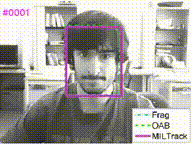

## 6.4 Tracker

非常好的文章（LearnOpenCV这网站本身就非常值得推荐） ：https://learnopencv.com/object-tracking-using-opencv-cpp-python/

这个章节用的是 single object tracker，即单目标追踪，在 OpenCV 中有如下类(那几个以 Tracker 开头的)：
- https://docs.opencv.org/4.x/dc/d6b/group__video__track.html
- https://docs.opencv.org/4.x/dc/d6b/group__tracking__legacy.html

简单代码在 [test_tracker.ipynb](../code/test_tracker.ipynb) 中，可参考。

1. Tracking 失败时（即检测不到目标）可以有健壮处理，可以看这是 MIL Tracker 作者的演示。

2. 种类：BOOSTING, MIL, KCF, TLD, MEDIANFLOW, GOTURN, MOSSE, or CSRT；优先推荐 KCF