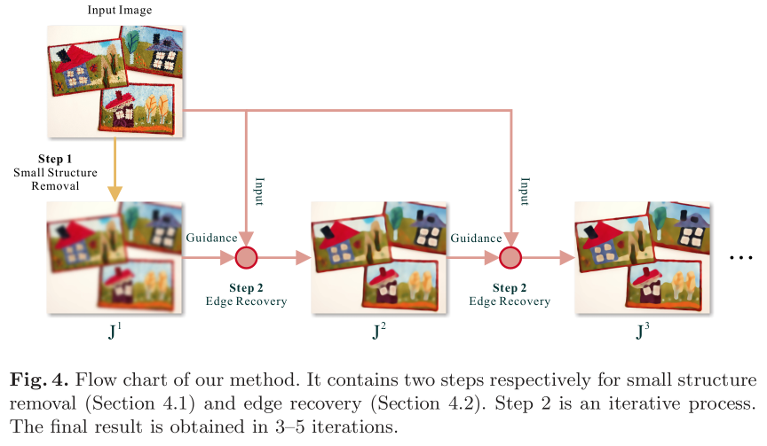

## Opencv 中的去噪

总结：

1. 最纯粹的空域滤波：bilteralFilter、bilteralTextureFilter、anisotropicDiffusion、EdgePreserving
2. 利用引导图片的滤波：jointBilateralFilter、guidedFilter、fastSmootherFilter、amFilter、dtFilter
3. 频率滤波

抛开均值高斯那些简单的不谈，我觉得传统去噪主要有三种：

### 最纯粹的空域滤波

这个基本就是往往是为了最小化某个公式（如TV滤波、anisotropicDiffusion）推出来滤波行为，我在 Opencv 中看到的有：bilteralFilter、bilteralTextureFilter、anisotropicDiffusion、EdgePreserving、l0smooth...

除了这些，我知道的还有：WLS Filter、TV Filter；这两个也是经典，但是 Opencv 没有实现，但是 skimage 实现了。

这一类的滤波在 [test_denoising_1.ipynb](../code/test_denoising_1.ipynb) 中。

### 利用引导图片的滤波

这些滤波需要用到一张引导图片，但往往引导图其实很多时候是对原图做了高斯这种简单平滑后的图。但是我在 OpenCV 中看到的有：jointBilateralFilter、guidedFilter(createGuidedFilter)、rollingGuidanceFilter、amFilter(createAMFilter)、dtFilter(createDTFilter)、fastGlobalSmootherFilter(createFastGlobalSmootherFilter)。

其中括号内的方法是创建对应方法的一个对象，因为这些方法需要传入引导图片，所以如果用一张引导图片做多个滤波处理的话，最好用括号内的方法，避免每次都初始化。此外，有的方法可以传入多张引导图片，具体哪些方法用的时候实验一下就行。

jointBilateralFilter，联合双边滤波，它实际上就是改了一个颜色参考：原来的双边根据原图中当前像素和周围像素的差异算出一个值，它改成了根据引导图中当前像素和周围像素的差异算出一个值。再加上引导图往往就是原图平滑后的图，其实就是计算颜色的先平滑一下再做那个权重。

guidedFilter，引导滤波，非常经典。它背后原理也很有道理，公式一步一步推，很有说服力。这方面好文章很多，这几个链接的都可以：[链接一](https://zhuanlan.zhihu.com/p/438206777)，[链接二](https://zhuanlan.zhihu.com/p/161666126)

rollingGuidanceFilter，这个能发 ECCV 2014 也挺离谱的，方法就是如下图所示。它强制引导图就是平滑后的图，然后不断循环做引导滤波。虽然它强制了引导图，即函数调用不需要传一张引导图，但我还是把这个方法归类于利用引导图片的滤波。

其他方法还没看，其中 dtFilter 貌似很出名，有时间再补。但反正主要目的是用，而不是完全学透，不然时间根本不够用。这类滤波代码在 [test_denoising_2.ipynb](../code/test_denoising_2.ipynb) 中了。

ximgproc 还有一个 fastBilateralSolverFilter，也要引导图片，但那个方法还要一个 confidence 图片，信心图。查了一下，这个方法主要是用在求立体视觉的视差图那里的，侧重点不在去噪上。这篇 [CSDN 文章](https://blog.csdn.net/DCCSDNDC/article/details/136906579)讲的可以。